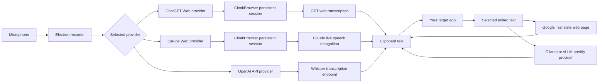

<p align="center">
  
</p>

<h1 align="center">GPT-Voice</h1>

<p align="center">
  <strong>Desktop voice transcription powered by web and API providers.</strong>
  <br />
  Record a thought, send it through a supported web session or API, and get clean text back on your clipboard.
</p>

<p align="center">
  <a href="https://github.com/swimmwatch/gpt-voice/actions/workflows/pr-checks.yml"></a>
  <a href="https://github.com/swimmwatch/gpt-voice/actions/workflows/release-builds.yml"></a>
  
  
  
  
  
  
</p>

## Why GPT-Voice?

GPT-Voice is a small Electron app for people who want fast voice-to-text without running a local Whisper model, downloading large checkpoints, or needing a GPU. It sends audio to a provider you control: a logged-in web session or the official OpenAI API transcription endpoint.

The result is a quiet desktop utility: press a hotkey, speak, stop, and the transcript is copied to your clipboard.

The provider architecture is intentionally simple so more GPT-capable web apps and speech services can be added later.

## Highlights

- **No local Whisper runtime**: no model files, no CUDA setup, no GPU requirement.
- **Provider choice**: use ChatGPT Web or Claude Web through saved browser sessions, or OpenAI API through your own API key.
- **Fast remote recognition**: get high-quality transcription from remote GPT/Whisper infrastructure instead of spending local CPU/GPU resources.
- **Separate provider settings**: web-session auth and API-key auth are stored independently.
- **Bundled Cloak Chromium**: packaged builds include the browser runtime needed by CloakBrowser.
- **Global hotkeys**: record, stop, cancel, translate selected text, and prettify selected text without leaving the app you are typing in.
- **Clipboard-first flow**: transcripts are copied immediately so you can paste anywhere.
- **Transcription history**: successful recognitions are stored locally so you can reopen and copy previous text.
- **Selected-text actions**: translate selected text through Google Translate or prettify selected text through a configured local LLM provider.
- **Desktop-native shell**: Electron tray app, notifications, packaged Linux AppImage/deb/rpm, plus a Windows installer.
- **CI protected**: linting, formatting, type checking, unit tests, Dependabot validation, CloakBrowser smoke tests, and package smoke builds.

## How It Works



GPT-Voice records audio locally and sends it to the selected provider. ChatGPT Web uses a background CloakBrowser context with your saved ChatGPT cookies. Claude Web sends live audio through its authenticated browser session. OpenAI API sends multipart audio to OpenAI's transcription endpoint with your API key. GPT-Voice copies finalized text to the clipboard.

Selected-text translation copies the translated result to the clipboard. Selected-text prettify sends the selected text and protected prettify prompt to the configured Ollama, vLLM, Claude CLI, or Codex CLI provider and copies the improved result to the clipboard.

Availability, quotas, and behavior are determined by the web service account you use. GPT-Voice does not bypass provider-side limits; it gives you a desktop workflow around the web features available to your account.

## Providers

### ChatGPT Web

ChatGPT Web uses a real browser session through CloakBrowser.

- Requires login in a visible browser window.
- Does not require an OpenAI API key.
- Reuses the saved `chatgpt-session.json` file from your per-user GPT-Voice data directory.
- Starts a persistent background CloakBrowser context for transcription.

Use this provider when you want the app to work through the GPT web account you already use.

### Claude Web

Claude Web uses a saved Claude browser session through CloakBrowser and a private, browser-owned speech-recognition integration. This integration is not a public API and can change when Claude changes its web application.

- Requires login in a visible browser window and does not require an API key. Login and Clear affect only Claude's saved GPT-Voice browser session; no external Chrome profile is read.
- Restores the saved session after restart and uses the recognition language selected in Claude provider settings.
- Captures microphone audio as 16 kHz mono PCM and sends it live while you speak. Pause excludes new microphone audio while the connection remains active.
- Stop drains the bounded live-audio queue and waits for one final result. Cancel stops the active operation and discards it.
- A failed live recording is retained in memory only when an explicit Retry is available. Retry uses the buffered provider path; GPT-Voice never automatically replays audio after it has been sent live.
- Routing uses one proven active Claude organization deterministically, including for multi-organization accounts. GPT-Voice does not infer or expose personal versus organization scope, and there is no account-scope selector. An unknown scope remains usable when routing is resolved.
- Compressed audio is not sent through the live PCM path. If Claude changes its private endpoint or protocol, transcription fails safely until the integration is revalidated; it does not silently switch to another provider or replay the recording.

Use this provider when your Claude account has browser dictation available and you accept the volatility of the private web integration.

### OpenAI API

OpenAI API uses the official audio transcription endpoint with a selectable compatible transcription model.

- Requires your own OpenAI API key with available billing/quota.
- Does not require browser login for transcription.
- Stores API settings separately from ChatGPT Web settings.
- Encrypts the API key with Electron `safeStorage`; if secure storage is unavailable, the key is not saved as plaintext.
- Supports `whisper-1`, `gpt-4o-transcribe`, and `gpt-4o-mini-transcribe`, a searchable supported-language selector, an optional prompt, and temperature from `0` to `1`.

Use this provider when you want the official API path and predictable API-account billing instead of web-session automation.

### Prettify Providers

Prettify Text is configured independently from transcription providers. Its provider selector is always visible in the main window, while complete settings are under **App settings → Prettify**.

- **Ollama** is the default prettify provider and uses `http://127.0.0.1:11434`.
- **vLLM** uses an OpenAI-compatible API base URL, defaulting to `http://127.0.0.1:8000/v1`.
- **Claude CLI** uses an installed Claude Code CLI. GPT-Voice requires a compatible CLI, but authentication remains owned by the CLI. The model and fallback model are optional; blank values use CLI defaults. Effort can be left at the default or set to low, medium, or high.
- **Codex CLI** uses an installed Codex CLI and is experimental. GPT-Voice enables execution only when the CLI proves the required schema, read-only isolation, disabled tools/integrations, and disabled web-search capabilities. A failed capability gate makes the provider unavailable without a bypass.
- HTTP model choices are loaded with **Refresh**. Opening a CLI model or capability dropdown starts one required preflight/discovery request when no current result exists; **Refresh** can revalidate it explicitly. Merely selecting a CLI provider performs no authentication, discovery, or generation command.
- Claude aliases include `sonnet`, `opus`, and `haiku`; a valid configured Claude model is preserved. Codex exposes only the reasoning-effort and verbosity values proven for the selected model. A blank CLI model uses the CLI default.
- Ollama models can be explicitly loaded from **App settings** or the visible model-memory control in the main window to reduce first-request latency. GPT-Voice unloads the Ollama model it loaded when the app fully quits.
- vLLM API keys are optional and saved encrypted with Electron `safeStorage` when secure storage is available.
- For a CLI executable, leave the path blank to resolve it through the GUI process `PATH`, or enter one absolute executable path, including paths containing spaces. Do not enter command-line arguments in this field.
- Claude CLI and Codex CLI use their standard platform configuration locations for authentication. GPT-Voice does not read, copy, store, or display CLI credentials or account identity.
- CLI timeouts accept whole seconds from 15 to 600 and default to 120. Cancellation or timeout terminates the isolated process and never retries automatically.
- GPT-Voice does not start Ollama, vLLM, or either CLI for you. Selected text is sent through the configured provider and can consume local resources, API quota, or subscription quota under that provider account.

## Install

Most users do not need Node.js, npm, Whisper, CUDA, or a local model. Download a ready-to-run build from the **Releases** page:

<p>
  <a href="https://github.com/swimmwatch/gpt-voice/releases"><strong>Download GPT-Voice from GitHub Releases</strong></a>
</p>

Choose the asset for your operating system:

| Platform | Recommended asset        | Best for                                     |
| -------- | ------------------------ | -------------------------------------------- |
| Windows  | `GPT-Voice Setup *.exe`  | Normal Windows installation                  |
| Linux    | `gpt-voice_*_amd64.deb`  | Ubuntu, Debian, Linux Mint, Pop!\_OS, etc.   |
| Linux    | `gpt-voice-*.x86_64.rpm` | Fedora, RHEL, CentOS, openSUSE, etc.         |
| Linux    | `GPT-Voice-*.AppImage`   | Portable Linux usage without package install |

Each release also includes platform-specific `SHA256SUMS-*.txt` files. Use them if you want to verify that the downloaded installer was not corrupted or replaced.

macOS release builds are paused until Developer ID signing and notarization are configured. Current releases do not include a supported DMG.

### Windows

Download `GPT-Voice Setup *.exe` from the latest release.

1. Double-click the installer.
2. Choose the install location if the installer asks for it.
3. Keep the desktop and Start Menu shortcuts enabled unless you prefer launching the app manually.
4. Finish the installer and start **GPT-Voice** from the Start Menu, desktop shortcut, or the final installer screen.

The Windows installer is an NSIS installer. It installs the app, bundled CloakBrowser runtime, icons, shortcuts, and an uninstaller entry in Windows settings.

To update, download the newer `GPT-Voice Setup *.exe` and run it over the existing installation.

To uninstall:

1. Open **Settings** -> **Apps** -> **Installed apps**.
2. Find **GPT-Voice**.
3. Click **Uninstall**.

Uninstalling removes the installed application files and shortcuts. Your local GPT-Voice session data is intentionally left in `%APPDATA%\GPT-Voice` so reinstalling does not force you to log in again. Delete that folder manually only if you want to remove saved sessions and settings.

### Linux: deb Package

For Ubuntu, Debian, Linux Mint, Pop!\_OS, and similar distributions, prefer the deb package:

```bash
sudo apt install ./gpt-voice_*_amd64.deb
```

This installs GPT-Voice into `/opt/GPT-Voice`, registers the desktop launcher, installs icons, and creates the `gpt-voice` command.

If your system does not support installing a local deb with `apt install`, use:

```bash
sudo dpkg -i ./gpt-voice_*_amd64.deb
sudo apt-get install -f
```

Launch GPT-Voice from your application menu or from a terminal:

```bash
gpt-voice
```

To update, install the newer deb package over the existing one:

```bash
sudo apt install ./gpt-voice_*_amd64.deb
```

To uninstall the application package:

```bash
sudo apt remove gpt-voice
```

To remove package files and package configuration:

```bash
sudo apt purge gpt-voice
```

Your saved session and settings are user data and are not removed by `apt remove` or `apt purge`. Delete `~/.config/GPT-Voice` manually only if you want to remove saved login/session data.

### Linux: rpm Package

For Fedora, RHEL, CentOS, openSUSE, and similar distributions, use the rpm package.

Use your distribution package manager rather than `rpm -i` for normal installs. Package managers resolve the runtime dependencies declared by the package; plain `rpm -i` only reports missing dependencies.

On Fedora, RHEL, CentOS, and compatible distributions:

```bash
sudo dnf install ./gpt-voice-*.x86_64.rpm
```

On older CentOS/RHEL systems that use `yum`:

```bash
sudo yum install ./gpt-voice-*.x86_64.rpm
```

On openSUSE:

```bash
sudo zypper install ./gpt-voice-*.x86_64.rpm
```

This installs GPT-Voice into `/opt/GPT-Voice`, registers the desktop launcher, installs icons, and creates the `gpt-voice` command.

The rpm package is built for `x86_64` desktop systems. It declares the Electron and CloakBrowser runtime dependencies needed by GPT-Voice, including GTK, NSS, notification, audio, GPU buffer, X11 screen-saver/input, UUID, accessibility, and XDG utility packages. On minimal installations, make sure the standard desktop/runtime repositories for your distribution are enabled before installing the package.

To update, install the newer rpm package with the same package manager command.

To uninstall on Fedora/RHEL/CentOS:

```bash
sudo dnf remove gpt-voice
```

To uninstall on openSUSE:

```bash
sudo zypper remove gpt-voice
```

Your saved session and settings remain in `~/.config/GPT-Voice`. Delete that directory manually only if you want a clean reset.

### Linux: AppImage

Use the AppImage if you want a portable build or do not want to install a system package.

1. Download `GPT-Voice-*.AppImage`.
2. Make it executable:

```bash
chmod +x GPT-Voice-*.AppImage
```

3. Run it:

```bash
./GPT-Voice-*.AppImage
```

On first launch, GPT-Voice registers a local desktop launcher and icon for the current user when possible. This makes the app show up correctly in Ubuntu/GNOME launchers.

To update, download the newer AppImage, make it executable, and use it instead of the old file.

To remove the AppImage version:

1. Quit GPT-Voice.
2. Remove the desktop integration:

```bash
./GPT-Voice-*.AppImage --remove-linux-appimage-desktop-integration
```

3. Delete the AppImage file.

Your saved session and settings remain in `~/.config/GPT-Voice`. Delete that directory manually only if you want a clean reset.

### First Launch

After installation, the first run is the same on every supported packaged platform:

1. Start **GPT-Voice**.
2. Choose a provider in the **Provider** select.
3. Open **Settings** next to the provider selector.
4. For **ChatGPT Web**, sign in through the browser login flow and close the login window after ChatGPT is ready.
5. For **Claude Web**, sign in through the browser login flow and choose the recognition language. For **OpenAI API**, paste your OpenAI API key and select the transcription model and language you need.
6. Wait until the main button shows the provider as connected or configured.

After that, GPT-Voice reuses the saved provider settings. ChatGPT Web and Claude Web start their background browsers automatically; OpenAI API does not need a browser for transcription.

## Run From Source

Use this path only if you want to develop GPT-Voice or build it locally.

```bash
npm ci
npm run prepare:cloakbrowser
npm run start
```

On first launch, choose a provider from the app window. ChatGPT Web and Claude Web open provider-specific login browsers and save separate browser sessions under your user profile. OpenAI API opens the provider settings window and saves encrypted API settings locally.

## How To Use

1. **Start the app** and choose **ChatGPT Web**, **Claude Web**, or **OpenAI API** in the Provider select in the main toolbar.
2. **Configure the provider** with the adjacent provider-settings button. Use a web provider to sign in once through its login browser, or save an OpenAI API key and transcription settings. The API key is encrypted with Electron safe storage and is never shown back in the UI.
3. **Record** with the visible primary button or the configured hotkey, then use the visible Stop, Pause, Resume, or Cancel action as needed.
4. **Paste anywhere**. The recognized text is copied to your clipboard automatically.
5. Optional: open **History** from the main toolbar or tray menu. Existing entries load progressively while you scroll; click transcript text to copy it again.
6. Optional: open **App settings** from the main toolbar or tray menu. Shortcuts and actions, Prettify, Browser, Network, and System are organized as separate sections. Unsaved changes require confirmation before closing.
7. Optional: choose Ollama, vLLM, Claude CLI, or Codex CLI in the always-visible Prettify selector, complete its settings, select text, and press the Prettify hotkey to copy a clearer version. For Ollama, the main window also provides a visible model-memory action when a model is selected.
8. Optional: select a target language in GPT-Voice, select text in another app, and press the Translate hotkey to copy the translated text.

## Default Controls

| Action              | Default  |
| ------------------- | -------- |
| Record              | `F9`     |
| Stop                | `F10`    |
| Cancel              | `Escape` |
| Translate selection | `F11`    |
| Prettify selection  | `F12`    |

Shortcuts are configurable from **App settings**.

Selected-text translation copies the translated result to the clipboard. Selected-text prettify copies the improved result to the clipboard. Translation uses OS automation to copy selected text when needed; Prettify reads the Linux primary selection directly and does not automate paste.

The Prettify provider and its supported HTTP or CLI controls are configurable from **App settings**. Unsupported provider controls are not passed through as arbitrary process arguments.

## Build Locally

```bash
npm run build
npm run pack
```

Platform packages:

```bash
npm run dist:fedora
npm run dist:linux
npm run dist:win
```

`npm run dist:fedora` is the preferred Linux release path. It builds and runs a Fedora Docker utility image with Node.js 24, npm 11, Electron packaging tools, RPM tooling, AppStream validation, and CloakBrowser runtime dependencies installed. The container writes final Linux release files to `release-artifacts/linux/`.

Linux builds produce:

- `release/GPT-Voice-1.2.0.AppImage`
- `release/gpt-voice_1.2.0_amd64.deb`
- `release/gpt-voice-1.2.0.x86_64.rpm`
- `release/linux-unpacked/gpt-voice`

`npm run dist:linux` still works as a native-host fallback. Native Linux rpm packaging requires `rpmbuild`, `rpm2cpio`, and `cpio`. On Ubuntu/Debian build hosts, install them before `npm run dist:linux`:

```bash
sudo apt install rpm cpio
```

### RPM Package Maintenance

RPM package metadata and runtime dependencies are maintained in `package.json`:

- `build.linux` owns the Linux product metadata, desktop entry fields, vendor, maintainer, summary, and description.
- `build.rpm.packageCategory` maps to the RPM group/category metadata.
- `build.rpm.depends` lists the runtime package dependencies expected by Fedora-style RPM package managers.
- `build.rpm.fpm` adds the generated AppStream metadata and package license file to the final rpm.

Generated metadata comes from `npm run generate:package-metadata`; do not edit `build/generated/` files by hand.

For RPM packaging changes, use the Fedora container path:

```bash
npm run dist:fedora
```

This rebuilds the Linux AppImage, deb, and rpm, then runs installer verification. The Linux installer verifier checks that the rpm has the expected metadata, dependency declarations, lifecycle script shell dependency, `app.asar`, bundled CloakBrowser runtime, license files, desktop entry, hicolor icons, and AppStream metadata.

To inspect the generated rpm manually:

```bash
docker run --rm --entrypoint rpm --volume "$PWD:/workspace" --workdir /workspace gpt-voice-fedora-release:local -qip release/gpt-voice-*.x86_64.rpm
docker run --rm --entrypoint rpm --volume "$PWD:/workspace" --workdir /workspace gpt-voice-fedora-release:local -qRp release/gpt-voice-*.x86_64.rpm
docker run --rm --entrypoint rpm --volume "$PWD:/workspace" --workdir /workspace gpt-voice-fedora-release:local -qlp release/gpt-voice-*.x86_64.rpm
```

## Release Automation

GitHub Actions can build installable artifacts for all supported platforms:

- Fedora Linux container: AppImage, deb, and rpm
- Windows: NSIS setup executable

The `Build Release Artifacts` workflow can be started manually from GitHub Actions. It also runs automatically when a GitHub Release is published, builds every supported packaging target, uploads workflow artifacts, and attaches the installers to that release. Linux release artifacts are built through `build/fedora-release/Dockerfile`; the workflow uses Docker Buildx cache plus workspace caches for npm, Electron, and CloakBrowser downloads so repeated Fedora builds stay fast.

macOS release artifacts are paused until Developer ID signing and notarization are configured.

## Quality Checks

```bash
npm run format:check
npm run lint
npm run typecheck
npm run test:types
npm test
npm run validate:dependabot
npm run audit:prod
npm run build:prod
npm run prepare:cloakbrowser -- --target=linux
npm run smoke:cloakbrowser
npm run smoke:fedora
```

The PR pipeline also runs a Fedora Linux container package smoke build and a Windows package smoke build. GitHub Actions workflow files are checked by a dedicated Actionlint workflow.

## Project Layout

```text
src/main/        Electron main process, IPC, hotkeys, browser orchestration
src/renderer/    React UI and recording UX
scripts/         CloakBrowser preparation, smoke tests, config validation
tests/           Unit tests based on Node.js test runner
assets/          App icons and README screenshots
build/           Packaging metadata, macOS entitlements, and Fedora release image files
.github/         PR checks, release builds, Dependabot, and templates
```

## Provider Troubleshooting

- **Claude Web is not connected**: open its provider settings, use Login, finish signing in in the visible browser, and close the login window. If the saved session expired, use Clear and sign in again. Confirm that an explicit recognition language is selected.
- **Claude Web fails after previously working**: the speech endpoint belongs to the Claude web application and can change without notice. Cancel the operation, keep the recording only if the UI offers explicit Retry, and update GPT-Voice after the integration has been revalidated. Do not repeatedly replay private audio while diagnosing a protocol change.
- **Claude Web cannot resolve an account route**: open Claude normally in the login window and leave one organization active. GPT-Voice uses the proven active route and does not offer a personal/organization scope override.
- **A CLI is not installed or executable**: verify the command is available to GUI applications through `PATH`, or configure one absolute executable-file path. A value containing flags or multiple commands is rejected.
- **A CLI is not authenticated**: authenticate with that CLI outside GPT-Voice using its documented login flow, then use **Refresh** in Prettify settings. GPT-Voice never asks for or stores the CLI credential.
- **A CLI model is unavailable**: leave the model blank to use the CLI default, choose a discovered model, or enter a provider-supported custom model. Claude fallback and Codex reasoning/verbosity are applied only where supported.
- **Codex remains unavailable**: update to a compatible Codex CLI and use **Refresh**. Missing output-schema support, model discovery, or proven no-tools/isolation controls fails closed and cannot be bypassed in GPT-Voice.
- **A request is cancelled, times out, exceeds an output limit, or exits unsuccessfully**: no automatic retry occurs. Check provider availability and quota, adjust the 15–600-second timeout if appropriate, and retry manually with non-private input after resolving the cause.

## Privacy And Sessions

GPT-Voice sends recorded audio to the transcription provider you select. ChatGPT Web sends audio through your authenticated web session. Claude Web sends live audio through an authenticated browser session and a private integration that can change. OpenAI API sends audio to OpenAI's official transcription endpoint with your API key. Prettify Text sends selected text and the protected prettify prompt to the configured Ollama, vLLM, Claude CLI, or Codex CLI provider. These requests use your provider account and can consume subscription or API quota; GPT-Voice does not bypass provider limits.

Provider data is stored in the native per-user app data directory for the current platform, for example `%APPDATA%\GPT-Voice` on Windows and `~/.config/GPT-Voice` on Linux. ChatGPT Web stores `chatgpt-session.json`; Claude Web stores `claude-web-session.json` and its non-secret language setting separately. OpenAI API stores `openai-api-settings.json` with an encrypted API key when Electron secure storage is available. Prettify provider settings, including optional CLI executable paths and model choices, are stored in `config.json`; an optional encrypted vLLM API key is stored in `prettify-provider-settings.json`. GPT-Voice does not store Claude CLI or Codex CLI authentication, account data, raw stdout, or stderr. Successful transcription history is stored locally in `gpt-voice.sqlite3` and can be cleared from the History window. Legacy `~/.gpt-voice` and `~/.webvoice` directories are migrated automatically when possible. Treat this data as sensitive and do not commit session files, API settings, history databases, or browser cache data.

To avoid duplicate provider requests when the same audio is retried, GPT-Voice keeps up to 10 successful transcription results in process memory for up to 5 minutes. It hashes the exact audio bytes with the selected provider's transcription settings to derive an opaque lookup key, but the cache never retains the audio itself. For Claude Web, a canonical recording is retained only in memory for an eligible explicit Retry after a live failure or successful completion; it is never automatically replayed. Failed and empty results are not cached, and all cached entries disappear when GPT-Voice restarts.

This project automates browser interactions with services you sign into. Use it responsibly and make sure your usage matches the rules of the services you connect to.

## Contributing And Security

Please read [CONTRIBUTING.md](CONTRIBUTING.md) before opening a pull request. Use a feature branch created from `main` and target `main` when the work is ready for review.

Security issues should be reported privately according to [SECURITY.md](SECURITY.md). Community participation is covered by [CODE_OF_CONDUCT.md](CODE_OF_CONDUCT.md).

## Tech Stack

- Electron
- React
- TypeScript
- CloakBrowser
- Playwright Core
- Webpack
- electron-builder

## License

GPT-Voice is licensed under the [PolyForm Noncommercial License 1.0.0](LICENSE).

You may use, copy, modify, and share the project for noncommercial purposes, including personal study, hobby projects, research, and private use. Commercial use is not permitted without a separate license from the author.

This is a source-available noncommercial license, not an OSI-approved open source license.
