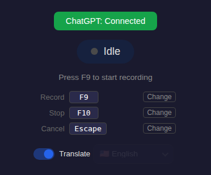
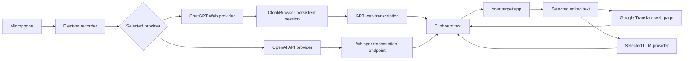

<p align="center">
  
</p>

<h1 align="center">GPT-Voice</h1>

<p align="center">
  <strong>Desktop voice transcription powered by GPT providers.</strong>
  <br />
  Record a thought, send it through a GPT web session or OpenAI API, and get clean text back on your clipboard.
</p>

<p align="center">
  <a href="https://github.com/swimmwatch/gpt-voice/actions/workflows/pr-checks.yml"></a>
  <a href="https://github.com/swimmwatch/gpt-voice/actions/workflows/release-builds.yml"></a>
  
  
  
  
  
  
</p>

<p align="center">
  
</p>

## Why GPT-Voice?

GPT-Voice is a small Electron app for people who want fast voice-to-text without running a local Whisper model, downloading large checkpoints, or needing a GPU. It sends audio to a provider you control: either a logged-in GPT web session or the official OpenAI API transcription endpoint.

The result is a quiet desktop utility: press a hotkey, speak, stop, and the transcript is copied to your clipboard.

The provider architecture is intentionally simple so more GPT-capable web apps and speech services can be added later.

## Highlights

- **No local Whisper runtime**: no model files, no CUDA setup, no GPU requirement.
- **Provider choice**: use ChatGPT Web through a saved browser session, or OpenAI API through your own API key.
- **Fast remote recognition**: get high-quality transcription from remote GPT/Whisper infrastructure instead of spending local CPU/GPU resources.
- **Separate provider settings**: web-session auth and API-key auth are stored independently.
- **Bundled Cloak Chromium**: packaged builds include the browser runtime needed by CloakBrowser.
- **Global hotkeys**: record, stop, cancel, translate selected text, and prettify selected text without leaving the app you are typing in.
- **Clipboard-first flow**: transcripts are copied immediately so you can paste anywhere.
- **Selected-text actions**: translate selected text through Google Translate, or prettify selected text through the selected LLM provider.
- **Desktop-native shell**: Electron tray app, notifications, packaged Linux AppImage/deb/rpm, plus a Windows installer.
- **CI protected**: linting, formatting, type checking, unit tests, Dependabot validation, CloakBrowser smoke tests, and package smoke builds.

## How It Works



GPT-Voice records audio locally and sends it to the selected provider. The ChatGPT Web provider uses a background CloakBrowser context with your saved ChatGPT cookies. The OpenAI API provider sends multipart audio to OpenAI's transcription endpoint with your API key. In both cases, GPT-Voice parses the final text and copies it to the clipboard.

Selected-text translation copies the translated result to the clipboard. Selected-text prettify sends the selected text to the active LLM provider and copies the improved result to the clipboard.

Availability, quotas, and behavior are determined by the web service account you use. GPT-Voice does not bypass provider-side limits; it gives you a desktop workflow around the web features available to your account.

## Providers

### ChatGPT Web

ChatGPT Web uses a real browser session through CloakBrowser.

- Requires login in a visible browser window.
- Does not require an OpenAI API key.
- Reuses the saved `chatgpt-session.json` file from your per-user GPT-Voice data directory.
- Starts a persistent background CloakBrowser context for transcription.
- Reuses a saved ChatGPT text conversation for Prettify Text requests so browser-based checks and text actions do not create a new chat every time.

Use this provider when you want the app to work through the GPT web account you already use.

### OpenAI API

OpenAI API uses the official audio transcription endpoint and the `whisper-1` model.

- Requires your own OpenAI API key with available billing/quota.
- Does not require browser login for transcription.
- Stores API settings separately from ChatGPT Web settings.
- Encrypts the API key with Electron `safeStorage`; if secure storage is unavailable, the key is not saved as plaintext.
- Supports Whisper-specific settings only: model `whisper-1`, language auto/en/ru/uk/be, optional prompt, and temperature from `0` to `1`.

Use this provider when you want the official API path and predictable API-account billing instead of web-session automation.

## Install

Most users do not need Node.js, npm, Whisper, CUDA, or a local model. Download a ready-to-run build from the **Releases** page:

<p>
  <a href="https://github.com/swimmwatch/gpt-voice/releases"><strong>Download GPT-Voice from GitHub Releases</strong></a>
</p>

Choose the asset for your operating system:

| Platform | Recommended asset        | Best for                                     |
| -------- | ------------------------ | -------------------------------------------- |
| Windows  | `GPT-Voice Setup *.exe`  | Normal Windows installation                  |
| Linux    | `gpt-voice_*_amd64.deb`  | Ubuntu, Debian, Linux Mint, Pop!\_OS, etc.   |
| Linux    | `gpt-voice-*.x86_64.rpm` | Fedora, RHEL, CentOS, openSUSE, etc.         |
| Linux    | `GPT-Voice-*.AppImage`   | Portable Linux usage without package install |

Each release also includes platform-specific `SHA256SUMS-*.txt` files. Use them if you want to verify that the downloaded installer was not corrupted or replaced.

macOS release builds are paused until Developer ID signing and notarization are configured. Current releases do not include a supported DMG.

### Windows

Download `GPT-Voice Setup *.exe` from the latest release.

1. Double-click the installer.
2. Choose the install location if the installer asks for it.
3. Keep the desktop and Start Menu shortcuts enabled unless you prefer launching the app manually.
4. Finish the installer and start **GPT-Voice** from the Start Menu, desktop shortcut, or the final installer screen.

The Windows installer is an NSIS installer. It installs the app, bundled CloakBrowser runtime, icons, shortcuts, and an uninstaller entry in Windows settings.

To update, download the newer `GPT-Voice Setup *.exe` and run it over the existing installation.

To uninstall:

1. Open **Settings** -> **Apps** -> **Installed apps**.
2. Find **GPT-Voice**.
3. Click **Uninstall**.

Uninstalling removes the installed application files and shortcuts. Your local GPT-Voice session data is intentionally left in `%APPDATA%\GPT-Voice` so reinstalling does not force you to log in again. Delete that folder manually only if you want to remove saved sessions and settings.

### Linux: deb Package

For Ubuntu, Debian, Linux Mint, Pop!\_OS, and similar distributions, prefer the deb package:

```bash
sudo apt install ./gpt-voice_*_amd64.deb
```

This installs GPT-Voice into `/opt/GPT-Voice`, registers the desktop launcher, installs icons, and creates the `gpt-voice` command.

If your system does not support installing a local deb with `apt install`, use:

```bash
sudo dpkg -i ./gpt-voice_*_amd64.deb
sudo apt-get install -f
```

Launch GPT-Voice from your application menu or from a terminal:

```bash
gpt-voice
```

To update, install the newer deb package over the existing one:

```bash
sudo apt install ./gpt-voice_*_amd64.deb
```

To uninstall the application package:

```bash
sudo apt remove gpt-voice
```

To remove package files and package configuration:

```bash
sudo apt purge gpt-voice
```

Your saved session and settings are user data and are not removed by `apt remove` or `apt purge`. Delete `~/.config/GPT-Voice` manually only if you want to remove saved login/session data.

### Linux: rpm Package

For Fedora, RHEL, CentOS, openSUSE, and similar distributions, use the rpm package.

Use your distribution package manager rather than `rpm -i` for normal installs. Package managers resolve the runtime dependencies declared by the package; plain `rpm -i` only reports missing dependencies.

On Fedora, RHEL, CentOS, and compatible distributions:

```bash
sudo dnf install ./gpt-voice-*.x86_64.rpm
```

On older CentOS/RHEL systems that use `yum`:

```bash
sudo yum install ./gpt-voice-*.x86_64.rpm
```

On openSUSE:

```bash
sudo zypper install ./gpt-voice-*.x86_64.rpm
```

This installs GPT-Voice into `/opt/GPT-Voice`, registers the desktop launcher, installs icons, and creates the `gpt-voice` command.

The rpm package is built for `x86_64` desktop systems. It declares the Electron and CloakBrowser runtime dependencies needed by GPT-Voice, including GTK, NSS, notification, audio, GPU buffer, X11 screen-saver/input, UUID, accessibility, and XDG utility packages. On minimal installations, make sure the standard desktop/runtime repositories for your distribution are enabled before installing the package.

To update, install the newer rpm package with the same package manager command.

To uninstall on Fedora/RHEL/CentOS:

```bash
sudo dnf remove gpt-voice
```

To uninstall on openSUSE:

```bash
sudo zypper remove gpt-voice
```

Your saved session and settings remain in `~/.config/GPT-Voice`. Delete that directory manually only if you want a clean reset.

### Linux: AppImage

Use the AppImage if you want a portable build or do not want to install a system package.

1. Download `GPT-Voice-*.AppImage`.
2. Make it executable:

```bash
chmod +x GPT-Voice-*.AppImage
```

3. Run it:

```bash
./GPT-Voice-*.AppImage
```

On first launch, GPT-Voice registers a local desktop launcher and icon for the current user when possible. This makes the app show up correctly in Ubuntu/GNOME launchers.

To update, download the newer AppImage, make it executable, and use it instead of the old file.

To remove the AppImage version:

1. Quit GPT-Voice.
2. Remove the desktop integration:

```bash
./GPT-Voice-*.AppImage --remove-linux-appimage-desktop-integration
```

3. Delete the AppImage file.

Your saved session and settings remain in `~/.config/GPT-Voice`. Delete that directory manually only if you want a clean reset.

### First Launch

After installation, the first run is the same on every supported packaged platform:

1. Start **GPT-Voice**.
2. Choose a provider in the **Provider** select.
3. Open **Settings** next to the provider selector.
4. For **ChatGPT Web**, sign in through the browser login flow and close the login window after ChatGPT is ready.
5. For **OpenAI API**, paste your OpenAI API key and adjust the Whisper settings you need.
6. Wait until the main button shows the provider as connected or configured.

After that, GPT-Voice reuses the saved provider settings. ChatGPT Web starts its background browser automatically; OpenAI API does not need a browser for transcription.

## Run From Source

Use this path only if you want to develop GPT-Voice or build it locally.

```bash
npm ci
npm run prepare:cloakbrowser
npm run start
```

On first launch, choose a provider from the app window. ChatGPT Web opens a login browser and saves the browser session under your user profile. OpenAI API opens the provider settings modal and saves encrypted API settings locally.

## How To Use

1. **Start the app** and choose **ChatGPT Web** or **OpenAI API** in the Provider select.
2. **Open Settings** and configure the selected provider.
3. **Use ChatGPT Web** by signing in once through the login browser. GPT-Voice stores the browser session locally.
4. **Use OpenAI API** by saving your API key and Whisper settings. The key is encrypted with Electron safe storage and is never shown back in the UI.
5. **Press the Record hotkey** and speak normally.
6. **Press Stop**. The audio is sent to the selected provider for transcription.
7. **Paste anywhere**. The recognized text is copied to your clipboard automatically.
8. Optional: edit the text, select it, choose a target language in GPT-Voice, and press the Translate hotkey to copy the translated text.
9. Optional: select text and press the Prettify hotkey to copy a clearer version from the active LLM provider.

## Default Controls

| Action              | Default  |
| ------------------- | -------- |
| Record              | `F9`     |
| Stop                | `F10`    |
| Cancel              | `Escape` |
| Translate selection | `F11`    |
| Prettify selection  | `F12`    |

Shortcuts are configurable from **App settings**.

Selected-text translation copies the translated result to the clipboard. Selected-text prettify copies the improved result to the clipboard. Translation uses OS automation to copy selected text when needed; Prettify reads the Linux primary selection directly and does not automate paste.

The Prettify Text prompt and reasoning setting are configurable from **App settings**.

## Build Locally

```bash
npm run build
npm run pack
```

Platform packages:

```bash
npm run dist:fedora
npm run dist:linux
npm run dist:win
```

`npm run dist:fedora` is the preferred Linux release path. It builds and runs a Fedora Docker utility image with Node.js 24, npm 11, Electron packaging tools, RPM tooling, AppStream validation, and CloakBrowser runtime dependencies installed. The container writes final Linux release files to `release-artifacts/linux/`.

Linux builds produce:

- `release/GPT-Voice-1.2.0.AppImage`
- `release/gpt-voice_1.2.0_amd64.deb`
- `release/gpt-voice-1.2.0.x86_64.rpm`
- `release/linux-unpacked/gpt-voice`

`npm run dist:linux` still works as a native-host fallback. Native Linux rpm packaging requires `rpmbuild`, `rpm2cpio`, and `cpio`. On Ubuntu/Debian build hosts, install them before `npm run dist:linux`:

```bash
sudo apt install rpm cpio
```

### RPM Package Maintenance

RPM package metadata and runtime dependencies are maintained in `package.json`:

- `build.linux` owns the Linux product metadata, desktop entry fields, vendor, maintainer, summary, and description.
- `build.rpm.packageCategory` maps to the RPM group/category metadata.
- `build.rpm.depends` lists the runtime package dependencies expected by Fedora-style RPM package managers.
- `build.rpm.fpm` adds the generated AppStream metadata and package license file to the final rpm.

Generated metadata comes from `npm run generate:package-metadata`; do not edit `build/generated/` files by hand.

For RPM packaging changes, use the Fedora container path:

```bash
npm run dist:fedora
```

This rebuilds the Linux AppImage, deb, and rpm, then runs installer verification. The Linux installer verifier checks that the rpm has the expected metadata, dependency declarations, lifecycle script shell dependency, `app.asar`, bundled CloakBrowser runtime, license files, desktop entry, hicolor icons, and AppStream metadata.

To inspect the generated rpm manually:

```bash
docker run --rm --entrypoint rpm --volume "$PWD:/workspace" --workdir /workspace gpt-voice-fedora-release:local -qip release/gpt-voice-*.x86_64.rpm
docker run --rm --entrypoint rpm --volume "$PWD:/workspace" --workdir /workspace gpt-voice-fedora-release:local -qRp release/gpt-voice-*.x86_64.rpm
docker run --rm --entrypoint rpm --volume "$PWD:/workspace" --workdir /workspace gpt-voice-fedora-release:local -qlp release/gpt-voice-*.x86_64.rpm
```

## Release Automation

GitHub Actions can build installable artifacts for all supported platforms:

- Fedora Linux container: AppImage, deb, and rpm
- Windows: NSIS setup executable

The `Build Release Artifacts` workflow can be started manually from GitHub Actions. It also runs automatically when a GitHub Release is published, builds every supported packaging target, uploads workflow artifacts, and attaches the installers to that release. Linux release artifacts are built through `build/fedora-release/Dockerfile`; the workflow uses Docker Buildx cache plus workspace caches for npm, Electron, and CloakBrowser downloads so repeated Fedora builds stay fast.

macOS release artifacts are paused until Developer ID signing and notarization are configured.

## Quality Checks

```bash
npm run format:check
npm run lint
npm run typecheck
npm run test:types
npm test
npm run validate:dependabot
npm run audit:prod
npm run build:prod
npm run prepare:cloakbrowser -- --target=linux
npm run smoke:cloakbrowser
npm run smoke:fedora
```

The PR pipeline also runs a Fedora Linux container package smoke build and a Windows package smoke build. GitHub Actions workflow files are checked by a dedicated Actionlint workflow.

## Project Layout

```text
src/main/        Electron main process, IPC, hotkeys, browser orchestration
src/renderer/    React UI and recording UX
scripts/         CloakBrowser preparation, smoke tests, config validation
tests/           Unit tests based on Node.js test runner
assets/          App icons and README screenshots
build/           Packaging metadata, macOS entitlements, and Fedora release image files
.github/         PR checks, release builds, Dependabot, and templates
```

## Privacy And Sessions

GPT-Voice sends recorded audio to the provider you select. ChatGPT Web sends audio through your authenticated web session. OpenAI API sends audio to OpenAI's official transcription endpoint with your API key. Prettify Text sends selected text and the configured prettify prompt to the selected LLM provider.

Provider data is stored in the native per-user app data directory for the current platform, for example `%APPDATA%\GPT-Voice` on Windows and `~/.config/GPT-Voice` on Linux. ChatGPT Web stores `chatgpt-session.json` and a non-secret `chatgpt-text-chat.json` conversation id for reusable text requests. OpenAI API stores `openai-api-settings.json` with an encrypted API key when Electron secure storage is available. Legacy `~/.gpt-voice` and `~/.webvoice` directories are migrated automatically when possible. Treat this data as sensitive and do not commit session files, API settings, or browser cache data.

This project automates browser interactions with services you sign into. Use it responsibly and make sure your usage matches the rules of the services you connect to.

## Contributing And Security

Please read [CONTRIBUTING.md](CONTRIBUTING.md) before opening a pull request. Use a feature branch created from `main` and target `main` when the work is ready for review.

Security issues should be reported privately according to [SECURITY.md](SECURITY.md). Community participation is covered by [CODE_OF_CONDUCT.md](CODE_OF_CONDUCT.md).

## Tech Stack

- Electron
- React
- TypeScript
- CloakBrowser
- Playwright Core
- Webpack
- electron-builder

## License

GPT-Voice is licensed under the [PolyForm Noncommercial License 1.0.0](LICENSE).

You may use, copy, modify, and share the project for noncommercial purposes, including personal study, hobby projects, research, and private use. Commercial use is not permitted without a separate license from the author.

This is a source-available noncommercial license, not an OSI-approved open source license.
