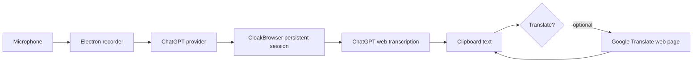

<p align="center">
  
</p>

<h1 align="center">GPT-Voice</h1>

<p align="center">
  <strong>Desktop voice transcription powered by GPT web sessions.</strong>
  <br />
  Record a thought, send it through your logged-in GPT web session, and get clean text back on your clipboard.
</p>

<p align="center">
  <a href="https://github.com/swimmwatch/gpt-voice/actions/workflows/pr-checks.yml"></a>
  <a href="https://github.com/swimmwatch/gpt-voice/actions/workflows/release-builds.yml"></a>
  
  
  
  
  
  
</p>

<p align="center">
  
</p>

## Why GPT-Voice?

GPT-Voice is a small Electron app for people who want fast voice-to-text without running a local Whisper model, downloading large checkpoints, or needing a GPU. It uses your own ChatGPT web account as the transcription backend, so the heavy speech recognition work happens remotely through the ChatGPT web app.

The result is a quiet desktop utility: press a hotkey, speak, stop, and the transcript is copied to your clipboard.

The current provider is ChatGPT, but the architecture is provider-based. The same idea can be extended to other web services that expose strong voice or language features through a browser session.

## Highlights

- **No local Whisper runtime**: no model files, no CUDA setup, no GPU requirement.
- **Uses your ChatGPT account**: sign in once through a real browser window and reuse that web session.
- **Fast remote recognition**: get high-quality transcription from the web service instead of spending local CPU/GPU resources.
- **No separate API key**: the app works through the ChatGPT web session you already use.
- **Bundled Cloak Chromium**: packaged builds include the browser runtime needed by CloakBrowser.
- **Global hotkeys**: record, stop, and cancel without leaving the app you are typing in.
- **Clipboard-first flow**: transcripts are copied immediately so you can paste anywhere.
- **Optional translation**: send the transcript through the bundled Google Translate browser page.
- **Desktop-native shell**: Electron tray app, notifications, packaged Linux AppImage/deb, plus Windows and macOS build targets.
- **CI protected**: linting, formatting, type checking, unit tests, Dependabot validation, CloakBrowser smoke tests, and package smoke builds.

## How It Works



GPT-Voice records audio locally, uses a background CloakBrowser context with your saved ChatGPT cookies, requests ChatGPT's web transcription endpoint, parses the result, and copies the text. It does not ship a speech model and does not require a separate OpenAI API key.

Availability, quotas, and behavior are determined by the web service account you use. GPT-Voice does not bypass provider-side limits; it gives you a desktop workflow around the web features available to your account.

## Install

Most users do not need Node.js, npm, Whisper, CUDA, or a local model. Download a ready-to-run build from the **Releases** page:

<p>
  <a href="https://github.com/swimmwatch/gpt-voice/releases"><strong>Download GPT-Voice from GitHub Releases</strong></a>
</p>

Choose the asset for your operating system:

| Platform | Recommended asset       | Best for                                     |
| -------- | ----------------------- | -------------------------------------------- |
| Windows  | `GPT-Voice Setup *.exe` | Normal Windows installation                  |
| macOS    | `GPT-Voice-*.dmg`       | Normal macOS drag-and-drop installation      |
| Linux    | `gpt-voice_*_amd64.deb` | Ubuntu, Debian, Linux Mint, Pop!\_OS, etc.   |
| Linux    | `GPT-Voice-*.AppImage`  | Portable Linux usage without package install |

Each release also includes platform-specific `SHA256SUMS-*.txt` files. Use them if you want to verify that the downloaded installer was not corrupted or replaced.

### Windows

Download `GPT-Voice Setup *.exe` from the latest release.

1. Double-click the installer.
2. Choose the install location if the installer asks for it.
3. Keep the desktop and Start Menu shortcuts enabled unless you prefer launching the app manually.
4. Finish the installer and start **GPT-Voice** from the Start Menu, desktop shortcut, or the final installer screen.

The Windows installer is an NSIS installer. It installs the app, bundled CloakBrowser runtime, icons, shortcuts, and an uninstaller entry in Windows settings.

To update, download the newer `GPT-Voice Setup *.exe` and run it over the existing installation.

To uninstall:

1. Open **Settings** -> **Apps** -> **Installed apps**.
2. Find **GPT-Voice**.
3. Click **Uninstall**.

Uninstalling removes the installed application files and shortcuts. Your local GPT-Voice session data is intentionally left in `%APPDATA%\GPT-Voice` so reinstalling does not force you to log in again. Delete that folder manually only if you want to remove saved sessions and settings.

### macOS

Download `GPT-Voice-*.dmg` from the latest release.

1. Open the downloaded DMG file.
2. Drag **GPT-Voice.app** into **Applications**.
3. Eject the DMG.
4. Open **GPT-Voice** from **Applications** or Spotlight.

To update, replace the existing app in **Applications** with the newer `GPT-Voice.app` from the latest DMG.

To uninstall:

1. Quit GPT-Voice from the menu bar or Activity Monitor if it is still running.
2. Delete **GPT-Voice.app** from **Applications**.

Your saved session and settings are stored separately in `~/Library/Application Support/GPT-Voice`. Delete that directory manually only if you want a completely clean uninstall.

If macOS blocks an unsigned or newly released build, verify the release checksum first. If you trust the build, Control-click **GPT-Voice.app**, choose **Open**, and confirm the prompt.

### Linux: deb Package

For Ubuntu, Debian, Linux Mint, Pop!\_OS, and similar distributions, prefer the deb package:

```bash
sudo apt install ./gpt-voice_*_amd64.deb
```

This installs GPT-Voice into `/opt/GPT-Voice`, registers the desktop launcher, installs icons, and creates the `gpt-voice` command.

If your system does not support installing a local deb with `apt install`, use:

```bash
sudo dpkg -i ./gpt-voice_*_amd64.deb
sudo apt-get install -f
```

Launch GPT-Voice from your application menu or from a terminal:

```bash
gpt-voice
```

To update, install the newer deb package over the existing one:

```bash
sudo apt install ./gpt-voice_*_amd64.deb
```

To uninstall the application package:

```bash
sudo apt remove gpt-voice
```

To remove package files and package configuration:

```bash
sudo apt purge gpt-voice
```

Your saved session and settings are user data and are not removed by `apt remove` or `apt purge`. Delete `~/.config/GPT-Voice` manually only if you want to remove saved login/session data.

### Linux: AppImage

Use the AppImage if you want a portable build or do not want to install a system package.

1. Download `GPT-Voice-*.AppImage`.
2. Make it executable:

```bash
chmod +x GPT-Voice-*.AppImage
```

3. Run it:

```bash
./GPT-Voice-*.AppImage
```

On first launch, GPT-Voice registers a local desktop launcher and icon for the current user when possible. This makes the app show up correctly in Ubuntu/GNOME launchers.

To update, download the newer AppImage, make it executable, and use it instead of the old file.

To remove the AppImage version:

1. Quit GPT-Voice.
2. Remove the desktop integration:

```bash
./GPT-Voice-*.AppImage --remove-linux-appimage-desktop-integration
```

3. Delete the AppImage file.

Your saved session and settings remain in `~/.config/GPT-Voice`. Delete that directory manually only if you want a clean reset.

### First Launch

After installation, the first run is the same on every platform:

1. Start **GPT-Voice**.
2. Click **Login to ChatGPT**.
3. Sign in with your ChatGPT account in the browser window.
4. Close the login window after ChatGPT is ready.
5. Wait until the app shows **ChatGPT: Connected**.

After that, GPT-Voice reuses the saved browser session and starts the background browser automatically.

## Run From Source

Use this path only if you want to develop GPT-Voice or build it locally.

```bash
npm ci
npm run prepare:cloakbrowser
npm run start
```

On first launch, click **Login to ChatGPT**, complete login in the browser window, then close that window. GPT-Voice saves the browser session under your user profile and starts the background browser automatically next time.

## How To Use

1. **Start the app** and click **Login to ChatGPT**.
2. **Sign in with your ChatGPT account** in the browser window that opens.
3. **Close the login window** after the account is ready. GPT-Voice stores the session locally.
4. **Press the Record hotkey** and speak normally.
5. **Press Stop**. The audio is sent through your ChatGPT web session for transcription.
6. **Paste anywhere**. The recognized text is copied to your clipboard automatically.
7. Optional: enable **Translate** and choose a target language to copy translated text instead.

## Default Controls

| Action | Default  |
| ------ | -------- |
| Record | `F9`     |
| Stop   | `F10`    |
| Cancel | `Escape` |

Shortcuts are configurable from the app window.

## Build Locally

```bash
npm run build
npm run pack
```

Platform packages:

```bash
npm run dist:linux
npm run dist:win
npm run dist:mac
```

Linux builds produce:

- `release/GPT-Voice-1.0.0.AppImage`
- `release/gpt-voice_1.0.0_amd64.deb`
- `release/linux-unpacked/gpt-voice`

## Release Automation

GitHub Actions can build installable artifacts for all supported platforms:

- Linux: AppImage and deb
- Windows: NSIS setup executable
- macOS: DMG

The `Build Release Artifacts` workflow can be started manually from GitHub Actions. It also runs automatically when a GitHub Release is published, builds every platform, uploads workflow artifacts, and attaches the installers to that release.

## Quality Checks

```bash
npm run format:check
npm run lint
npm run typecheck
npm run test:types
npm test
npm run validate:dependabot
npm run audit:prod
npm run build:prod
npm run prepare:cloakbrowser -- --target=linux
npm run smoke:cloakbrowser
```

The PR pipeline also runs package smoke builds for Linux, Windows, and macOS. GitHub Actions workflow files are checked by a dedicated Actionlint workflow.

## Project Layout

```text
src/main/        Electron main process, IPC, hotkeys, browser orchestration
src/renderer/    React UI and recording UX
scripts/         CloakBrowser preparation, smoke tests, config validation
tests/           Unit tests based on Node.js test runner
assets/          App icons and README screenshots
.github/         PR checks, release builds, Dependabot, and templates
```

## Privacy And Sessions

GPT-Voice sends recorded audio to the ChatGPT web service through your authenticated web session. Session data is stored in the native per-user app data directory for the current platform, for example `%APPDATA%\GPT-Voice` on Windows, `~/Library/Application Support/GPT-Voice` on macOS, and `~/.config/GPT-Voice` on Linux. Legacy `~/.gpt-voice` and `~/.webvoice` directories are migrated automatically when possible. Treat this data as sensitive and do not commit session files or browser cache data.

This project automates browser interactions with services you sign into. Use it responsibly and make sure your usage matches the rules of the services you connect to.

## Contributing And Security

Please read [CONTRIBUTING.md](CONTRIBUTING.md) before opening a pull request. Use a feature branch created from `main` and target `main` when the work is ready for review.

Security issues should be reported privately according to [SECURITY.md](SECURITY.md). Community participation is covered by [CODE_OF_CONDUCT.md](CODE_OF_CONDUCT.md).

## Tech Stack

- Electron
- React
- TypeScript
- CloakBrowser
- Playwright Core
- Webpack
- electron-builder

## License

GPT-Voice is licensed under the [PolyForm Noncommercial License 1.0.0](LICENSE).

You may use, copy, modify, and share the project for noncommercial purposes, including personal study, hobby projects, research, and private use. Commercial use is not permitted without a separate license from the author.

This is a source-available noncommercial license, not an OSI-approved open source license.
