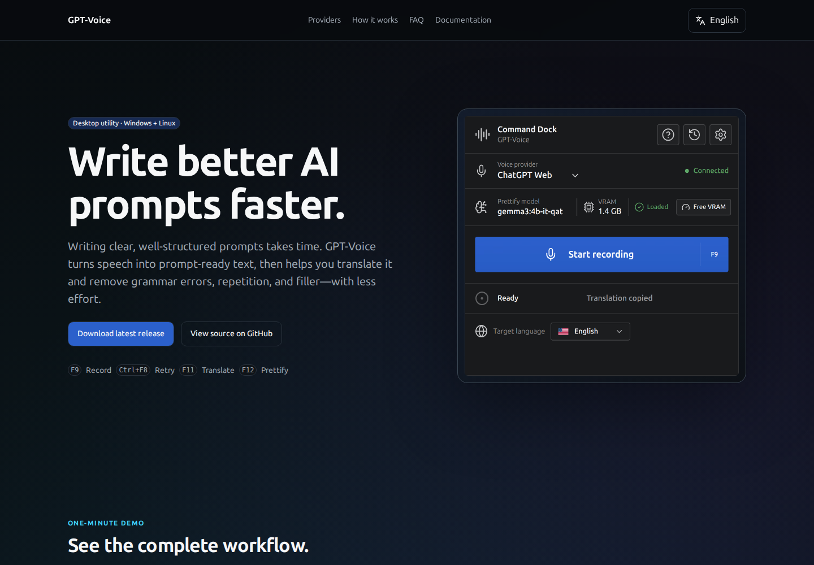
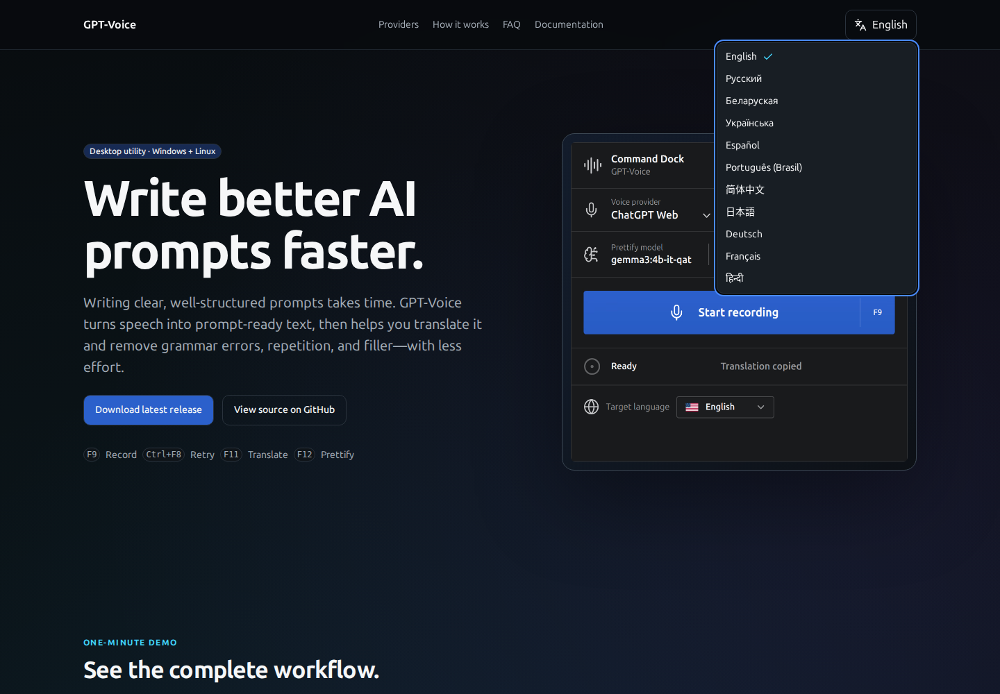
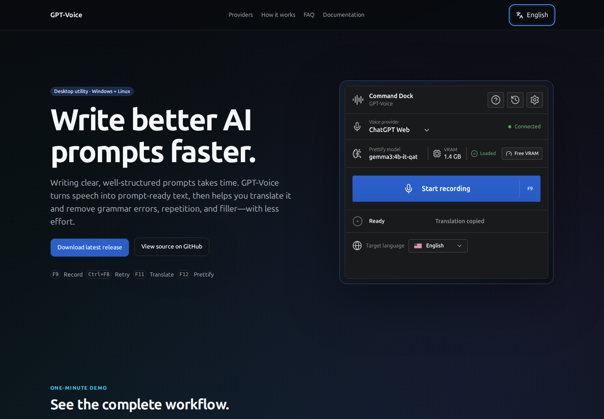
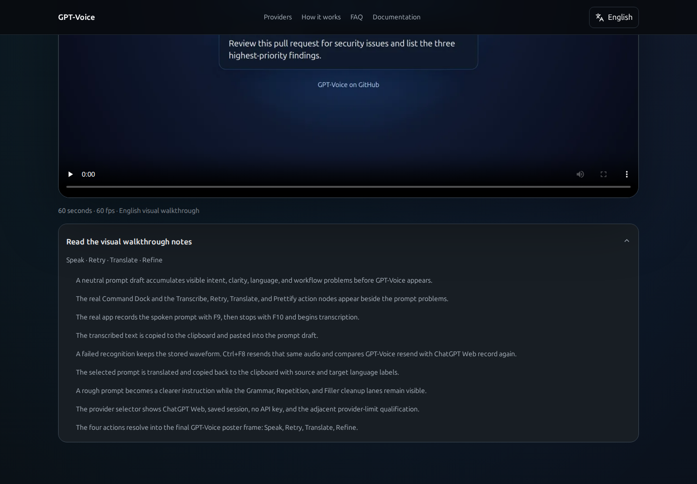
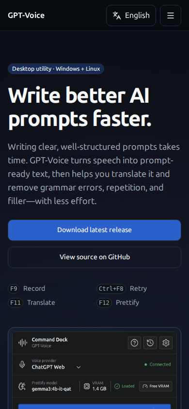
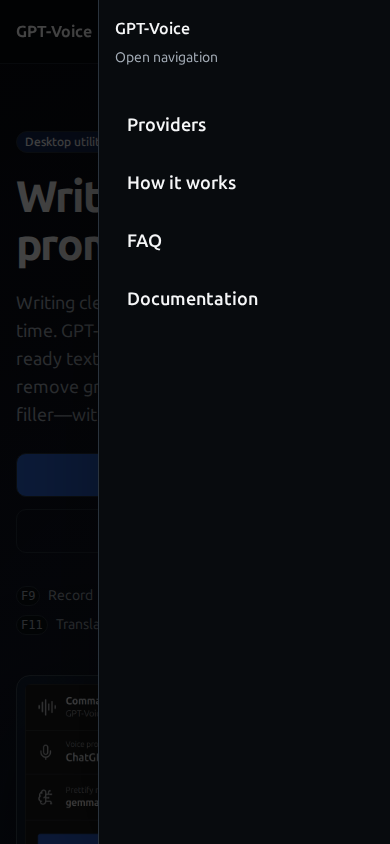
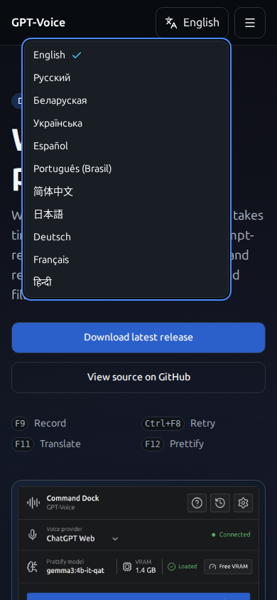
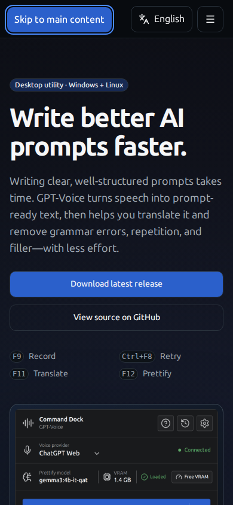
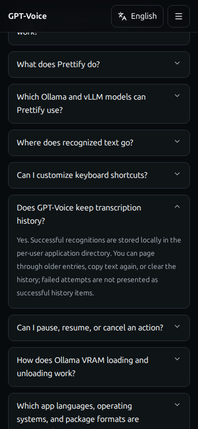

# Landing Interface Audit

## Audit scope

Audited a fresh isolated production build of the English landing page with CloakBrowser on 2026-07-16 at 1440×1000
and 390×844. The user goal was to understand the product, inspect its workflow, and reach either a download, the source
repository, or the documentation without losing visibility or orientation. The accessibility target was readable contrast,
responsive reflow, visible hover and keyboard states, and operable navigation and disclosure controls.

## Overall verdict

The landing page is visually legible and functionally intact in the tested desktop and mobile states. No element became
invisible on hover, the page did not overflow horizontally, all local assets loaded, and the fresh diagnostic tab recorded
no browser-console errors or warnings. The main usability gap is the mobile navigation drawer: it has no visible close
control, and tapping the backdrop did not dismiss it.

## Audit steps

### 1. Desktop entry and primary actions — Healthy

The hierarchy is clear, the hero text and application image are fully visible, and the two primary paths are easy to find.
Measured body-copy contrast was 8.68:1; the primary CTA measured 5.38:1. The page had no horizontal overflow, broken
images, or clipped content.

### 2. Desktop language and hover states — Mostly healthy

All eleven language entries fit inside the viewport and route to canonical localized documentation paths, including
`pt-br` and `zh-cn`. The hero secondary CTA remains readable on hover, changes to a raised dark surface, and measured
18.39:1 contrast. A sweep of 28 visible links and buttons found no disappearing text or controls.

The desktop navigation links and hero CTAs provide clear hover feedback. The language trigger, walkthrough disclosure,
twelve FAQ triggers, wordmark, final CTAs, and footer links remain readable but do not all provide a distinct visual hover
change. The language and FAQ buttons also keep the default cursor.

### 3. Demo and visual walkthrough — Healthy

The local MP4 loaded and played successfully at 1920×1080 with a duration of 60.05 seconds and no media error. The
walkthrough disclosure and all twelve FAQ disclosures opened successfully and exposed non-empty content. Expanded
walkthrough copy remains readable and visually separated from the page background.

### 4. Mobile entry and responsive reflow — Healthy

At 390×844, the hero, actions, shortcuts, and product image reflow without page-level horizontal overflow. Images load,
text remains legible, and no content is clipped. One heading reported a harmless two-pixel internal height difference
while retaining visible overflow; no visual clipping was observed.

### 5. Mobile navigation drawer — Needs improvement

The drawer fits within the viewport, exposes all four destinations, and closes when a destination is selected or Escape
is pressed. Focus returns to the `Open navigation` trigger after Escape, and selected section anchors settle below the
sticky header.

There is no visible close button. Tapping the dimmed backdrop did not dismiss the drawer in the fresh touch-equivalent
check, so a pointer or touch user who opens it unintentionally must select a destination to leave the open state. Add a
clearly labelled close control and make backdrop dismissal reliable.

### 6. Mobile language menu — Healthy with ambiguous intent

All eleven choices fit inside the 390×844 viewport without scrolling or clipping. The menu is readable and keyboard
operable.

The trigger is labelled `Language`, but every choice opens localized documentation instead of translating the landing
page. The behavior is functional, although the label suggests a page-language switch. A label such as `Documentation
language` would set a clearer expectation.

### 7. Keyboard entry and skip link — Healthy

The first Tab press exposes `Skip to main content` as a 175×42-pixel visible control with a strong focus outline. The full
DOM control sweep retained a visible computed focus change for application-owned controls.

### 8. Mobile FAQ disclosure — Healthy

FAQ rows remain distinct from the background, expanded answers are readable, and the state change is visible through the
chevron and revealed content. The tested answer fit the viewport width without clipping or horizontal scrolling.

## Highest-impact findings

1. **Mobile drawer dismissal (medium UX and accessibility risk).** The drawer has no visible close action and the backdrop
   did not dismiss it. Escape and navigation selection work, but touch users lack an explicit non-navigational exit.
2. **Language-selector intent (medium UX risk).** `Language` navigates to localized documentation rather than changing the
   landing-page language, which can surprise users.
3. **Weak hover affordance (low interaction-affordance risk).** Several links and disclosure controls remain visible but
   do not visibly respond to hover; FAQ and language controls also use the default cursor.
4. **Native video keyboard controls (low verification risk).** Chromium exposes two browser-native media-control stops
   where the video stays active but CSS `:focus-visible` is not detectable. This needs a manual keyboard and screen-reader
   check on supported platforms before being classified as an application defect.

## Confirmed functional checks

- All three desktop section links reached the intended anchors below the sticky header.
- Mobile `How it works` selection closed the drawer and reached an unobscured target.
- The walkthrough and all twelve FAQ disclosures toggled and exposed non-empty content.
- All eleven language entries resolved to the expected localized documentation routes.
- The demo MP4 loaded and played without a media error.
- A clean landing load produced zero console errors and warnings.
- Every local request returned HTTP 200: HTML, JavaScript, CSS, font, icon, poster, application image, provider icons, and
  English captions.

## Evidence limits

This is a rendered English landing-page audit at two viewports, not a claim of full WCAG conformance. External GitHub
destinations were verified but not followed. MkDocs was deliberately offline, so documentation links were validated as
canonical destinations rather than opened. Native video controls and screen-reader announcements require manual checks
on the supported operating systems and browsers.
