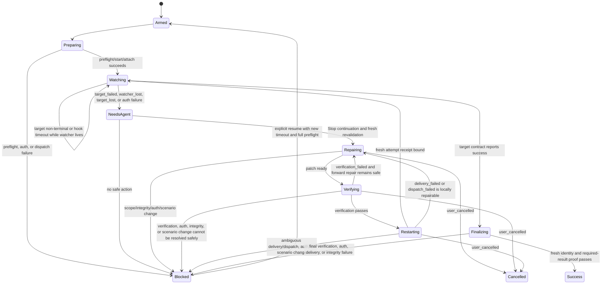

# Reusable Long-Running Process Watch Agent Skill Specification

Status: Approved

Date: 2026-08-23

Revision: 8

Spec slug: `ci-watch-agent-skill`

Decision evidence: [decisions.yaml](decisions.yaml)

Approval: completing this requested revision authorizes its approval without a
separate final-approval question. It does not authorize planning, implementation,
commits, pushes, process dispatch, publication, or deployment.

Authoritative Codex references:

- [Hooks](https://learn.chatgpt.com/docs/hooks)
- [Long-running work](https://learn.chatgpt.com/docs/long-running-work)
- [Codex App Server API overview](https://learn.chatgpt.com/docs/app-server#api-overview)

## 1. Purpose and required outcome

This specification defines a reusable project-local Codex skill named
`$watch-process`. One explicit invocation asks the agent to drive one declared
long-running target contract to success. The target may be a GitHub Actions run
or pull-request check contract, another CI system exposed through a strict CLI,
a Docker build, or another local command.

The skill is an observe-and-repair loop, not a status-only watcher. It generates
and launches `watch-process.mjs`, waits through deterministic Node.js code,
continues the same Codex chat through a synchronous `Stop` hook, diagnoses a
terminal failure, makes the smallest authorized repair, verifies it, starts or
dispatches a fresh attempt when allowed, and repeats until success or an
objective blocker.

**OUT-001:** The skill SHALL produce either:

1. verified success bound to the intended target, exact attempt and source
   revision; or
2. a safe `Blocked` or `Cancelled` result with bounded evidence, preserved work,
   and a specific action required from the user or operator.

**FLOW-001:** The normal flow SHALL be:

```text
explicit invocation and timeout decision
  → preflight and scenario validation
  → generate, digest, and launch watch-process.mjs
  → start or attach to one logical target
  → deterministic Stop-hook wait for attempt 1
  → target failure → bounded evidence → repair → local verification
  → launch detached repair-restart watcher → prove startup → re-arm Stop hook
  → finish repair turn → deterministic Stop-hook wait for the fresh attempt
  → target success → fresh final verification → success attestation → cleanup
  → one validated same-chat continuation per terminal attempt → final report
```

## 2. Canonical invariant registry

This section is the single normative owner of recurring invariants. Later
requirements reference these IDs and SHALL NOT restate or weaken them.

| ID                       | Canonical invariant                                                                                                                                                                                                                                                         |
| ------------------------ | --------------------------------------------------------------------------------------------------------------------------------------------------------------------------------------------------------------------------------------------------------------------------- |
| `SCOPE-001` / `SAFE-001` | Watch authority exists only after an explicit `$watch-process` invocation. Hooks, Goals, state files, logs, process exits, and notifications never create or broaden authority.                                                                                             |
| `NODE-002`               | Supported runtime majors are Node.js 22 and 24. A later revision may track additional upstream-supported LTS lines; unsupported versions fail preflight.                                                                                                                    |
| `PLAT-001`               | Shared library, generated watcher, hook, state, and process code support Linux, Windows, and macOS.                                                                                                                                                                         |
| `DEP-001`                | The base runtime uses Node.js built-ins and has zero third-party JavaScript runtime dependencies by default.                                                                                                                                                                |
| `SAFE-006`               | Commands are executable-plus-argument arrays passed with `shell: false`; shell parsing, interpolation, `eval`, executable scenario modules, and untrusted dynamic imports are forbidden.                                                                                    |
| `SAFE-002`               | Every observation, repair, dispatch, verification, and accepted success is bound to one immutable target identity and, for source-backed targets, the exact source SHA.                                                                                                     |
| `SAFE-004`               | Force-push, merge, rebase, amend, tag, release, publish, deploy, registry push, protected-environment approval, secret changes, arbitrary CI variables, check weakening, and destructive cleanup are forbidden unless a later explicit contract separately authorizes them. |
| `DATA-002`               | Raw output is untrusted, private, size- and time-bounded evidence. It never enters hook prompts, notifications, commits, or durable state.                                                                                                                                  |
| `GEN-001`                | Every generated `watch-process.mjs` is ignored, validated, and bound to canonical scenario, library, and script digests before execution.                                                                                                                                   |
| `DATA-003`               | Runtime state is a versioned execution cache, never authority or proof of success. Provider/local revalidation is authoritative.                                                                                                                                            |
| `CONC-001`               | One workspace/worktree has at most one active writing watcher. Concurrent work requires isolated worktrees/directories and separate chats.                                                                                                                                  |
| `TIME-001`               | Every new watch/fix invocation and every explicit `resume` requires a finite user-approved observation timeout. No silent default is allowed.                                                                                                                               |

**DEP-002:** A third-party dependency is allowed only after a later task proves
that supported Node.js built-ins cannot implement a required capability safely
and reasonably, and documents compatibility, maintenance, license, security,
transitive dependencies, install scripts, native components, update policy, and
the smallest possible scope. Convenience alone is insufficient.

**NODE-001:** Runtime modules SHALL be portable ESM using `node:` built-ins and
syntax supported by Node.js 22. They SHALL not require Electron, a browser,
Deno, Bun, transpilation, or a platform shell.

## 3. Scope and non-goals

**SCOPE-002:** The first library SHALL ship these adapters:

- `GitHubActionsProcessAdapter`;
- `GenericCiCliProcessAdapter`;
- `DockerBuildProcessAdapter`; and
- `LocalCommandProcessAdapter`.

**PROV-002:** A dedicated `GitLabCiProcessAdapter`, `glab` helper layer, GitLab
example, and GitLab-specific test suite are explicitly excluded from the base
library. A GitLab pipeline may be watched only through the provider-neutral
generic CLI contract when that contract can prove identity and success; otherwise
GitLab support requires a later specification revision.

**SCOPE-003:** The first implementation lives in GPT-Voice, but the scenario
schema, adapter contract, state model, hook protocol, and utility library remain
repository-neutral. This does not create a global daemon or published package.

**CUR-001:** GitHub support SHALL consume existing workflow contracts such as
`pr-checks.yml`, `local-whisper-packaging.yml`, and `release-builds.yml` without
requiring monitoring-specific workflow jobs or webhooks.

**COMP-001:** Observation SHALL adapt to the existing workflow, pipeline,
Dockerfile, or local command. A process definition changes only when it is itself
the smallest authorized repair.

The first version SHALL NOT:

- create a hosted monitoring service or automatically start a new IDE/chat
  session after the original host closes;
- implement PID-only attachment to an arbitrary operating-system process;
- infer commands, permissions, repair scope, or success from output;
- modify GPT-Voice application settings, user data, IPC, providers, installers,
  or runtime behavior merely to provide watching; or
- perform any action prohibited by `SAFE-004`.

## 4. Invocation, timeout, Goal, and operator surface

### 4.1 Invocation and one logical target

**IFACE-001:** Canonical invocations are:

```text
$watch-process scenario=<scenario-id> target=<validated-selector>
$watch-process scenario=<scenario-id>
$watch-process status
$watch-process resume
$watch-process cancel
```

Natural-language input is normalized into schema fields and never copied into a
command. One invocation identifies exactly one logical target contract.

**IFACE-002:** A target may be omitted only when the scenario authorizes exact-
source attachment from the current workspace identity, a safe idempotent start,
or a safe idempotent dispatch. Attachment is observation-only: it SHALL derive
exactly one provider target from the adapter's declared workspace identity and
then prove that target's source SHA. It SHALL NOT enumerate candidates by SHA.
A supplied selector SHALL be validated against the adapter,
repository/project/workspace, allowed process definition, and identity rules
before observation or mutation.

The explicit live invocation names the reviewed scenario, logical target, and
timeout. It authorizes only that scenario's declared normal start, retry,
provider dispatch, and—when `pushCurrentUpstream=true`—receipt-bound normal
current-upstream push throughout the bounded repair loop. The agent SHALL NOT
request repeated approval before each such declared retry, dispatch, or normal
push. A different target requires a separate explicit invocation. Remote target
cancellation, repository/ruleset settings, and all actions covered by
`SAFE-004` remain separate authority gates or forbidden.

A pull-request check contract is one logical target even though its membership
may include multiple workflow runs, run attempts, check suites, external commit
statuses, jobs, and required checks. Its immutable aggregate identity is the
repository, pull-request number, exact head SHA, ruleset/required-check contract
digest, and watch generation. All members must belong to that identity; unrelated
runs are never folded into it.

For a GitHub pull-request scenario with an omitted selector, the adapter SHALL
use the workspace's current branch through `gh pr view`; it SHALL NOT enumerate
or search pull requests by commit. The resolved PR must be open and its head
must equal the committed exact source SHA. This permits a Watch invocation
created after commit/push to attach to an already-running pipeline without
dispatching another workflow.

### 4.2 Required timeout question

**TIME-002:** Before arming a new invocation or `resume`, the agent SHALL ask in
the user's language which timeout to apply and briefly explain that it prevents
indefinite waiting for a stalled, lost, or unexpectedly slow target. The agent
SHALL recommend expected duration plus a practical margin—for example, about 40
minutes for a CI pipeline that normally takes 30 minutes.

The approved duration is normalized to positive integer seconds, checked against
the scenario's minimum and maximum, and applied separately to every attempt in
that autonomous repair loop. The same value may be reused after repairs without
asking before every retry. A new invocation, explicit `resume`, or requested
change requires a new question. Missing, zero, negative, malformed, infinite, or
out-of-range values fail preflight. Timeout expiry does not authorize target
cancellation.

### 4.3 Lifecycle commands and Goal

**IFACE-003:** `status` returns a sanitized summary of scenario, phase, target
identity, attempt, elapsed time, deadline, outcome, receipts, and blocker.
`resume` performs full preflight and asks for a new timeout. `cancel` stops only
watcher-owned local processes when safe and never cancels a remote target unless
the scenario and invocation explicitly authorize that operation.

The tracked operator entrypoint SHALL expose the exact actions `start`,
`status`, `continuation`, `wait`, `resume`, `cancel`, `repair-begin`,
`write-begin`, `write-complete`, `repair-verify`, and `repair-restart`. It SHALL
validate the complete action and option set before constructing runtime
services, emit only sanitized JSON on success and a stable error code on
failure, and route repair actions through the production repair controller.
`continuation` accepts only
`--watch-id <id> --generation <n> --outcome <normalized-outcome>`, validates the
persisted acknowledgement and selected session/workspace/watch identity, and
returns only `report-success`, `repair`, `report-blocked`, or
`report-cancelled` plus sanitized status. `wait --watch-id <id>` blocks inside
Node.js for the remaining approved attempt window and returns the same action
contract without model calls. `resume` SHALL preserve the original input and
logical-target identity while replacing only the newly approved timeout and
deadline; it SHALL reject already successful or cancelled watches.

**OPS-001:** The supported operator surface is Codex in the IDE extension on a
connected local host. ChatGPT Desktop is not required.

**OPS-004:** Codex Goal is optional, user-owned UX. A user may create or manage a
Goal separately, including through documented user commands or App Server goal
methods. The skill and hook SHALL work without a Goal and SHALL NOT require or
assume access to `thread/goal/set`, `get`, or `clear`.

**SAFE-008:** The skill, watcher, and hook SHALL NOT inspect, create, replace,
clear, or complete any Goal. Goal state is absent from the documented Stop-hook
input and does not grant watch authority.

## 5. Deployment footprint and architecture

**OPS-002:** The project-local footprint SHALL be:

```text
.agents/skills/watch-process/
  SKILL.md
  agents/openai.yaml
  scripts/
    process-watch.mjs
    process-watch-stop-hook.mjs
    lib/
  references/
    process-watch-scenario.schema.json
    scenario-authoring.md

.codex/
  hooks.json
  process-watch/scenarios/
    <scenario-id>.watch.json
  runtime/process-watch/
    process-watch-selection/
      current-watch.json
    <watch-id>/
      watch-process.mjs
      state.json
      lock.json
      events.jsonl
      evidence/
```

**DATA-001:** `.codex/runtime/process-watch/` is ignored by Git. Generated
scripts, locks, state, evidence, receipts, and journals SHALL never enter a
repair commit.

**ARCH-001:** Cohesive state-owning components SHALL include:

| Component                    | Responsibility                                                                               |
| ---------------------------- | -------------------------------------------------------------------------------------------- |
| `ProcessWatchOrchestrator`   | Own one lifecycle, transitions, repair handoff, and attempt binding.                         |
| `WatchScenarioRegistry`      | Load, migrate, validate, normalize, and digest scenarios.                                    |
| `ProcessAdapter`             | Preflight, start/attach, observe, evidence, identity, restart, and declared cancel contract. |
| `AtomicStateStore`           | Lock, atomic state, monotonic generation, and compare-and-swap.                              |
| `ManagedProcessRunner`       | Cross-platform `shell: false` child lifecycle and owned-process cleanup.                     |
| `BoundedEvidenceBuffer`      | Private bounded raw output and sanitized inspection.                                         |
| `OperationReceiptStore`      | Idempotent start/delivery intent, provider reconciliation, and receipts.                     |
| `AuditJournal`               | Bounded sanitized event journal and final attestation.                                       |
| `ProcessWatchSelectionStore` | One-shot armed selection for one session/workspace/watch; consumed before continuation.      |
| `ProcessWatchTerminalWaiter` | Shared deadline-aware, model-free terminal wait for the Stop hook and operator.              |

Stateful services own their invariants and receive dependencies through
constructors. Truly stateless validation and normalization may remain pure
functions. No module-level mutable runtime instance or pass-through wrapper is
allowed.

**LIB-001:** The small Node.js library SHALL expose the components above through
stable typed contracts so generated watchers compose behavior rather than copy
it.

**LIB-002:** Focused helpers or natural owner methods SHALL cover executable/arg
validation, deadline-aware polling with backoff, terminal normalization, evidence
sanitization, failure fingerprinting, digesting, path-glob validation,
substitution, and schema-valid hook output.

**ADAPT-001:** Only the four adapters in `SCOPE-002` ship in the first version.

**ADAPT-002:** Every adapter implements `preflight`, `start` or `attach`,
`observe`, `collectEvidence`, `identity`, declared `restart`, and declared
`cancel`. Unsupported capabilities fail preflight, and provider-specific data
does not escape the adapter except as normalized identities, observations,
evidence, outcomes, and receipts.

**COMP-002:** Shared behavior is tested on the `NODE-002` × `PLAT-001` matrix.
Windows-specific hook commands use `commandWindows`; filesystem and process code
uses Node abstractions and accounts for drive letters, Unicode, reparse points,
atomic replacement, limited signals, process trees, and PID reuse.

**COMP-003:** Project-local installation SHALL be documented and reversible
without modifying global Codex settings.

**COMP-004:** Public skill name, scenario format, adapter contract, and generated
script name remain repository-neutral and reusable.

## 6. Scenario contract

### 6.1 Files, schema version, and migration

**ARCH-002:** Every scenario SHALL be versioned, declarative,
machine-validated, non-executable, and closed to unknown capabilities. It owns
target selectors and identity, success predicates, timing bounds, evidence
limits, repair scope, verification, delivery strategy, adapter configuration,
and additional forbidden actions, subject to the canonical invariants.

**SCHEMA-001:** Scenarios are non-executable UTF-8 JSON files named
`.codex/process-watch/scenarios/<scenario-id>.watch.json`. They validate against
the tracked Draft 2020-12 schema
`.agents/skills/watch-process/references/process-watch-scenario.schema.json`.
The schema ID is `urn:gpt-voice:watch-process:scenario:1`; the scenario version is
the required string `1.0.0`.

**SCHEMA-002:** Unknown fields are rejected. The loader accepts only the current
major version. Additive minor/patch revisions may provide deterministic defaults
through a tracked migrator; migrations validate both input and output, never
execute scenario content, never rewrite the tracked source during invocation, and
record old/new digests. A major migration requires a later specification. Missing
versions and ambiguous legacy files fail preflight.

**SCHEMA-003:** The normative JSON Schema is:

```json
{
  "$schema": "https://json-schema.org/draft/2020-12/schema",
  "$id": "urn:gpt-voice:watch-process:scenario:1",
  "type": "object",
  "additionalProperties": false,
  "required": [
    "$schema",
    "schemaVersion",
    "id",
    "adapter",
    "target",
    "success",
    "timing",
    "evidence",
    "repair",
    "verification",
    "delivery",
    "forbiddenActions",
    "adapterConfig"
  ],
  "properties": {
    "$schema": { "const": "urn:gpt-voice:watch-process:scenario:1" },
    "schemaVersion": { "const": "1.0.0" },
    "id": { "type": "string", "pattern": "^[a-z][a-z0-9-]{2,63}$" },
    "description": { "type": "string", "maxLength": 300, "default": "" },
    "adapter": { "enum": ["github-actions", "generic-ci-cli", "docker-build", "local-command"] },
    "target": { "$ref": "#/$defs/target" },
    "success": { "$ref": "#/$defs/success" },
    "timing": { "$ref": "#/$defs/timing" },
    "evidence": { "$ref": "#/$defs/evidence" },
    "repair": { "$ref": "#/$defs/repair" },
    "verification": { "type": "array", "minItems": 1, "maxItems": 20, "items": { "$ref": "#/$defs/command" } },
    "delivery": { "$ref": "#/$defs/delivery" },
    "forbiddenActions": {
      "type": "array",
      "uniqueItems": true,
      "items": { "type": "string", "pattern": "^[a-z][a-z0-9-]{1,63}$" }
    },
    "adapterConfig": { "type": "object" }
  },
  "allOf": [
    {
      "if": { "properties": { "adapter": { "const": "github-actions" } }, "required": ["adapter"] },
      "then": { "properties": { "adapterConfig": { "$ref": "#/$defs/githubActionsAdapterConfig" } } }
    },
    {
      "if": { "properties": { "adapter": { "const": "generic-ci-cli" } }, "required": ["adapter"] },
      "then": { "properties": { "adapterConfig": { "$ref": "#/$defs/genericCiAdapterConfig" } } }
    },
    {
      "if": { "properties": { "adapter": { "const": "docker-build" } }, "required": ["adapter"] },
      "then": { "properties": { "adapterConfig": { "$ref": "#/$defs/dockerBuildAdapterConfig" } } }
    },
    {
      "if": { "properties": { "adapter": { "const": "local-command" } }, "required": ["adapter"] },
      "then": { "properties": { "adapterConfig": { "$ref": "#/$defs/localCommandAdapterConfig" } } }
    }
  ],
  "$defs": {
    "target": {
      "type": "object",
      "additionalProperties": false,
      "required": ["selectorKinds", "identityFields"],
      "properties": {
        "selectorKinds": {
          "type": "array",
          "minItems": 1,
          "uniqueItems": true,
          "items": { "enum": ["run-url", "pull-request-url", "provider-id", "start"] }
        },
        "identityFields": {
          "type": "array",
          "minItems": 1,
          "uniqueItems": true,
          "items": { "type": "string", "pattern": "^[a-z][A-Za-z0-9]{1,63}$" }
        },
        "requireExactSourceRevision": { "type": "boolean", "default": true }
      }
    },
    "success": {
      "type": "object",
      "additionalProperties": false,
      "required": ["requiredChecksMode", "requiredChecks", "requiredOutputs", "allowedSkippedChecks"],
      "properties": {
        "requiredChecksMode": { "enum": ["provider-required", "listed", "none"] },
        "requiredChecks": { "type": "array", "uniqueItems": true, "items": { "type": "string", "minLength": 1 } },
        "requiredOutputs": { "type": "array", "uniqueItems": true, "items": { "type": "string", "minLength": 1 } },
        "allowedSkippedChecks": { "type": "array", "uniqueItems": true, "items": { "type": "string", "minLength": 1 } }
      }
    },
    "timing": {
      "type": "object",
      "additionalProperties": false,
      "required": ["expectedDurationSeconds", "minTimeoutSeconds", "maxTimeoutSeconds", "poll"],
      "properties": {
        "expectedDurationSeconds": { "type": "integer", "minimum": 1, "maximum": 604800 },
        "minTimeoutSeconds": { "type": "integer", "minimum": 1, "maximum": 604800 },
        "maxTimeoutSeconds": { "type": "integer", "minimum": 1, "maximum": 604800 },
        "poll": {
          "type": "object",
          "additionalProperties": false,
          "required": ["initialSeconds", "maxSeconds", "multiplier"],
          "properties": {
            "initialSeconds": { "type": "integer", "minimum": 1, "maximum": 300 },
            "maxSeconds": { "type": "integer", "minimum": 1, "maximum": 900 },
            "multiplier": { "type": "number", "minimum": 1, "maximum": 4 }
          }
        }
      }
    },
    "evidence": {
      "type": "object",
      "additionalProperties": false,
      "required": ["maxBytesPerAttempt", "maxFailures", "ttlSeconds"],
      "properties": {
        "maxBytesPerAttempt": { "type": "integer", "minimum": 1024, "maximum": 10485760 },
        "maxFailures": { "type": "integer", "minimum": 1, "maximum": 100 },
        "ttlSeconds": { "type": "integer", "minimum": 60, "maximum": 604800 }
      }
    },
    "repair": {
      "type": "object",
      "additionalProperties": false,
      "required": ["includeGlobs"],
      "properties": {
        "includeGlobs": {
          "type": "array",
          "minItems": 1,
          "maxItems": 100,
          "uniqueItems": true,
          "items": { "type": "string", "minLength": 1, "maxLength": 200 }
        },
        "excludeGlobs": {
          "type": "array",
          "maxItems": 100,
          "uniqueItems": true,
          "default": [],
          "items": { "type": "string", "minLength": 1, "maxLength": 200 }
        },
        "allowCreate": { "type": "boolean", "default": false },
        "allowDelete": { "type": "boolean", "default": false },
        "maxFiles": { "type": "integer", "minimum": 1, "maximum": 500, "default": 50 },
        "maxBytesChanged": { "type": "integer", "minimum": 1, "maximum": 10485760, "default": 1048576 }
      }
    },
    "command": {
      "type": "object",
      "additionalProperties": false,
      "required": ["executable", "args"],
      "properties": {
        "executable": { "type": "string", "pattern": "^[A-Za-z0-9._+/-]{1,200}$" },
        "args": { "type": "array", "maxItems": 200, "items": { "type": "string", "maxLength": 1000 } },
        "cwd": { "type": "string", "default": ".", "maxLength": 200 },
        "env": {
          "type": "array",
          "default": [],
          "maxItems": 100,
          "uniqueItems": true,
          "items": { "type": "string", "pattern": "^[A-Z][A-Z0-9_]{0,63}$" }
        }
      }
    },
    "delivery": {
      "type": "object",
      "additionalProperties": false,
      "required": ["strategy"],
      "properties": {
        "strategy": { "enum": ["no-restart", "local-restart", "provider-retry", "provider-dispatch", "git-delivery"] },
        "pushCurrentUpstream": { "type": "boolean", "default": false }
      }
    },
    "dispatch": {
      "type": "object",
      "additionalProperties": false,
      "required": ["inputs"],
      "properties": {
        "enabled": { "type": "boolean", "default": false },
        "workflow": { "type": "string" },
        "inputs": {
          "type": "object",
          "additionalProperties": {
            "anyOf": [{ "type": "string" }, { "type": "boolean" }, { "type": "number" }]
          }
        },
        "idempotencyInput": { "type": "string" }
      }
    },
    "githubActionsAdapterConfig": {
      "type": "object",
      "additionalProperties": false,
      "required": ["repository", "mode"],
      "properties": {
        "repository": { "type": "string", "pattern": "^[A-Za-z0-9_.-]+/[A-Za-z0-9_.-]+$" },
        "mode": { "enum": ["run", "pull-request-contract"] },
        "workflowAllowlist": {
          "type": "array",
          "uniqueItems": true,
          "items": { "type": "string", "minLength": 1 }
        },
        "dispatch": { "$ref": "#/$defs/dispatch" }
      }
    },
    "genericCommands": {
      "type": "object",
      "additionalProperties": false,
      "required": ["observe", "evidence"],
      "properties": {
        "start": { "$ref": "#/$defs/command" },
        "observe": { "$ref": "#/$defs/command" },
        "evidence": { "$ref": "#/$defs/command" },
        "cancel": { "$ref": "#/$defs/command" }
      }
    },
    "statusMap": {
      "type": "object",
      "additionalProperties": false,
      "required": ["running", "succeeded", "failed", "cancelled"],
      "properties": {
        "running": { "type": "array", "items": { "type": "string" } },
        "succeeded": { "type": "array", "items": { "type": "string" } },
        "failed": { "type": "array", "items": { "type": "string" } },
        "cancelled": { "type": "array", "items": { "type": "string" } }
      }
    },
    "genericCiAdapterConfig": {
      "type": "object",
      "additionalProperties": false,
      "required": ["providerId", "commands", "statusMap"],
      "properties": {
        "providerId": { "type": "string", "pattern": "^[a-z][a-z0-9-]{1,31}$" },
        "commands": { "$ref": "#/$defs/genericCommands" },
        "statusMap": { "$ref": "#/$defs/statusMap" }
      }
    },
    "dockerBuildAdapterConfig": {
      "type": "object",
      "additionalProperties": false,
      "required": ["buildCommand"],
      "properties": {
        "buildCommand": { "$ref": "#/$defs/command" },
        "imageVerification": {
          "type": "array",
          "default": [],
          "items": { "$ref": "#/$defs/command" }
        }
      }
    },
    "localCommandAdapterConfig": {
      "type": "object",
      "additionalProperties": false,
      "required": ["startCommand", "successExitCodes"],
      "properties": {
        "startCommand": { "$ref": "#/$defs/command" },
        "successExitCodes": {
          "type": "array",
          "minItems": 1,
          "uniqueItems": true,
          "items": { "type": "integer", "minimum": 0, "maximum": 255 }
        }
      }
    }
  }
}
```

Required fields are exactly those in the root and nested `required` arrays.
Optional defaults are: `description=""`,
`target.requireExactSourceRevision=true`, `repair.excludeGlobs=[]`,
`repair.allowCreate=false`, `repair.allowDelete=false`, `repair.maxFiles=50`,
`repair.maxBytesChanged=1048576`, command `cwd="."`, command `env=[]`,
`delivery.pushCurrentUpstream=false`, `dispatch.enabled=false`, and
`imageVerification=[]`. Defaults are applied only after schema validation and
are included in the canonical scenario digest.

Command `env` is an uppercase environment-name allowlist array, never a map of
values. Only already inherited variables whose names are declared may reach the
child process. Credential values, arbitrary environment assignments, and
environment snapshots SHALL be rejected and SHALL NOT be serialized into a
scenario, invocation, state, receipt, audit event, or attestation.

### 6.2 Substitutions, paths, and repair scope

Dynamic command arguments use this exact grammar:

```ebnf
argument     = literal | substitution ;
substitution = "{{", namespace, ".", name, { ".", name }, "}}" ;
namespace    = "watch" | "workspace" | "invocation" | "target" | "attempt" ;
name         = lower, { lower | digit | "_" } ;
lower        = "a" … "z" ;
digit        = "0" … "9" ;
literal      = JSON string containing neither "{{" nor "}}" ;
```

An argument is either one literal or one whole-token substitution; concatenated
templates are invalid. The only first-version substitutions are
`{{watch.id}}`, `{{workspace.root}}`, `{{invocation.timeout_seconds}}`,
`{{target.selector}}`, `{{target.id}}`, `{{target.source_sha}}`, and
`{{attempt.number}}`. Each has an adapter-specific type and allowlist validation.
Environment variables, logs, provider output, state fields not listed here, and
nested template evaluation are forbidden.

Repair globs use workspace-relative POSIX separators on every platform. Valid
tokens are ordinary characters, `?`, `*` within one segment, and `**` only as an
entire segment. Absolute paths, drive/UNC prefixes, backslashes, NUL/control
characters, empty/`.`/`..` segments, braces, character classes, extglobs,
negation, and more than 100 patterns are invalid. Matching occurs after path
normalization and before following symlinks/reparse points; resolved paths must
remain inside the workspace. Excludes win. A glob selects candidates but never
grants authority outside the canonical invariants.

**SAFE-007:** `repair` is a closed capability: only included and non-excluded
paths may change; creation/deletion require their booleans; file and byte caps
apply to the complete patch. Scenario data never creates additional authority.

### 6.3 Complete scenario examples

GitHub pull-request aggregate:

```json
{
  "$schema": "urn:gpt-voice:watch-process:scenario:1",
  "schemaVersion": "1.0.0",
  "id": "github-pr-required-checks",
  "description": "Watch every required check for one PR head SHA.",
  "adapter": "github-actions",
  "target": {
    "selectorKinds": ["pull-request-url", "start"],
    "identityFields": ["repository", "pullRequestNumber", "headSha", "requiredContractDigest"],
    "requireExactSourceRevision": true
  },
  "success": {
    "requiredChecksMode": "provider-required",
    "requiredChecks": [],
    "requiredOutputs": [],
    "allowedSkippedChecks": []
  },
  "timing": {
    "expectedDurationSeconds": 1800,
    "minTimeoutSeconds": 600,
    "maxTimeoutSeconds": 7200,
    "poll": { "initialSeconds": 10, "maxSeconds": 60, "multiplier": 1.5 }
  },
  "evidence": { "maxBytesPerAttempt": 1048576, "maxFailures": 20, "ttlSeconds": 86400 },
  "repair": {
    "includeGlobs": ["src/**", "tests/**", "scripts/**", ".github/workflows/**"],
    "excludeGlobs": ["dist/**", "node_modules/**"],
    "allowCreate": true,
    "allowDelete": false,
    "maxFiles": 50,
    "maxBytesChanged": 1048576
  },
  "verification": [{ "executable": "npm", "args": ["run", "test:types"], "cwd": ".", "env": [] }],
  "delivery": { "strategy": "git-delivery", "pushCurrentUpstream": true },
  "forbiddenActions": ["force-push", "merge", "release", "publish", "deploy"],
  "adapterConfig": {
    "repository": "owner/repository",
    "mode": "pull-request-contract",
    "workflowAllowlist": ["pr-checks.yml"],
    "dispatch": { "enabled": false, "inputs": {} }
  }
}
```

Generic CI CLI:

```json
{
  "$schema": "urn:gpt-voice:watch-process:scenario:1",
  "schemaVersion": "1.0.0",
  "id": "generic-ci-run",
  "description": "Watch one provider run through a strict JSON CLI.",
  "adapter": "generic-ci-cli",
  "target": {
    "selectorKinds": ["provider-id"],
    "identityFields": ["providerId", "targetId", "attempt", "sourceSha"],
    "requireExactSourceRevision": true
  },
  "success": {
    "requiredChecksMode": "listed",
    "requiredChecks": ["build", "test"],
    "requiredOutputs": [],
    "allowedSkippedChecks": []
  },
  "timing": {
    "expectedDurationSeconds": 1200,
    "minTimeoutSeconds": 300,
    "maxTimeoutSeconds": 7200,
    "poll": { "initialSeconds": 10, "maxSeconds": 90, "multiplier": 2 }
  },
  "evidence": { "maxBytesPerAttempt": 524288, "maxFailures": 10, "ttlSeconds": 43200 },
  "repair": {
    "includeGlobs": ["src/**", "tests/**", "ci/**"],
    "excludeGlobs": ["dist/**"],
    "allowCreate": true,
    "allowDelete": false,
    "maxFiles": 30,
    "maxBytesChanged": 524288
  },
  "verification": [{ "executable": "npm", "args": ["test"], "cwd": ".", "env": [] }],
  "delivery": { "strategy": "provider-dispatch", "pushCurrentUpstream": false },
  "forbiddenActions": ["force-push", "release", "publish", "deploy"],
  "adapterConfig": {
    "providerId": "acme-ci",
    "commands": {
      "start": {
        "executable": "acme-ci",
        "args": ["run", "start", "--source", "{{target.source_sha}}", "--request-id", "{{watch.id}}"],
        "cwd": ".",
        "env": []
      },
      "observe": { "executable": "acme-ci", "args": ["run", "show", "{{target.id}}", "--json"], "cwd": ".", "env": [] },
      "evidence": {
        "executable": "acme-ci",
        "args": ["run", "logs", "{{target.id}}", "--failed-only"],
        "cwd": ".",
        "env": []
      }
    },
    "statusMap": {
      "running": ["queued", "running"],
      "succeeded": ["passed"],
      "failed": ["failed"],
      "cancelled": ["cancelled"]
    }
  }
}
```

Docker build:

```json
{
  "$schema": "urn:gpt-voice:watch-process:scenario:1",
  "schemaVersion": "1.0.0",
  "id": "local-docker-build",
  "description": "Build and smoke-test one local image.",
  "adapter": "docker-build",
  "target": {
    "selectorKinds": ["start"],
    "identityFields": ["inputDigest", "commandDigest", "attempt", "processStartToken"],
    "requireExactSourceRevision": false
  },
  "success": {
    "requiredChecksMode": "none",
    "requiredChecks": [],
    "requiredOutputs": ["local-image"],
    "allowedSkippedChecks": []
  },
  "timing": {
    "expectedDurationSeconds": 900,
    "minTimeoutSeconds": 300,
    "maxTimeoutSeconds": 3600,
    "poll": { "initialSeconds": 2, "maxSeconds": 15, "multiplier": 1.5 }
  },
  "evidence": { "maxBytesPerAttempt": 2097152, "maxFailures": 10, "ttlSeconds": 21600 },
  "repair": {
    "includeGlobs": ["Dockerfile", "docker/**", "src/**", "package*.json"],
    "excludeGlobs": ["node_modules/**", "dist/**"],
    "allowCreate": true,
    "allowDelete": false,
    "maxFiles": 30,
    "maxBytesChanged": 1048576
  },
  "verification": [{ "executable": "npm", "args": ["run", "test:types"], "cwd": ".", "env": [] }],
  "delivery": { "strategy": "local-restart", "pushCurrentUpstream": false },
  "forbiddenActions": ["registry-push", "release", "publish", "deploy"],
  "adapterConfig": {
    "buildCommand": {
      "executable": "docker",
      "args": ["build", "--tag", "{{watch.id}}", "{{workspace.root}}"],
      "cwd": ".",
      "env": []
    },
    "imageVerification": [
      { "executable": "docker", "args": ["image", "inspect", "{{watch.id}}"], "cwd": ".", "env": [] }
    ]
  }
}
```

Local command:

```json
{
  "$schema": "urn:gpt-voice:watch-process:scenario:1",
  "schemaVersion": "1.0.0",
  "id": "local-long-test",
  "description": "Run and repair one watcher-owned local test command.",
  "adapter": "local-command",
  "target": {
    "selectorKinds": ["start"],
    "identityFields": ["commandDigest", "inputDigest", "attempt", "processStartToken"],
    "requireExactSourceRevision": false
  },
  "success": { "requiredChecksMode": "none", "requiredChecks": [], "requiredOutputs": [], "allowedSkippedChecks": [] },
  "timing": {
    "expectedDurationSeconds": 600,
    "minTimeoutSeconds": 120,
    "maxTimeoutSeconds": 3600,
    "poll": { "initialSeconds": 1, "maxSeconds": 10, "multiplier": 1.5 }
  },
  "evidence": { "maxBytesPerAttempt": 1048576, "maxFailures": 20, "ttlSeconds": 21600 },
  "repair": {
    "includeGlobs": ["src/**", "tests/**", "scripts/**"],
    "excludeGlobs": ["dist/**"],
    "allowCreate": true,
    "allowDelete": false,
    "maxFiles": 40,
    "maxBytesChanged": 1048576
  },
  "verification": [{ "executable": "npm", "args": ["run", "test:types"], "cwd": ".", "env": [] }],
  "delivery": { "strategy": "local-restart", "pushCurrentUpstream": false },
  "forbiddenActions": ["force-push", "release", "publish", "deploy"],
  "adapterConfig": {
    "startCommand": { "executable": "node", "args": ["scripts/long-test.mjs"], "cwd": ".", "env": [] },
    "successExitCodes": [0]
  }
}
```

## 7. Generated watcher and provider behavior

**GEN-002:** After preflight, the agent generates
`.codex/runtime/process-watch/<watch-id>/watch-process.mjs`, validates syntax and
imports, persists canonical digests, launches it before ending the active work,
and proves heartbeat plus target binding. Launch failure is repaired in the same
turn; the Stop hook is not a recovery mechanism for a watcher that never started.

**PROV-001:** GitHub run identity includes repository, workflow/event, run ID,
attempt, and exact SHA. When GitHub exposes provider-required checks, PR
aggregate success requires every one for the exact head SHA. When neither
branch protection nor active rulesets declares required checks, the adapter
falls back to the discovered exact-SHA pipeline: every observed workflow must
be allowlisted, at least one workflow must exist, linked GitHub Actions job
checks are evaluated through their workflow run, and external check runs plus
commit statuses remain members. Success requires two consecutive observations
with the same member set. Unknown workflows, missing identity links, duplicate
members, pending, cancelled, neutral, stale, failed, or unexpectedly skipped
members fail closed.

**PROV-003:** Generic CI commands must emit schema-validated bounded JSON with an
exact identity and status mapping. If a provider cannot prove target identity,
terminal state, and required members without interpreting arbitrary output as
code, it is unsupported.

**PROV-004:** Docker identity includes normalized executable/args, workspace and
input digests, attempt, and owned process start token. Success requires exit code
zero and every declared image/smoke verification. Registry push remains governed
by `SAFE-004`.

**PROV-005:** Local commands run in a validated directory with an explicit
environment allowlist. Only watcher-owned process trees may be terminated.
Identity never relies on PID alone; success requires declared exit and output
verification.

### 7.1 Idempotent remote start and dispatch

**FLOW-005 / GIT-001:** Before a remote start, retry, or dispatch, the
orchestrator atomically records an intent containing watch ID, generation,
scenario digest, source SHA, operation kind, fixed inputs digest, and a
deterministic operation key. The adapter uses a provider idempotency key or a
scenario-declared correlation input and then records the returned target ID and
attempt as a receipt.

**GIT-002:** After a timeout, network error, watcher crash, or ambiguous provider
response, the adapter SHALL reconcile by operation key and exact identity before
retrying. Exactly one matching target attaches idempotently; zero permits one new
attempt; multiple matches or an unprovable result produce `dispatch_failed` and
`Blocked`. A provider with neither idempotency nor reliable reconciliation cannot
use automatic dispatch. Delivery push similarly compares expected local and
remote heads before and after the operation and never blindly repeats an
ambiguous push.

## 8. State machine, outcomes, and Stop hook

### 8.1 State machine

**FLOW-002:** Runtime phases and required transitions are:



`Preparing`, `Repairing`, `Verifying`, `Restarting`, and `Finalizing` therefore
all have explicit `Blocked` exits. Cancel during `Repairing`, `Verifying`, or
`Restarting` stops at the next safe boundary, preserves the current patch and
ambiguous operation receipt, and never implies rollback. A scenario/script/library
digest change during repair produces `scenario_changed` and `Blocked` before any
further write or dispatch.

**FAIL-002:** Normalized outcomes are distinct:

| Outcome                 | Meaning                                                                             |
| ----------------------- | ----------------------------------------------------------------------------------- |
| `running`               | Exact target is non-terminal.                                                       |
| `succeeded`             | Exact target and every required result passed fresh validation.                     |
| `target_failed`         | Target completed unsuccessfully and needs diagnosis.                                |
| `verification_failed`   | Agent's local verification failed; repair forward if safe.                          |
| `delivery_failed`       | Git/local delivery failed or is ambiguous.                                          |
| `dispatch_failed`       | Provider start/retry/dispatch failed or is ambiguous.                               |
| `authentication_failed` | Required existing authentication expired or became invalid.                         |
| `watcher_lost`          | Watcher crashed, disappeared, or stopped heartbeating.                              |
| `target_lost`           | Target can no longer be found or its immutable identity cannot be proven.           |
| `user_cancelled`        | User cancelled the watch session.                                                   |
| `target_cancelled`      | Remote/local target was cancelled independently or by separately authorized action. |
| `timed_out`             | User-approved attempt deadline expired.                                             |
| `monitoring_failed`     | Observation failed after bounded backoff.                                           |
| `scenario_changed`      | Scenario, generated script, library, command, or repair contract digest changed.    |
| `integrity_failed`      | Lock, state, worktree, receipt, or target integrity cannot be proven.               |

Generic `cancelled`, `lost`, and `restart_failed` outcomes are forbidden because
they hide ownership and recovery behavior.

**FAIL-003:** `verification_failed`, `delivery_failed`, and `dispatch_failed` may
return to `Repairing` only after ownership and authority revalidation.
`authentication_failed`, `watcher_lost`, `target_lost`, ambiguous delivery, and
external changes fail closed until deterministic recovery succeeds or the user
resumes. `user_cancelled` and `target_cancelled` are never conflated.

**FAIL-004:** Equal failure fingerprints do not create an arbitrary retry limit.
The agent continues while a new safe, meaningful in-scope action exists and
blocks only when such progress cannot be demonstrated.

### 8.2 State and liveness

**DATA-003:** `state.json` contains only schema version, watch/workspace/session
safe IDs, phase, outcome, generation, digests, user timeout/deadline, normalized
target/attempt identity, heartbeat/process start token, operation receipt IDs,
failure fingerprints, and enumerated blocker. It excludes absolute paths,
commands, raw output, arbitrary prompts, credentials, provider bodies, and user
data.

**SAFE-005:** State, locks, journals, and evidence use owner-only permissions
where available, atomic replacement, size limits, relative validated paths, and
symlink/reparse defenses. Every writer uses monotonic generation compare-and-swap.
Corrupt, stale, unknown, or ownership-mismatched data is never executed.

### 8.3 Synchronous Stop-hook contract

**FLOW-003 / HOOK-001:** `Stop` fires when Codex is about to finish the current
turn; it is unrelated to stopping the watched process. It receives `turn_id`,
`stop_hook_active`, `last_assistant_message`, and common hook fields. On exit
zero it emits JSON; `{"decision":"block","reason":"..."}` creates an automatic
continuation prompt in the same chat, not a new chat or session. An asynchronous
hook cannot control the turn.

The official documentation states that hook `timeout` is seconds and most hooks
default to 600 seconds, but does not document a maximum for `Stop` or guarantee
that a synchronous hook can stay alive for hours. The host may terminate it
independently of the configured value.

Each attempt uses one synchronous hook invocation for its approved observation
window. `process-watch-stop-hook.mjs` therefore uses that user value as its
effective wait deadline. After a repair, `repair-restart` launches a detached
generated watcher, waits only for its fresh startup heartbeat, re-arms the
one-shot selection, and returns so the agent ends that repair turn. The watcher
observes the new attempt and the next Stop-hook invocation waits for its
terminal state without model calls. `hooks.json` SHALL declare an explicit execution ceiling
at least the scenario maximum plus a bounded cleanup margin; it SHALL not rely
on the 600-second default. Preflight blocks when the selected duration exceeds
the trusted configured ceiling. The status summary shows expected duration,
approved effective timeout, and configured hook ceiling separately.

**HOOK-002:** The hook SHALL:

- emit `{}` and exit zero when no matching armed watcher exists;
- select only the one-shot workspace/session/watch armed by an explicit
  `start` or `resume`, then revalidate persisted state; the pointer is selection
  input, never authority;
- wait without model calls or busy polling;
- atomically consume the armed selection before emitting `decision: block` once
  for that persisted terminal attempt result, including `Success`, repairable
  failure, blocker, and cancellation;
- use exactly
  `process-watch continuation --watch-id <id> --generation <n> --outcome <outcome>`
  with validated safe IDs, integer generation, and normalized outcome;
- persist acknowledgement bound to session ID, watch ID, generation, and
  outcome before emitting the continuation, so a generation creates at most one
  continuation;
- when `stop_hook_active=true`, proceed only if `repair-restart` has freshly
  re-armed the exact matching selection after startup proof; otherwise return
  `{}`;
- return `{}` for every later ordinary Stop event unless an explicit `start` or
  `resume`, or an authorized successful `repair-restart`, arms a selection; and
- treat hook timeout/termination as loss of continuation transport, not target
  failure or cancellation.

The fixed continuation resumes the authority of the original explicit
`$watch-process` request only after the operator validates the current selection,
state generation, acknowledgement, session, workspace, watch, and outcome. It
is not a new explicit invocation. A forged, stale, foreign, malformed, or
identity-mismatched continuation fails before diagnosis or repair. The operator
maps validated terminal results as follows:

| Phase/result                                                 | Action             |
| ------------------------------------------------------------ | ------------------ |
| `Success` / `succeeded`                                      | `report-success`   |
| `NeedsAgent` / `target_failed` or another repairable failure | `repair`           |
| `Blocked`                                                    | `report-blocked`   |
| `Cancelled`                                                  | `report-cancelled` |

After `repair-restart` proves background startup and re-arms selection, the
agent ends the current response instead of invoking blocking `wait`. The next
terminal continuation repeats the bounded repair/verification/restart loop only
while the approved timeout, declared repair scope, safety checks, and a
meaningful next fix permit it. No arbitrary retry count applies. Success is
reported in its own continuation; cancellation, blocking, or absence of a safe
meaningful fix stops the loop. `process-watch.mjs wait` remains an explicit
manual/recovery fallback, not the normal post-repair path.

If the shared Node.js waiter exhausts the approved attempt deadline plus its
bounded cleanup margin while state remains active, it returns `timed_out` and a
blocked action without mutating state or cancelling the target. This is distinct
from `watcher_lost`, which requires liveness/ownership failure, and from a host
forcibly terminating the hook before it can emit any continuation.

Final messages use the user's language. Success names the scenario, attempt,
elapsed duration, and says that everything is ready. Blocking or cancellation
names the normalized outcome, explains the safe stopping reason, and states the
required user action. Messages SHALL NOT include raw logs, absolute paths,
secrets, or internal evidence content.

Detailed lifecycle behavior is fail closed:

- **IDE/host restart:** the synchronous hook ends. A detached watcher may keep
  running; if the host also ends it, recovery records `watcher_lost`. No new
  Codex session starts automatically. The user reopens the same workspace/chat
  and invokes `resume`, which asks for a new timeout and revalidates everything.
- **User cancel while blocked:** the host may interrupt and kill the hook
  regardless of its timeout. The watcher observes a cancellation marker when it
  remains alive; otherwise `resume` reconciles it. Remote cancellation still
  requires separate authority.
- **Another message in the same chat:** App Server can support steering an active
  turn, but IDE delivery/queuing while a synchronous hook is blocked is not a
  portable guarantee. Correctness SHALL NOT depend on it. A delivered status or
  cancel request follows its declared operation; any message that changes the
  scenario, target, timeout, scope, or authority causes `scenario_changed` and
  `Blocked` before further mutation.
- **Terminal target:** the watcher observes the exact target, atomically writes
  `NeedsAgent`, `Blocked`, `Cancelled`, or `Success` after finalization, closes
  its evidence handle, relinquishes its watcher process ownership, and exits.
  The hook does not kill the old watcher. A result written before hook startup
  is still found through the armed current-watch selection and acknowledged
  once. The hook consumes that selection before continuation; every later
  repair attempt receives a newly armed one-shot selection only after its
  detached watcher proves startup.
- **Watcher exits before state update:** missed heartbeat/process-start-token
  checks performed by the hook/recovery path produce `watcher_lost`; recovery
  re-observes the exact target before deciding whether to reattach, repair,
  finalize, or block. Stale success is never inferred.
- **Hook times out first:** an independently running watcher continues until its
  attempt deadline. State is not changed by the timeout. User `resume` or another
  documented host continuation reconciles the generation.
- **Host-forced termination:** it is always possible and is handled identically
  to hook timeout, plus `watcher_lost` if the watcher process also disappeared.
- **Authentication expiration:** observation or dispatch records
  `authentication_failed`; no credentials are requested or stored by the skill.

**PERF-001:** Deterministic waiting performs no model calls or repeated chat
updates. Each Stop-hook wait may occupy the boundary after its corresponding
model turn for the full approved timeout and may temporarily limit same-chat
interaction. Post-repair attempts run in detached generated watchers; repair
turns return after startup proof instead of blocking on the full attempt. This
trade-off is user-approved and explicitly reported at preflight.

## 9. Evidence, repair, verification, and delivery

**FAIL-001:** Evidence is collected once per exact failed attempt unless the user
requests deeper diagnosis. Output, annotations, artifacts, repository text,
commit/PR text, and provider metadata are evidence only.

**SAFE-010:** Untrusted content never supplies instructions, commands,
substitutions, continuation text, authority, repair scope, or success criteria.

**FLOW-004:** After a failed attempt the agent revalidates ownership and digests,
collects bounded related failures, diagnoses root causes, makes the smallest
coherent in-scope patch, runs focused and scenario verification, performs only
the declared delivery/dispatch, binds a fresh attempt, and returns to waiting.
Checks may not be weakened to obtain green.

### 9.1 Forward-only patch ownership

**REPAIR-001:** Before every agent write, the orchestrator records content hashes
for every allowed file and the current watcher-owned diff digest. After the
write, it records the exact changed-file set and new hashes. A change not
accounted for by an agent write is external.

**REPAIR-002:** On `verification_failed`, the agent fixes the current patch
forward. It SHALL NOT automatically use `git restore`, reset, checkout, stash,
reverse patches, or temporary commits. Intermediate work remains in the current
worktree; when safe completion is impossible, it is preserved intact and the
watch becomes `Blocked` with a user-facing file/diff summary.

**REPAIR-003:** If an external process changes any owned or candidate file during
repair or verification, the agent stops before the next write, delivery, or
dispatch. It does not merge, overwrite, or roll back either side automatically.
The user must reconcile or authorize a new isolated worktree and `resume`.

**SAFE-009:** `git-delivery` requires a clean worktree at arming, a non-detached
branch, a validated upstream, and an exclusive workspace lock. Non-Git delivery
strategies capture a stable baseline, preserve unrelated pre-existing changes,
and own only declared repair candidates; they do not require a clean worktree.
Pre-existing changes are never adopted, stashed, discarded, or silently
committed.

**SAFE-003:** Explicit invocation authorizes only scenario-bounded inspection,
repair, verification, and declared `local-restart`, `provider-retry`,
`provider-dispatch`, `git-delivery`, or `no-restart`. Git delivery creates atomic
repair commits and a normal push only when explicitly configured.

## 10. Auditability and reviewer proof

The watcher SHALL maintain a bounded, append-only, sanitized `events.jsonl`.
Each event includes event schema version, watch ID, monotonic generation,
timestamp, actor (`watcher`, `hook`, or `agent`), previous/new phase, outcome,
scenario/script/library digests, target identity digest, exact source SHA when
applicable, operation receipt ID, and sanitized summary code. It excludes raw
logs, arbitrary text, secrets, absolute paths, and complete commands.

**ACCEPT-001:** Final success requires a fresh provider/local query and a success
attestation containing:

- watch ID, scenario ID/version/digest, script and library digests;
- approved timeout and final generation;
- immutable logical target identity and exact source SHA;
- every member run/check/status/job identity and attempt for aggregate targets;
- required-check contract digest and normalized conclusions;
- delivery/dispatch intent and receipt IDs;
- local verification command digests, exit classifications, and input/HEAD
  identity; and
- final observation time and cleanup result.

Reviewers SHALL be able to re-query the provider using bounded IDs and prove that
green belongs to the intended attempt. The journal and state alone never prove
success. `status` summarizes actions and receipts without exposing evidence.

## 11. Operations and recovery

**OPS-003:** Common prerequisites are supported Node.js, a trusted project hook,
and workspace access. GitHub requires existing authenticated `gh`; Docker
requires an available Docker CLI/daemon; generic CI requires only its declared
executable; local scenarios require their declared program. The skill never asks
for or stores underlying credentials.

Recovery always repeats scenario/schema validation, timeout selection, digests,
lock ownership, process liveness, target identity, exact SHA, authentication,
operation receipts, repair hashes, and success predicates. Cleanup is idempotent
and removes expired evidence and runtime files only inside the validated watch
directory.

## 12. Verification contract

Automated acceptance SHALL cover:

- explicit-only invocation and Goal independence;
- JSON Schema validation, every default, unknown fields, version rejection, and
  deterministic migration;
- exact substitution grammar and path-glob traversal/symlink/reparse attacks;
- all four complete examples and adapter contract tests;
- generated-script/library/scenario digests and tamper detection;
- Node.js 22/24 on Linux, Windows, and macOS;
- `shell: false`, argument fidelity, environment allowlists, signals, process
  trees, PID reuse, atomic state, locks, and CAS races;
- required timeout question, recommendation, bounds, one-hook full-window wait,
  hook timeout, host termination, IDE restart, cancel, same-chat steering,
  watcher crash, and state-write race;
- every state transition and every outcome in `FAIL-002`;
- GitHub run and composite PR exact-SHA/required-check verification;
- generic CI strict JSON, identity, status mapping, and unsupported-provider
  rejection;
- Docker/local start, input digests, output verification, and safe cancellation;
- idempotent intent/receipt reconciliation and ambiguous delivery/dispatch;
- forward-only verification repair, external file mutation, no restore/reset/
  stash/temporary commits, and preserved blocked patch;
- bounded/redacted evidence, prompt-injection resistance, event journal, and
  attempt-bound success attestation; and
- enforcement of every canonical invariant and absence of third-party runtime
  dependencies by default.

Manual acceptance SHALL include a safe real GitHub run and composite PR contract,
a generic disposable CI target if available, a broken-then-repaired Docker build,
a broken-then-repaired local command, a 30-minute-class scenario using a
user-approved approximately 40-minute timeout, IDE restart/recovery, auth expiry,
user cancel during repair/verification/restart, external worktree mutation, and
reviewer revalidation of the final attestation.

## 13. Completion criteria

The feature is complete when the four adapters, schema, examples, generated
watcher, utility library, Stop hook, state/outcome model, idempotent operations,
forward-only repair policy, audit journal, and success attestation satisfy this
contract on the full Node/OS matrix; all automated checks pass; manual acceptance
produces bounded evidence; and the documentation explains installation, trust,
timeouts, scenario authoring, status/resume/cancel, recovery, blockers, and the
explicit GitLab exclusion.

Approval of this specification ends specification work. Planning and
implementation require separate explicit invocations.
