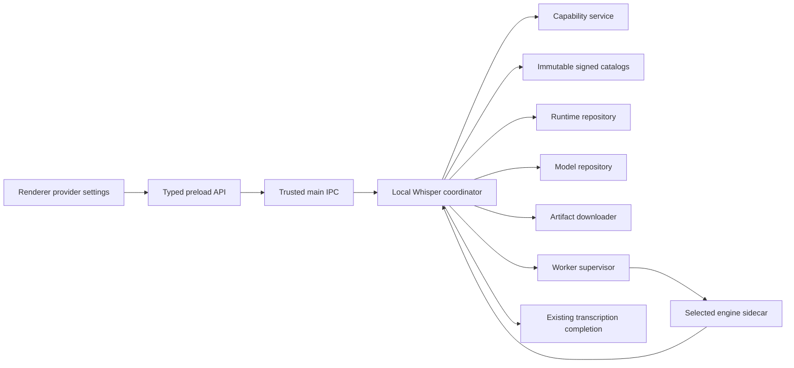

# Local Whisper Technical Specification

Status: Approved
Date: 2026-08-01
Spec slug: `local-whisper`
Decision evidence: [decisions.yaml](decisions.yaml)
Research baseline: [Local Whisper Runtime and GPU Compatibility Research](../../researches/local-whisper/main.md)
Approval: **APPROVAL-001** Explicit `approve` for revision 2 recorded in the persistent `spec:local-whisper` interview on 2026-08-01.

## 1. Objective

Local Whisper SHALL be one selectable local Voice provider that runs buffered batch Whisper speech-to-text inference on the user's device and returns final transcription text through the existing GPT-Voice completion flow.

The feature SHALL provide:

- explicit inference-engine, GPU/CPU target, backend, device, model, revision, and variant selection;
- validated basic and advanced inference settings;
- explicit installation, update, rollback, and removal of immutable engine-native model revisions;
- explicit installation and removal of app-version-pinned runtime packs;
- lazy model loading plus `Load now` and `Unload` controls;
- an exact, model-specific answer to whether the selected configuration can run on the current device;
- safe failure without automatic engine, target, backend, device, model, revision, variant, precision, or CPU fallback.

**OUT-001** Success means a user can select Local Whisper, deliberately install the required runtime and model, validate and load the exact configuration, transcribe locally, unload its RAM/VRAM allocation, and understand every unsupported, missing, invalid, or failed state without changing existing remote-provider behavior.

## 2. Normative Language

`SHALL` and `MUST` are mandatory. `SHALL NOT` and `MUST NOT` are prohibited. `MAY` is optional only when the surrounding requirements remain satisfied.

Support tier, artifact setup, capability validation, residency, and active transcription are separate dimensions throughout this specification. A path may be supported but not installed, installed but not validated, validated but unloaded, or loaded but busy.

## 3. Scope

### 3.1 Included

**SCOPE-001** The first release SHALL expose one provider named `Local Whisper`. The phrase “local dispart provider” is treated as a typo, not as a separate provider. The provider SHALL expose two explicit engines:

- `whisperCpp`, based initially on pinned `whisper.cpp` v1.9.1 build inputs;
- `fasterWhisper`, based initially on pinned Faster-Whisper v1.2.1 and a reviewed, pinned CTranslate2 build.

An immutable runtime manifest SHALL own the complete engine and dependency revisions used in a shipped pack. Changing those baselines requires an explicit specification/catalog revision and qualification; upstream `latest` is never resolved at runtime.

**MODEL-005** The curated multilingual logical model catalog SHALL contain only:

- `tiny`;
- `base`;
- `small`;
- `medium`;
- `large-v3`;
- `large-v3-turbo`.

**MODEL-001** Each logical model SHALL be selectable and manageable from the provider settings. **MODEL-002** Each installable revision SHALL be immutable and independently downloadable and removable. **VRAM-001** The selected model SHALL support explicit load and unload operations in addition to lazy loading.

**SCOPE-002** The provider result contract SHALL contain final transcription text only and SHALL enter the existing successful transcription completion flow exactly once.

### 3.2 Excluded

The first release SHALL NOT include:

- Distil-Whisper, English-only model families, arbitrary third-party models, or user model import;
- translation to English, VAD, timestamps, segments, diarization, or partial/interim result contracts (**NONGOAL-003**);
- automatic fallback between engines, GPU and CPU, backends, devices, models, revisions, variants, or precisions;
- automatic model/runtime downloads, updates, selection changes, or storage cleanup;
- custom model/runtime storage paths;
- renderer WebGPU inference or any dependency on Chromium GPU acceleration;
- DirectML or Windows ML (**NONGOAL-002**);
- a user-managed Python, Conda, compiler, CUDA toolkit, or arbitrary executable integration;
- production-ready macOS or Apple Silicon inference (**NONGOAL-001**).

## 4. Observed Baseline and Invariants

**BASE-001** Local Whisper is greenfield: the repository currently has no local Whisper worker, model repository, download/delete infrastructure, accelerator pack, or GPU-capability contract.

**ARCH-001** Local Whisper SHALL integrate with the existing main-owned buffered batch Voice-provider flow. It SHALL NOT add a streaming recorder or a new renderer audio path.

**ARCH-002, ARCH-008, SEC-006** The provider metadata and readiness types SHALL gain a real `localRuntime`/no-auth contract. Local Whisper SHALL NOT create or persist a dummy API key, access token, cookie, or browser session.

**ARCH-003, ARCH-006, LIFE-001** Provider factories may continue creating side-effect-free provider instances, but the main-process composition root SHALL own the long-lived Local Whisper coordinator, catalogs, repositories, downloader, capability service, worker supervisor, and residency state. Module-level constructed mutable runtime instances are prohibited.

**IPC-001, SEC-001** Filesystem access, executable selection, native process execution, downloads, integrity checks, GPU/CPU probing, model inventory, and residency SHALL remain in Electron main. The renderer SHALL never receive authority to choose a URL, filesystem path, executable, environment variable, or command argument.

**ARCH-004, IPC-002** Renderer access SHALL use additive, typed `window.electronAPI` operations and trusted-sender-validated IPC. Main SHALL authoritatively validate every command even when the UI has already disabled or validated it.

**SET-001** Local Whisper settings SHALL use a versioned, namespaced, private provider-settings repository rather than overloading authentication settings. **UI-002** Its form SHALL work within the current scrollable 560×680 provider-settings window and its 440×520 minimum size.

**COMP-001, COMP-002** Existing provider IDs, defaults, remote inference, batch recording, retry, and provider-switch behavior SHALL remain compatible. Installing or enabling Local Whisper is optional.

**COMP-003** On successful local transcription, existing cache, clipboard, history, timing, notification, and audit completion behavior SHALL be reused. A failed, cancelled, conflicting, or partial local operation SHALL not mutate clipboard, successful-result cache, or transcription history.

**SEC-002, DIAG-001** Existing privacy rules remain authoritative: audio, transcripts, initial prompts, raw worker output, arbitrary paths, and native exception text SHALL NOT appear in routine logs, audit records, or diagnostics.

**PKG-001** Existing base Windows and Linux installers SHALL not embed GiB-scale model weights or unrequested accelerator packs.

**DOC-001** Documentation that currently says no local Whisper model, CUDA setup, or GPU is required SHALL be revised to make clear that this remains true for the base app and remote providers, while Local Whisper is an optional explicit download with platform-specific prerequisites.

## 5. Resolved Product Contract

The following choices are fixed for this Draft:

1. One Local Whisper provider exposes an explicit engine selector (**ARCH-007, UI-003**).
2. Both pinned engines ship behind one shared domain contract; they retain separate workers, runtime packs, native model formats, and qualification matrices (**RUNTIME-001, RUNTIME-002**).
3. GPU and CPU are explicit targets with GPU as the initial default. There is no `auto` target and no GPU-to-CPU fallback (**COMP-005, SET-002, CAP-005**).
4. `whisperCpp` is eligible for NVIDIA, AMD Preview, and CPU paths. Faster-Whisper is eligible only for validated NVIDIA CUDA and CPU paths in release 1 (**COMP-006, AMD-005**).
5. Runtime packs and models are downloaded only after explicit user action. Runtime packs are app-version-pinned and executable artifacts are signed (**PKG-002, SEC-003, OPS-001**).
6. Models and runtimes use fixed application-managed storage. Custom locations and import are unavailable (**MODEL-006, SEC-004**).
7. Basic controls are always visible; reviewed expert controls are under `Advanced` (**UI-004, SET-003**).
8. Loading is lazy on the first eligible cache-miss transcription that requires inference, with equivalent `Load now` and explicit `Unload` operations. Engine, runtime, target, backend, device, model, variant, or load-affecting precision changes unload the current worker. Provider change and application exit unload it as well (**VRAM-002, LIFE-002**).
9. `Ready` is earned only by backend initialization, allocation, full model load, and bounded warm-up for the exact capability fingerprint (**CAP-006, CAP-007**).
10. Updates are explicit and installed alongside old immutable revisions. Nothing changes the selected revision automatically (**MODEL-007, RUNTIME-003, COMP-007**).
11. Deleting the selected or loaded model confirms, rejects active transcription, unloads first, removes exact managed files, preserves the selection as `Model missing`, and performs no fallback (**MODEL-008, VRAM-003, FAIL-001**).
12. Conflicting lifecycle operations fail immediately and require explicit retry; unrelated downloads may continue (**LIFE-003, FAIL-002**).
13. Local Whisper remains selectable when unsupported or Not ready. The UI SHALL show the known tier/state/reason, and load/transcription SHALL still fail safely if invoked (**UI-005, CAP-008**).

## 6. Support Matrix

Support tier is a reviewed product claim, not a result of probing. `Production target after gate` means the path SHALL NOT be labeled Production in a release until the exact hardware gate in Section 19 has passed for that OS and engine.

| OS / architecture                       | Engine          | Target / backend         | Device        | Release tier                                                      |
| --------------------------------------- | --------------- | ------------------------ | ------------- | ----------------------------------------------------------------- |
| Windows x64                             | `whisperCpp`    | GPU / CUDA               | NVIDIA        | Production target after the Windows NVIDIA gate                   |
| Windows x64                             | `fasterWhisper` | GPU / CUDA               | NVIDIA        | Production target after the Windows NVIDIA gate                   |
| Linux x64                               | `whisperCpp`    | GPU / CUDA               | NVIDIA        | Production target after the Linux NVIDIA gate                     |
| Linux x64                               | `fasterWhisper` | GPU / CUDA               | NVIDIA        | Production target after the Linux NVIDIA gate                     |
| Windows x64                             | `whisperCpp`    | GPU / Vulkan             | AMD           | Preview; no hardware evidence in this specification task          |
| Linux x64                               | `whisperCpp`    | GPU / HIP                | AMD           | Preview; exact allowlisted OS/ROCm/device/`gfx` intersection only |
| Linux x64                               | `whisperCpp`    | GPU / Vulkan             | AMD           | Preview; explicit alternative, never a HIP fallback               |
| Windows x64                             | both            | CPU / CPU                | x64 CPU       | Production target after each engine's Windows CPU gate            |
| Linux x64                               | both            | CPU / CPU                | x64 CPU       | Production target after each engine's Linux CPU gate              |
| Windows/Linux x64                       | `fasterWhisper` | GPU / HIP or Vulkan      | AMD           | Unsupported in release 1                                          |
| macOS arm64                             | `whisperCpp`    | GPU / Metal              | Apple Silicon | Planned/unavailable skeleton only                                 |
| macOS arm64                             | either          | CPU or any other backend | Any           | Unavailable in release 1                                          |
| Other OS/architectures or unlisted GPUs | either          | Any                      | Any           | Unsupported                                                       |

**COMP-004** NVIDIA and CPU Production claims remain conditional release gates rather than current facts. **NVIDIA-001, AC-MAN-001** The available Linux x64 laptop—NVIDIA GeForce RTX 5070 Ti Laptop GPU, driver 595.84, compute capability 12.0, and 12,227 MiB VRAM—can supply Linux NVIDIA and hybrid-device evidence only. It proves nothing about Windows, AMD, or Apple.

**CPU-001, COMP-008, AC-MAN-002** Both engines target Production CPU support on Windows and Linux x64 only after per-engine, per-OS correctness and performance qualification. This CPU contract never extends to macOS.

**AMD-001, AMD-002** AMD is technically feasible but untested here and SHALL remain Preview. Documentation and mocked probes do not constitute hardware validation.

**AMD-003** Windows AMD SHALL use `whisperCpp` Vulkan only. Windows HIP, Faster-Whisper AMD, DirectML, and Windows ML are excluded.

**AMD-004** Linux AMD SHALL prefer HIP only for an exact supported intersection and SHALL expose Vulkan as a separate explicit Preview choice. A HIP failure SHALL NOT select Vulkan.

**AMD-006, PKG-003, CAP-009** Linux HIP packs SHALL be versioned by reviewed ROCm and OS family. An immutable app manifest SHALL enumerate exact OS family, ROCm family, AMD device IDs, compiled `gfx` targets, and external prerequisites; every unlisted combination fails closed.

**CAP-002, CAP-004** Vendor enumeration alone never proves compatibility. Every path must satisfy its backend features, allocation/compute probe, full selected-model load, and warm-up.

**MAC-001, MAC-002, MAC-003** macOS SHALL have only shared protocol types, the `metal` backend identifier, an unavailable adapter skeleton, and UI/type tests. It SHALL publish no Local Whisper runtime or model download catalog, allow no runtime/model download or execution action, make no CPU exception, and never report `Ready`.

## 7. Architecture and Ownership



### 7.1 Coordinator

The process-owned coordinator SHALL own:

- current normalized settings and a monotonically increasing configuration epoch;
- immutable catalog and sanitized inventory snapshots;
- support, setup, capability, residency, and activity states;
- the one active worker supervisor;
- operation conflict arbitration and per-artifact locks;
- sanitized progress and error snapshots.

Provider instances SHALL delegate transcription and shutdown to this coordinator. Reading provider metadata or a settings snapshot SHALL NOT start a worker, probe a device, access the network, download an artifact, or allocate RAM/VRAM.

### 7.2 Engine adapters

**MODEL-004** `whisperCpp` SHALL consume separately pinned `ggml` artifacts. Faster-Whisper SHALL consume separately pinned project-reviewed CTranslate2 conversions. The two formats are never treated as interchangeable.

Each engine adapter SHALL map the common validated domain contract to only reviewed worker options. Unsupported upstream flags SHALL not be accepted from persistence or IPC.

### 7.3 Worker boundary

**ARCH-005, RUN-001** Each engine SHALL run as a supervised sidecar, never as renderer code or a native Electron/Node addon. Worker process exit is the hard resource-release boundary after a graceful free attempt.

**RUN-002, SEC-005, PRIV-001** The supervisor SHALL:

- spawn an absolute, manifest-owned executable with `shell: false`, a fixed app-owned working directory, an allowlisted argument vector, and a sanitized environment;
- expose no TCP, UDP, Unix-domain, named-pipe service, or listening port;
- use versioned, request-ID-based, length-prefixed stdin/stdout frames with strict schemas;
- require a handshake containing protocol version, engine identity, runtime revision, backend capabilities, and maximum frame sizes before any model load;
- carry audio, prompt, managed model path/identity, and other private or user-specific inference values in bounded protocol frames, never argv or process titles;
- reserve stdout for protocol frames and keep a sanitized, capped stderr ring buffer that is never copied verbatim into routine logs;
- reject oversized, malformed, duplicate, out-of-order, or unknown mandatory frames;
- bound spawn, handshake, probe, load, warm-up, transcription, unload, and termination stages;
- request graceful model release, then terminate and finally hard-kill the complete child tree if bounds expire;
- place the complete worker tree in a Windows Job Object with kill-on-job-close on Windows;
- start a dedicated Linux process group through a minimal reviewed launcher that sets parent-death signaling, rechecks the parent after setup, and terminates descendants on control-stream/parent death;
- bind every worker/lock to a random app-instance ownership nonce plus PID, OS process start identity, verified executable identity, and configuration epoch;
- never kill or adopt a process from PID alone; restart recovery must prove the full OS identity/nonce and otherwise treat a stale lock as non-authoritative;
- confirm child termination before reporting an uncertain allocation as released.

**RUN-005, FAIL-007** Initial non-user-editable upper bounds SHALL be 10 seconds for handshake, 30 seconds for the bounded backend probe, 5 minutes for full model load, 2 minutes for warm-up, 15 seconds for graceful unload, and two 5-second terminate/kill-confirmation stages. Local Whisper SHALL add its own inference deadline because the current shared batch flow has none: `max(120 seconds, 10 × validated audio duration)`, capped at 30 minutes. An uncached end-to-end transcription is bounded by the applicable spawn/probe/load/warm-up stages plus that inference deadline and cleanup bounds. Expiry cancels the request, terminates an uncertain child, returns `OPERATION_TIMEOUT` with the exact stage, and produces no partial success. Changing these constants requires qualification evidence and a specification revision.

Protocol JSON/control frames SHALL be at most 1 MiB, audio SHALL be chunked into bounded binary frames, and captured stderr SHALL be capped at 64 KiB per worker. Breaching a bound is a protocol failure and terminates the child.

**RUN-003, FAIL-005** A crash, hang, protocol mismatch, load failure, or warm-up failure SHALL fail the current operation, discard partial output, invalidate operational readiness, clean up the child, and require a fresh explicit load or later lazy-load attempt. There is no transparent transcription replay, restart loop, or fallback.

### 7.4 Runtime prerequisites

**PKG-004, COMP-009** Runtime packs SHALL include only reviewed redistributable user-space dependencies and SHALL declare every system-owned prerequisite. The app SHALL NOT install GPU drivers, a full CUDA toolkit, system ROCm, device permissions, or elevated services.

- NVIDIA packs MAY include only license-approved CUDA/cuBLAS/cuDNN redistributables and required notices; the NVIDIA driver remains system-owned.
- Faster-Whisper packs SHALL use their isolated packaged Python/CTranslate2/PyAV environment and ignore user Python, site packages, `PATH`, and dynamic-loader overrides.
- Faster-Whisper workers SHALL receive only verified local artifact paths, enable their offline/local-only behavior, and never resolve a Hugging Face/model-hub identifier at inference time.
- HIP packs SHALL declare whether each reviewed user-space ROCm component is bundled and which exact system driver/ROCm/permission prerequisites remain external.
- Vulkan packs SHALL use the installed vendor driver/ICD and SHALL reject software implementations. They SHALL NOT bundle a vendor GPU driver.
- CPU packs SHALL declare required ISA features and fail validation rather than risk an illegal-instruction crash.

### 7.5 Non-normative implementation references

The following user-supplied references were inspected at immutable commits on
2026-08-01. They are evidence and implementation examples, not dependencies,
security proof, qualification evidence, or permission to weaken Sections
7.1–7.4:

- [OpenWhispr application at `bf8b7e0`](https://github.com/OpenWhispr/openwhispr/tree/bf8b7e0b4e1de0c9779c63f4752bd80bdd39ee2c): its state-owning persistent manager and backend-specific runtime selection illustrate retaining one loaded model; its loopback HTTP ports, model/private values in argv and multipart requests, temporary audio files, inherited environment, raw diagnostic logging, automatic GPU-to-CPU retry, mutable GitHub release lookup, PID files, and `taskkill` cleanup are explicitly not adopted.
- [OpenWhispr whisper.cpp fork at `dd18d11`](https://github.com/OpenWhispr/whisper.cpp/tree/dd18d1107cf20feb58f11b2719d66a5bfeaff0dc): `examples/server/server.cpp` illustrates serialized `whisper_context` initialization, inference, abort callback, replacement, and final `whisper_free`; `.github/workflows/build-binaries.yml` illustrates separate CPU/CUDA/Vulkan artifacts and companion-library packaging. The HTTP server, listener, upload surface, and published binaries are not reused as the worker boundary or accepted as release evidence.

For traceability, implementation packets pin the exact reviewed commits and
paths they use as background. A later reference revision is not treated as the
same evidence; its ideas or source require a fresh diff, provenance, license,
build, security, and compatibility review before they can affect a runtime
pack.

## 8. Provider Settings Screen

**UI-001, VAL-001** Local Whisper SHALL have a dedicated provider-settings form with the fields, actions, conditional visibility, and renderer/main validation below. A syntactically valid but unsupported or incomplete configuration may be saved and selected; it SHALL remain visibly Not ready and fail safely if load or transcription is invoked.

The form SHALL be organized into these scrollable sections:

1. status and current-device assessment;
2. runtime setup;
3. model and revision management;
4. basic inference settings;
5. collapsed `Advanced` inference settings;
6. managed storage and licenses.

Every disabled action SHALL expose a perceivable reason. Errors SHALL be associated with the relevant field, announced to assistive technology, and summarized near the action area. Progress SHALL include text/status semantics rather than color alone.

### 8.1 Settings fields

| Field             | Type and allowed values                                                                                        | Default                                                                              | Visibility                                                                                                            | Normative behavior                                                                                                                                                                                                                                        |
| ----------------- | -------------------------------------------------------------------------------------------------------------- | ------------------------------------------------------------------------------------ | --------------------------------------------------------------------------------------------------------------------- | --------------------------------------------------------------------------------------------------------------------------------------------------------------------------------------------------------------------------------------------------------- |
| Engine            | `whisperCpp` or `fasterWhisper`                                                                                | `whisperCpp`                                                                         | Always                                                                                                                | Required. Unknown values are invalid. A change unloads the current residency and invalidates the previous capability fingerprint.                                                                                                                         |
| Execution target  | `gpu` or `cpu`                                                                                                 | `gpu`                                                                                | Always                                                                                                                | Required; there is no `auto`. No target fallback is allowed. A change unloads and invalidates capability.                                                                                                                                                 |
| Backend           | `cuda`, `hip`, `vulkan`, `metal`, or `cpu`                                                                     | See Section 8.2                                                                      | Selector for supported GPU paths; read-only `CPU` for CPU; read-only disabled `Metal (Planned)` in the macOS skeleton | `cpu` is valid only with target CPU. `metal` is a typed macOS-only unavailable skeleton value. Other GPU backends are invalid with target CPU. A failure never changes the persisted backend.                                                             |
| Device            | Main-issued opaque stable ID plus sanitized display name                                                       | See Section 8.2                                                                      | GPU selector; read-only host CPU summary for CPU                                                                      | A GPU device is required for load/transcription. Arbitrary IDs are rejected. A disappeared device remains selected and unavailable; no other device is selected automatically.                                                                            |
| Runtime revision  | Immutable compatible catalog revision                                                                          | App-pinned `recommendedRevision` for a new `(engine, target, backend)` selection key | Runtime setup                                                                                                         | Existing selections never advance automatically. A missing/incompatible selection remains `Runtime missing`/`Runtime incompatible`. A change unloads and invalidates capability.                                                                          |
| Model family      | `tiny`, `base`, `small`, `medium`, `large-v3`, or `large-v3-turbo`                                             | `base`                                                                               | Always                                                                                                                | Required. Every option exposes the approximate family RAM/VRAM guidance from Section 8.1.1 before selection. A change unloads and invalidates capability.                                                                                                 |
| Model revision    | Immutable catalog revision for the selected engine/family                                                      | Catalog `recommendedRevision` for a new `(engine, model family)` selection key       | Always                                                                                                                | Existing selections never advance automatically. A selected absent revision remains selected as `Model missing`.                                                                                                                                          |
| Model variant     | Reviewed variant from the selected artifact entry                                                              | `full` when available; otherwise the sole variant                                    | Only when more than one reviewed variant exists                                                                       | For `whisperCpp`, a reviewed `q5_0` variant MAY appear only when its exact manifest and qualification exist; only `large-v3` and `large-v3-turbo` are candidates in release 1. Faster-Whisper compute precision is not a model variant. A change unloads. |
| Language          | `auto` or a canonical ID from the app-shipped common language catalog                                          | `auto`                                                                               | Always                                                                                                                | Required. No free text or localized label is persisted. Only IDs with reviewed mappings for both engines are allowed; unknown or engine-specific aliases are invalid.                                                                                     |
| Initial prompt    | Unicode text                                                                                                   | Empty                                                                                | Always                                                                                                                | Optional; maximum 1,000 Unicode code points. NUL, invalid Unicode scalar sequences, and longer values are rejected. No silent truncation, trimming, or normalization is permitted. A live counter SHALL be shown.                                         |
| Temperature       | UI decimal `0.00..1.00`; canonical persisted/IPC integer `temperatureHundredths` in `0..100`, divisible by `5` | `0` (`0.00` in UI)                                                                   | Always                                                                                                                | Non-safe-integers, out-of-range, and off-grid values are invalid. Locale parsing remains renderer-only; main receives the canonical integer. No temperature fallback list is exposed.                                                                     |
| Compute precision | Faster-Whisper values from Section 8.4                                                                         | Target-specific                                                                      | Advanced; Faster-Whisper only                                                                                         | `whisperCpp` quantization is represented by model variant. A Faster-Whisper precision change unloads and invalidates capability.                                                                                                                          |
| Decoding strategy | `greedy`, `beamSearch`, or `bestOfSampling`                                                                    | `greedy`                                                                             | Advanced                                                                                                              | Only the mappings in Section 8.5 are valid.                                                                                                                                                                                                               |
| Beam size         | Safe integer `1..10`                                                                                           | `5`                                                                                  | Advanced, only for `beamSearch`                                                                                       | Required when visible. Fractional and out-of-range numeric values are invalid. It is absent from other worker requests.                                                                                                                                   |
| Best of           | Safe integer `1..10`                                                                                           | `5`                                                                                  | Advanced, only for `bestOfSampling`                                                                                   | Required when visible. Fractional and out-of-range numeric values are invalid. It is absent from other worker requests.                                                                                                                                   |
| CPU threads       | `auto` or integer `1..detectedLogicalProcessors`                                                               | `auto`                                                                               | Advanced, CPU target only                                                                                             | The current main-process detected upper bound is authoritative. `auto` resolves at load time. The value is never applied to a GPU worker. A change invalidates the capability proof and requires reload/warm-up.                                          |
| Model storage     | Sanitized platform label/app-relative location and aggregate/per-artifact disk usage                           | Fixed per-user data root                                                             | Model management                                                                                                      | The renderer never receives the absolute path or username. An optional `Open storage folder` action is performed entirely by trusted main. No arbitrary path, custom directory, import, or symlink target is accepted.                                    |

**SET-005, VAL-002** These defaults are applied only when no Local Whisper settings have ever been stored for the relevant profile. Missing or corrupt fields in an existing selection SHALL produce validation/repair state; they SHALL not silently switch a previously selected engine, target, backend, device, model revision, or runtime revision.

### 8.1.1 Approximate model memory guidance

**MODEL-010, UI-007** Before a user selects, downloads, validates, or loads a model, the model-family control SHALL expose the following release-1 capacity guidance for all six curated multilingual families. The values are deliberately approximate, rounded ranges for advance planning rather than exact allocation limits.

| Model family     | Approximate GPU VRAM capacity | Approximate total system RAM | Guidance note                                                                |
| ---------------- | ----------------------------- | ---------------------------- | ---------------------------------------------------------------------------- |
| `tiny`           | approximately 1–2 GiB         | approximately 2–4 GiB        | Lowest resource use; appropriate for resource-constrained supported devices. |
| `base`           | approximately 1–2 GiB         | approximately 2–4 GiB        | Default model; similar capacity class to `tiny` with higher model cost.      |
| `small`          | approximately 2–3 GiB         | approximately 4–6 GiB        | Mid-range option with a material increase over `base`.                       |
| `medium`         | approximately 3–6 GiB         | approximately 6–10 GiB       | High-memory option; exact engine and precision materially affect the result. |
| `large-v3`       | approximately 6–8 GiB         | approximately 10–16 GiB      | Highest release-1 memory class; qualification may publish a narrower figure. |
| `large-v3-turbo` | approximately 3–6 GiB         | approximately 6–10 GiB       | Reduced large-model class; not assumed equal to `large-v3`.                  |

VRAM guidance applies only to a GPU target; CPU execution does not allocate model VRAM. RAM guidance is total installed system-capacity guidance, not a claim that the model itself owns the entire amount. The ranges conservatively combine the pinned engines' published model/representative memory evidence, runtime and host overhead, precision or quantization variation, and operating-system/application headroom. They SHALL be labeled `Approximate requirements` and SHALL NOT be presented as a guarantee, a qualified peak, or a substitute for current free-memory validation.

After engine, target, backend, model revision, variant, and Faster-Whisper precision are known, the screen SHALL replace or supplement the family range with the narrower matching catalog estimate and identify it as `Estimated for selected configuration`. When a matching qualified measurement exists, it SHALL also show `Qualified peak` separately; neither value may silently rewrite the family guidance or persisted selection.

The family table itself SHALL NOT block selection, download, or installation. Current-device preflight and `Load now` use the exact selected-configuration rules in Sections 9.2 and 11. A device below the family guidance MAY still be tested when the exact catalog threshold and resource probe permit it; a device inside or above the range may still fail a real allocation or load.

### 8.2 Initial backend and device selection

**SET-004, CAP-010, SET-007, VAL-003** Dependent selections SHALL be persisted by these stable keys:

- runtime, backend/device, and precision preferences by `(engine, target, backend)` where applicable;
- selected device by `(engine, backend)`;
- model family by engine;
- model revision and variant by `(engine, model family)`;
- CPU threads by engine;
- shared request controls independently of engine.

Switching a parent field SHALL restore the last explicitly saved compatible child values for the resulting key, including a currently missing or unavailable device/artifact. If the key has never existed, only these deterministic initialization rules apply:

- a new engine starts with model family `base` and that engine/family's catalog `recommendedRevision`/default variant;
- a new target starts with its target-specific precision/thread defaults;
- a new engine/target/backend key starts with its app-pinned runtime `recommendedRevision`;
- a new model family starts with its engine/family `recommendedRevision` and `full` variant when available;
- no catalog update re-runs initialization for an existing key.

Backend and device remain explicit persisted values. For a new, never-configured GPU selection key:

- if no catalog-eligible physical GPU/backend combination is detected, backend/device remain unset and the configuration is Not ready;
- if exactly one catalog-eligible physical GPU/backend combination is detected, it SHALL be selected initially;
- if more than one eligible combination exists, backend/device remain unset until the user chooses;
- CUDA is the eligible NVIDIA route;
- Windows AMD exposes Vulkan;
- exact-allowlisted Linux AMD exposes HIP first in the list and Vulkan as a separate explicit alternative;
- software Vulkan devices, Intel GPUs, unknown vendors, and unsupported adapters are not eligible defaults.

This one-time initialization is not fallback authority. A driver change, device disappearance, backend failure, or later discovery SHALL preserve the persisted value and make it Not ready until the user explicitly changes it.

Deliberately changing a parent can therefore initialize previously unseen children, but a runtime failure never does. Returning to an earlier key restores its prior choices rather than selecting current catalog recommendations.

### 8.3 Common language catalog

**SET-008, COMP-011** The app release SHALL pin a `languageCatalogRevision` containing `auto` plus the reviewed intersection of canonical Whisper language IDs supported by both engine adapters. Each entry SHALL have one stable persisted ID, localized display metadata, and explicit `whisperCpp` and Faster-Whisper worker mappings. Locale-specific variants or aliases are unavailable unless the catalog defines an unambiguous mapping. Automated tests SHALL enumerate every entry through both adapters; an incomplete mapping removes the ID from the common catalog rather than deferring behavior to a worker.

### 8.4 Faster-Whisper precision

| Target / backend            | Allowed values            | Default   | Requirement                                                                                 |
| --------------------------- | ------------------------- | --------- | ------------------------------------------------------------------------------------------- |
| GPU / CUDA                  | `float16`, `int8_float16` | `float16` | The exact device, runtime, allocation, full load, and warm-up must pass for that precision. |
| CPU / CPU                   | `int8`, `float32`         | `int8`    | The exact CPU pack, ISA, allocation, full load, and warm-up must pass.                      |
| Any unsupported combination | None                      | None      | Speculative upstream values are not exposed or accepted.                                    |

The runtime manifest MAY narrow these values for a specific pack; it SHALL NOT add values absent from this specification without a revision.

### 8.5 Decoding cross-field rules

| Strategy         | Temperature                                                       | Active control                | Worker contract                                                                |
| ---------------- | ----------------------------------------------------------------- | ----------------------------- | ------------------------------------------------------------------------------ |
| `greedy`         | `temperatureHundredths = 0` (`0.00`)                              | Neither beam size nor best-of | One deterministic candidate; inactive controls are omitted.                    |
| `beamSearch`     | `temperatureHundredths = 0` (`0.00`)                              | Beam size `1..10`             | Beam search with the submitted size; best-of is omitted.                       |
| `bestOfSampling` | `temperatureHundredths = 5..100`, divisible by `5` (`0.05..1.00`) | Best of `1..10`               | Temperature sampling with the submitted candidate count; beam size is omitted. |

The UI SHALL show a cross-field error instead of silently changing temperature, strategy, beam size, or best-of. Hidden UI values MAY be retained for convenience, but they SHALL be absent from the active normalized settings and worker request.

### 8.5 Validation and change semantics

The renderer SHALL provide immediate feedback, but main SHALL be the only validation authority.

1. Unknown enum/catalog values, malformed unions, forged device IDs, non-finite numbers, invalid integers, invalid Unicode, and cross-field-invalid settings SHALL be rejected without partial persistence.
2. Engine, runtime revision, target, backend, device, model identity, variant, precision, and CPU threads are load-affecting. Changing one SHALL first unload/terminate the resident worker, increment the configuration epoch, and invalidate current operational readiness (**LIFE-004**).
3. Language, prompt, temperature, strategy, beam size, and best-of are request-affecting. They apply to the next transcription without unloading, but every request captures one immutable validated settings epoch.
4. An engine adapter MAY declare an otherwise request-affecting field load-affecting only through an app-shipped capability manifest and tests; the UI/state snapshot SHALL then expose that behavior.
5. While transcription or a conflicting lifecycle operation is active, a load-affecting save SHALL fail with `OPERATION_CONFLICT`. It SHALL not be queued or applied partially.
6. Syntactically valid but unsupported combinations MAY be saved. They remain visibly Not ready and cannot pass load/transcription validation.
7. A missing runtime/model MAY remain selected so the setup action can target the exact required artifact.
8. Download completion alone never produces readiness.
9. Settings snapshots SHALL not perform probe/load/download side effects.

### 8.6 Initial-prompt storage

**SET-006, PRIV-002** The initial prompt SHALL persist in the versioned Local Whisper settings file because it is a provider setting, but it SHALL be treated as private local text:

- never log, audit, export, or include its value in crash diagnostics;
- never place it in argv, process title, URL, download metadata, or filesystem name;
- send it to the selected worker only through the private framed protocol for a transcription;
- clear it when the user resets Local Whisper settings;
- do not claim encryption unless the repository adds and verifies such a contract.

### 8.7 Settings actions and status surface

The screen SHALL expose:

- `Check compatibility`: performs a non-resident platform/device/prerequisite/resource preflight and returns at most `EstimateOnly`; it never downloads or leaves a model allocation;
- `Download runtime`, `Resume`, `Cancel`, and `Retry` for the exact selected revision, plus per-installed-revision `Remove runtime` actions;
- per-model-revision `Download`, `Resume`, `Cancel`, `Retry`, and `Delete` actions;
- `Load now`: runs the same full load/warm-up contract used by lazy loading;
- `Unload`: releases the current worker allocation;
- the complete approximate six-family RAM/VRAM guidance before model selection, plus selected-configuration estimated and qualified RAM/VRAM;
- installed/download/expanded sizes, license/provenance link, support tier, setup state, capability state, residency state, last validation time, and safe failure/recovery guidance.

Known Planned or permanently Unsupported actions SHALL be disabled with an explanation, while main still rejects forged IPC. Recoverable Not-ready states SHALL surface the relevant setup/retry action. Selecting Local Whisper as the active provider remains permitted; an attempted transcription then returns the typed state-specific failure rather than switching providers.

`Load now` is the definitive user-facing “can this exact configuration run?” action: it performs full load and warm-up and intentionally leaves the model resident. Lazy first transcription runs the same proof. The status surface SHALL distinguish `Estimate only`, `Validated · Unloaded`, and currently operational `Ready`.

## 9. Canonical Identities and Fingerprints

### 9.1 Runtime pack

Every runtime pack SHALL be immutable and identified by at least:

- app compatibility/catalog revision;
- engine ID and exact upstream/build-input revisions;
- OS and architecture;
- target/backend and dependency family;
- compiled compute capabilities or `gfx` targets where relevant;
- worker protocol version;
- pack revision and signing key ID;
- archive byte size, SHA-256, signature, and allowlisted origin;
- exact expected file list, types, modes, sizes, and SHA-256 hashes;
- external driver/runtime/permission prerequisites;
- build provenance, SBOM/component inventory, and license notices.

Packs for different engines, backends, platforms, app/protocol revisions, or accelerator targets SHALL never overwrite one another.

### 9.2 Model artifact

**MODEL-003, MODEL-009** A selectable model artifact SHALL be the immutable tuple:

```text
engine + logical model + source checkpoint revision
+ artifact/conversion revision + native format + variant
```

Its catalog entry SHALL also contain exact expected files/sizes/hashes, download and installed bytes, license/provenance, runtime/protocol compatibility, estimated RAM/VRAM, qualification status, and empirically measured peak memory where available.

**CAP-013** Each selectable artifact SHALL contain a closed memory-estimate matrix covering every catalog-exposed target/backend/runtime/variant combination and, for Faster-Whisper, every exposed compute precision. Each record SHALL bind to that exact configuration identity and contain non-negative safe-integer `estimatedPeakRamBytes`, `estimatedPeakVramBytes` or an explicit CPU `notApplicable` value, an evidence basis (`upstream`, `derived`, or `qualified`), the source/build revision, and a short renderer-safe methodology label. A qualified measurement SHALL remain a separate value tied to its exact qualification profile and fingerprint.

A missing record, duplicate key, unsafe number, unit ambiguity, GPU record without VRAM, CPU record with VRAM, identity mismatch, or estimate from another runtime/model/variant/precision/backend revision makes the relevant catalog configuration invalid. Such a record SHALL NOT be reused as a load gate or displayed as selected-configuration evidence. The UI SHALL fall back only to the Section 8.1.1 family range with `Exact estimate unavailable`; production/Preview catalog publication SHALL fail verification until every exposed configuration has a valid matching record.

For `whisperCpp`, full and reviewed quantized `ggml` files are distinct variants. For Faster-Whisper, a CTranslate2 conversion is a distinct artifact revision, while runtime compute precision remains a setting rather than a source-model identity.

All conversion and quantization SHALL occur in reviewed project build/publishing automation. The desktop app SHALL only download and verify finished native artifacts; it SHALL not convert or quantize model weights on the user's device.

File/download size is not a memory guarantee. **CAP-003** Catalog estimates are advisory until the exact model passes real allocation, full load, and warm-up. The application SHALL never derive RAM or VRAM requirements from artifact byte size at runtime.

### 9.3 Residency key

The single process residency key SHALL contain:

- engine and runtime-pack revision;
- target, backend, and opaque device ID;
- model artifact tuple;
- Faster-Whisper precision or another explicitly declared load-affecting engine setting;
- resolved CPU thread count for CPU residency.

Changing any key field requires unload before another key can become resident. Only one key may be loaded per application process.

### 9.4 Capability fingerprint

The exact capability fingerprint SHALL contain:

- OS build/family and architecture;
- app/catalog and worker protocol revisions;
- engine/runtime pack and verified file identity;
- target/backend/device;
- relevant driver, runtime, CPU ISA, and topology identifiers;
- model artifact tuple and verified file identity;
- load-affecting settings and resolved values.

Raw serial numbers and hardware UUIDs SHALL not be included. Driver change, device topology change, suspend/resume, external-GPU change, artifact modification, catalog denylisting, or any fingerprint setting change marks prior capability evidence `Stale`.

### 9.5 Transcription cache context

**CACHE-001** A successful Local Whisper cache key SHALL include the audio identity plus every output-affecting value: provider, engine, runtime/protocol revision, target/backend/device class, model artifact tuple, precision, language, prompt, temperature, strategy, beam/best-of, CPU threads when output-affecting, and adapter mapping revision. Raw prompt text SHALL participate only through private in-memory comparison or a non-exported canonical digest; it SHALL not be serialized into a diagnostic/log-visible cache identifier. No cache result may cross a materially different configuration.

## 10. Normative State Model

### 10.1 Support tier

`Production`, `Preview`, `Planned`, or `Unsupported` is derived only from the app-shipped support matrix and release evidence.

- Hardware probing SHALL NOT promote a tier.
- A Preview path remains Preview after successful warm-up.
- An absent Linux HIP allowlist intersection is Unsupported, not Preview-by-default.
- Planned permits explanatory UI but no executable operation.

### 10.2 Artifact setup

Runtime packs and model artifacts have independent states:

```text
Missing -> Downloading -> Resumable -> Verifying -> Installing -> Installed
Installed -> Deleting -> Missing
Installed -> Installed + Update available
Any operation -> Failed
Verification/inventory failure -> Corrupt
Security denylist -> Blocked
```

- `Resumable`, `Verifying`, and `Installing` are not executable/loadable.
- `Update available` never downloads or changes selection automatically.
- `Corrupt` and `Blocked` artifacts never execute or load.
- A failed new install leaves an older installed revision unchanged.

### 10.3 Capability validation

Capability state is separate from current residency:

```text
Unchecked -> Checking -> EstimateOnly | Validated | NotReady
Validated -> Stale | NotReady
EstimateOnly | NotReady | Stale -> Checking
```

- `EstimateOnly` may use catalog requirements, enumerated backend features, and current memory, but SHALL never be presented as `Ready`.
- `Validated` requires a verified runtime and model, exact backend initialization, bounded compute/allocation proof, full model load, and warm-up for the exact fingerprint.
- `Validated` evidence is process-local and is never authoritative after app restart.
- Intentional unload MAY retain `Validated` evidence for the unchanged fingerprint, but it does not retain operational `Ready`; a subsequent load rechecks dynamic resources and repeats load/warm-up.
- A failed actual allocation/load/warm-up overrides every earlier estimate and sets `NotReady` with a typed cause.

### 10.4 Residency and activity

Residency uses:

```text
Unloaded -> Loading -> Loaded -> Unloading -> Unloaded
Loading | Loaded | Unloading -> Failed -> Unloaded
```

Transcription activity is independently `Idle` or `Transcribing`.

- GPU `Loaded` means the exact model is resident through the selected GPU backend.
- CPU `Loaded` means the exact model is resident in worker RAM.
- `Load now` and lazy first-use loading execute the same validation path.
- Successful transcription normally retains `Loaded` residency.
- `Unload` requests engine-level free and then terminates the sidecar; confirmed process exit is required for deterministic ownership release.
- A crash or uncertain load fails activity, invalidates operational readiness, and forces cleanup.

### 10.5 Derived provider readiness

**CAP-011, LIFE-005, UI-006** The provider's operational status SHALL be derived as follows:

| Conditions                                                                                                        | Status                                                                  |
| ----------------------------------------------------------------------------------------------------------------- | ----------------------------------------------------------------------- |
| Valid settings, installed verified artifacts, exact capability `Validated`, residency `Loaded`, no blocking fault | `Ready` (or `Busy` while transcribing)                                  |
| Same fingerprint was validated but residency is `Unloaded`                                                        | `Validated · Unloaded`; operationally Not ready, eligible for lazy load |
| Artifacts missing/downloading/corrupt/blocked, capability unchecked/estimate/stale/not-ready, or residency failed | `Not ready` with exact safe reason                                      |
| Support tier Planned/Unsupported                                                                                  | `Planned`/`Unsupported`; never Ready                                    |

This rule preserves useful validation history after `Unload` without claiming that an unloaded model is presently Ready.

The existing authentication-oriented `isReady` guard SHALL NOT be reused to block lazy loading. Provider metadata/readiness SHALL add a discriminated local-runtime snapshot with at least `canAttempt`, derived operational status, and safe reason. `canAttempt` means the coordinator may receive a transcription request and either lazy-load or return its exact typed setup/capability failure; it is not a claim of success. Structurally invalid settings or an active conflict may disable the attempt, but missing artifacts, unsupported hardware, or unloaded residency SHALL never be misrepresented as a missing login/API key.

## 11. Current-Device Validation

**CAP-001** The settings screen and provider SHALL validate whether the exact selected Local Whisper configuration can run on the current device. The result SHALL include support tier, setup state, capability state, residency, engine, target, backend, sanitized opaque device ID, runtime/model revisions, observed timestamp, and safe reason codes.

### 11.1 Common stages

A full proof, initiated only by `Load now` or an eligible uncached transcription, SHALL check, in order:

1. supported OS and architecture;
2. support-matrix eligibility for engine/target/backend/device;
3. installed, non-blocked, signature/hash-verified runtime pack and compatible protocol;
4. backend/system prerequisites and exact device presence;
5. installed, hash-verified compatible model artifact;
6. current disk/RAM/VRAM advisory resources;
7. backend initialization and bounded allocation/compute dispatch;
8. full model load;
9. bounded local warm-up using non-personal embedded synthetic input;
10. confirmation that the worker actually used the selected target/backend/device and did not fall back internally.

`Check compatibility` and predownload checks stop at an `EstimateOnly` result and SHALL list the exact missing artifacts or prerequisites. They MAY perform a bounded non-resident backend probe in a short-lived worker, but SHALL not load the selected model, retain a worker/allocation, or report Ready. No check initiates a download implicitly.

The exact selected-configuration memory estimate SHALL use the matching qualified peak when one exists, otherwise its matching catalog peak, then add at least `max(20% of that peak, 512 MiB)` headroom. The Section 8.1.1 family ranges never supply this block threshold. When the backend exposes a trustworthy current free-memory value below the exact threshold, `Load now` and uncached lazy inference SHALL be blocked with `INSUFFICIENT_VRAM` or `INSUFFICIENT_RAM`; release 1 has no override. When the backend cannot expose a trustworthy value, the UI SHALL show `Resource availability unknown` and MAY permit the real allocation attempt. A passing or unavailable estimate never guarantees success; dynamic real allocation/load failure remains authoritative.

**CAP-012, FAIL-006** This known-insufficient-versus-unknown resource policy is mandatory and has no release-1 user override.

### 11.2 CUDA

CUDA validation SHALL prove:

- a physical NVIDIA device matching the selected opaque ID;
- a driver version compatible with the pack's pinned CUDA dependency family;
- a compiled/allowed compute capability for the pack;
- required reviewed libraries from the pack, not arbitrary user paths;
- successful bounded device allocation and kernel/compute dispatch;
- full model load and warm-up on CUDA;
- worker confirmation of the actual CUDA device and precision.

### 11.3 Linux HIP

HIP validation SHALL prove:

- exact app-manifest match for Linux distribution/OS family, ROCm family, AMD device ID, and compiled `gfx` target;
- every declared system prerequisite rather than a floating arbitrary ROCm installation;
- usable `/dev/kfd` and DRM render-node permissions without elevation or permission modification;
- successful allocation and bounded HIP kernel dispatch;
- full model load and warm-up on the selected HIP device.

Any missing or unlisted intersection fails closed. Vulkan and CPU remain explicit alternative settings, not recovery paths.

### 11.4 Vulkan

AMD Vulkan validation SHALL prove:

- a physical hardware device, not a software ICD;
- Vulkan API 1.2 or newer;
- `storageBuffer16BitAccess` and every feature required by the pinned worker;
- a usable memory budget when the driver exposes it;
- successful bounded compute dispatch;
- full model load and warm-up on the selected Vulkan device.

### 11.5 CPU

CPU validation SHALL prove:

- Windows or Linux x64 support for the selected engine pack;
- required ISA features and a positive logical-processor count;
- a valid requested thread count or a resolved `auto` count within that total;
- sufficient current RAM with required headroom;
- bounded compute, full model load, and warm-up without GPU initialization.

### 11.6 Metal skeleton

The Metal adapter SHALL return one stable typed `PLANNED_UNAVAILABLE` result before any manifest lookup, download, spawn, allocation, or transcription. Remote data SHALL not be able to enable it in this release.

## 12. Artifact Trust, Storage, and Distribution

### 12.1 Catalog and signing

**SEC-008, PKG-005** The application SHALL ship an immutable Local Whisper catalog authenticated with Ed25519 by a public key/key ID embedded in the installed application. A key supplied by a downloaded artifact is never trusted.

This trust model assumes that the installed application and embedded verifier key are trusted. Current Windows/Linux packaging does not provide a universal verified code-signing root, and this feature SHALL NOT claim otherwise. Artifact signatures protect the app-owned download/publishing path against substitution under that assumption; they cannot protect a user who runs a tampered application. Adding mandatory base-application code signing is outside this specification and would require a separate packaging/release decision.

Every catalog entry SHALL contain the identities and metadata from Section 9 and one or more allowlisted HTTPS origins. Redirect targets SHALL be revalidated against the allowlist. URLs and request headers SHALL not contain device identifiers, prompts, audio, transcripts, or user settings.

All artifacts SHALL be verified against exact size and SHA-256 from the authenticated catalog. Executable runtime archives SHALL additionally carry an artifact signature. Runtime executables and libraries SHALL be revalidated before every spawn. Model files SHALL be fully verified at promotion and before their first load in each app process; changed identity, size, or metadata forces a full rehash.

The embedded verifier keyring SHALL support key IDs and rotation only through a newly trusted installed application release obtained under the project's existing distribution policy. This requirement does not imply a signed-update channel. An app-shipped security denylist MAY mark an installed revision `Blocked`; this prevents execution/load without deleting it or selecting a fallback.

### 12.2 Managed roots

**MODEL-006, SEC-004** Large artifacts SHALL live in a fixed, non-roaming, per-user application data root separate from configuration files:

- Windows: `%LOCALAPPDATA%/<canonical-app-id>/local-whisper`;
- Linux: `${XDG_DATA_HOME:-$HOME/.local/share}/<canonical-app-id>/local-whisper`.

The root SHALL contain separate `runtimes`, `models`, and `staging` namespaces. The private versioned Local Whisper settings file remains in the existing application configuration root. The macOS path resolver MAY exist for type completeness but SHALL not create/populate executable runtime storage in this release.

**SEC-007, RUN-004** All filesystem and worker-ownership operations SHALL satisfy the following path/process identity contract. All filesystem operations SHALL:

- canonicalize and prove containment under the expected managed artifact directory;
- reject Unix symlinks/mount-boundary escapes and Windows reparse points, junctions, and unexpected volume boundaries in every managed path component;
- bind verification, spawn, promotion, quarantine, and deletion to stable descriptor/handle-backed file and directory identities with no-follow semantics where the OS exposes them; a changed identity between check and use fails the operation;
- use owner-private permissions/ACLs without elevation;
- reconstruct inventory only from valid managed manifests;
- never execute or recursively delete unknown files/directories as repair behavior;
- use per-artifact locks, including across duplicate application instances.

Destructive removal SHALL first atomically rename the exact immutable artifact directory into an app-owned quarantine directory on the same filesystem while its anchored lock/identity remains held. It SHALL then delete only catalog-manifest entries through that anchored directory. An unexpected entry, identity swap, junction/reparse point, mount change, failed quarantine, or non-empty final directory makes removal fail without broad recursive cleanup.

Runtime spawn SHALL revalidate the executable/library identity immediately before creation and require the worker handshake to report the expected build/protocol digest. A path swap, file-ID change, or digest mismatch terminates the child before model data is accepted.

The UI SHALL show sanitized managed location and disk usage. Removal means ordinary filesystem unlinking; the app SHALL not promise SSD secure erasure or recoverability.

### 12.3 Download and install

**DL-001, DL-002, DL-003, PERF-001** Runtime and model downloads occur only after an explicit user action and use journaled app-owned staging on the same filesystem as the final artifact.

Download, hashing, signature verification, extraction, and inventory rehash SHALL be streaming/backpressured work outside the Electron main event loop. No full multi-GiB archive/file may be buffered in memory. At most two unrelated artifact transfers may run concurrently; additional explicit requests wait in a visible download queue, while worker lifecycle/destructive conflicts remain subject to Section 14 rather than that queue. Each transfer SHALL cap in-memory buffering at 32 MiB.

Initial transport bounds SHALL be a 20-second connection timeout, a 60-second no-progress timeout, at most five redirects, and a 12-hour total transfer timeout. Cancellation SHALL abort network activity promptly and make all hashing/extraction workers observe cancellation checkpoints; if a helper does not stop within 5 seconds it is terminated without promoting staging. These are operational constants, not user settings.

Before transfer, main SHALL calculate required free space for the partial/archive bytes, expanded installed bytes, atomic promotion, any simultaneously retained installed revision, and a safety margin of at least `max(10% of expanded size, 512 MiB)`. Insufficient space fails before network transfer when known and remains safe on mid-transfer `ENOSPC`.

A staged artifact SHALL never execute or load. Installation SHALL follow:

1. resolve a typed catalog artifact ID to an allowlisted HTTPS origin in main;
2. create a unique contained staging directory and journal;
3. stream bytes with bounded progress and cancellation;
4. verify complete length, catalog/signature authenticity, and archive SHA-256;
5. extract or materialize with fixed limits and no execution;
6. verify exact expected file names, regular-file types, modes, sizes, and SHA-256 hashes;
7. verify app/protocol/backend compatibility;
8. atomically rename/promote to its immutable identity directory;
9. reconstruct inventory and report `Installed`.

Archive extraction SHALL reject absolute paths, `..` traversal, symlinks, hard links, device nodes, FIFOs, sockets, unexpected names, duplicate entries, excessive file count, and expanded-size overflow. No installer, `pip`, Conda, compiler, or package manager is invoked on the user's system.

Expected-file count and expanded-byte limits SHALL come from the authenticated exact manifest; extraction cannot exceed them. Progress updates SHALL be rate-limited and renderer-safe, and large-artifact work SHALL not block settings, recording controls, provider switching, or application shutdown responsiveness.

### 12.4 Resume, cancel, restart, and retry

An unexpected network loss or app restart MAY retain a partial only when artifact identity, manifest revision, URL, expected length, and server validator such as ETag still match. Resume SHALL require a valid range response and SHALL verify the completed object from beginning to end. Any mismatch discards the partial and restarts from byte zero after explicit resume/retry.

Explicit `Cancel` SHALL stop the request and remove that unverified staging data. A failure SHALL preserve a previous installed revision and require explicit `Retry`; there is no unbounded automatic retry loop. On startup, abandoned journals SHALL be classified as safely resumable or removed without touching installed artifacts.

**FAIL-003** Offline, DNS/TLS, HTTP, redirect, range, length, hash, signature, extraction, protocol, permissions, and disk-space failures SHALL produce distinct safe setup errors and SHALL never promote a partial artifact.

### 12.5 Updates and rollback

An app catalog may advertise a new immutable model or runtime revision as `Update available`.

- Download is explicit.
- The old revision remains installed and selected.
- The new revision is installed alongside it.
- Selection changes only through an explicit user save and unload/reload.
- Rollback is an explicit selection of a still-installed compatible old revision.
- App-incompatible packs remain stored but cannot execute.
- No app upgrade or downgrade automatically deletes an artifact.

## 13. Model and Runtime Management Scenarios

### 13.1 Download selected model revision

1. The user selects engine, logical family, revision, and variant.
2. The screen shows exact download/installed sizes, source/provenance, license, format, estimated memory, and support limitations.
3. `Download` starts only the exact catalog artifact.
4. On verified atomic promotion, state becomes `Installed`; selection is unchanged.
5. The model remains unloaded until `Load now` or a transcription request.

Changing selection during download does not retarget the existing download. The unrelated download may finish into inventory, while its original artifact identity remains explicit.

### 13.2 Delete a model revision

Every catalog revision SHALL have state-specific actions:

| Revision state                                | Available destructive/setup action                                                                                                                                                                                          |
| --------------------------------------------- | --------------------------------------------------------------------------------------------------------------------------------------------------------------------------------------------------------------------------- |
| `Missing`                                     | No Delete action; Download is available when supported.                                                                                                                                                                     |
| `Downloading` or `Resumable`                  | `Cancel` controls staging; Delete is unavailable.                                                                                                                                                                           |
| `Verifying`, `Installing`, or `Deleting`      | Conflicting actions are unavailable and forged commands return `OPERATION_CONFLICT`.                                                                                                                                        |
| `Installed` or `Installed + Update available` | Delete is available for selected and unselected revisions.                                                                                                                                                                  |
| `Corrupt`, `Blocked`, or `Delete failed`      | Remove/Retry removal is available only when the authenticated catalog and repository can prove the exact managed identity directory; otherwise automatic deletion is prohibited and safe manual-recovery guidance is shown. |
| Unknown/unmanaged directory                   | Never exposed as a deletable catalog artifact.                                                                                                                                                                              |

**MODEL-008, VRAM-003, FAIL-001** Deletion of any eligible model revision SHALL:

1. show confirmation naming logical model, engine, artifact revision, variant, and disk impact;
2. reject during active transcription or conflicting install/delete/lifecycle work;
3. unload and stop the worker first if that exact artifact is resident;
4. use the authenticated catalog/repository identity even when model contents are corrupt;
5. atomically quarantine the exact identity directory within its managed parent, then delete only manifest-owned entries through the anchored path-safety contract in Section 12.2;
6. on partial deletion, report `Delete failed`, keep the exact selection, mark the revision unusable, and reconstruct inventory;
7. only after complete proven deletion, retain the persisted selection as `Model missing` when it was selected;
8. never select/download another model or revision automatically.

Deleting an unselected installed revision does not affect the active worker. Unknown files are not deleted as part of this action.

### 13.3 Remove a runtime pack

Runtime management SHALL list actions per revision, not only for the selected pack, and SHALL use the same state-action table as models. **RUNTIME-004, FAIL-004** Removal SHALL use equivalent confirmation, conflict rejection, worker unload/termination, containment/quarantine, exact-file deletion, and partial-failure rules. If selected, the revision remains selected as `Runtime missing`. No compatible-looking pack is selected automatically.

### 13.4 Transcription preflight, cache, and lazy load

**ARCH-009, CACHE-002** Local Whisper SHALL not use the current browser-auth readiness/cache ordering. The shared transcription orchestration SHALL dispatch by provider readiness kind and apply this exact order for Local Whisper:

1. capture provider/configuration/inventory epochs and validate the canonical audio plus structural settings;
2. run local dispatch eligibility: support tier, exact device presence, external prerequisites, trustworthy resource insufficiency, and selected runtime/model setup, compatibility, integrity, and denylist state;
3. fail with the exact typed state code before cache lookup if that gate fails;
4. construct the complete private cache context from the same epochs;
5. on a valid cache hit, enter the existing successful completion flow without starting/loading a worker and leave residency unchanged;
6. on a cache miss, acquire the lifecycle lock, recheck every epoch/gate, and run the lazy load sequence below.

Thus missing, corrupt, blocked, incompatible, unsupported, absent-device, and known-insufficient-resource states cannot be bypassed by an old cache entry. `Validated · Unloaded` may serve an eligible cache hit without allocating VRAM/RAM. Lazy loading occurs on the first eligible cache miss that actually requires inference.

`Load now` skips cache and executes the full load sequence directly:

1. Capture the exact configuration epoch and validate settings.
2. Verify support eligibility, runtime/model state, integrity, and prerequisites.
3. Acquire the lifecycle lock and recheck the epoch.
4. Spawn and handshake with the selected worker.
5. Initialize the exact backend/device and verify its identity.
6. Allocate and fully load the selected model.
7. Run the bounded warm-up and prove no internal fallback.
8. Set capability `Validated`, residency `Loaded`, and operational `Ready` only if every stage succeeds.

An eligible cache-miss transcription from `Unloaded` SHALL perform the same sequence and wait for it. It SHALL never initiate an implicit download. Any stage failure terminates the child, sets a typed Not-ready reason, preserves selection/install state, and does not submit audio for a successful completion.

### 13.5 Unload

`Unload` SHALL reject active transcription, enter `Unloading`, request engine-level model free, then stop the worker. If graceful free/exit exceeds its bound, the supervisor SHALL terminate the child tree and confirm exit. Confirmed forced termination may complete with a sanitized warning; unconfirmed termination remains `Failed` and blocks destructive artifact operations.

After successful unload:

- residency is `Unloaded`;
- provider operational status is not Ready;
- same-fingerprint capability evidence may remain `Validated` for display;
- current dynamic resources are not assumed available for the next load;
- worker-owned RAM/VRAM must no longer be allocated after the platform settling bound.

### 13.6 Replacement, provider switch, and exit

Engine, runtime, target, backend, device, model, variant, precision, or CPU-thread changes SHALL unload the old residency before activating the new epoch. A failure to unload leaves the old selection unchanged and the save failed.

An idle provider switch SHALL serialize Local Whisper unload/shutdown before another provider becomes active. A switch requested during `Loading`, `Unloading`, or `Transcribing` SHALL return `OPERATION_CONFLICT`; it SHALL not cancel, wait in a hidden queue, or change the current provider. Unrelated downloads owned by the composition root MAY continue.

Application exit is the lifecycle exception: it SHALL stop accepting work, cancel an active load/transcription, discard partial output, preserve only valid resumable journals, clean private in-memory audio, and perform bounded graceful-then-forced child-tree termination. Exit cleanup SHALL never wait beyond the declared cancellation/termination bounds.

On OS suspend, the coordinator SHALL mark the capability `Stale`, stop accepting work, and request cancellation/unload within the platform's available shutdown window. On resume it SHALL treat any prior residency as uncertain, terminate any still-proven-owned worker, set residency `Unloaded`, re-enumerate devices, and require explicit/lazy reload; it SHALL never auto-reload. Hot-unplug, driver reset, or external-GPU change during operation SHALL fail the activity, clean up the worker, and produce the same `Stale`/`Unloaded` recovery boundary.

## 14. Concurrency and Lifecycle Rules

Exactly one worker lifecycle or transcription operation may own the active worker at a time. Load, unload, resident replacement, selected runtime/model deletion, and transcription are mutually conflicting.

- The renderer SHALL disable conflicts it knows about; main SHALL independently reject stale/forged races.
- Every mutating command SHALL include or be checked against configuration and inventory epochs.
- A conflict returns `OPERATION_CONFLICT` immediately. Hidden destructive queues are prohibited.
- The user must explicitly retry after the active operation finishes.
- A download for an artifact unrelated to the worker or destructive target MAY continue.
- Per-artifact locking SHALL serialize download, verification, promotion, deletion, integrity check, and load use of the same revision.
- Multiple application instances SHALL not concurrently promote/delete/load the same managed artifact.
- Closing the settings window does not cancel a process-owned download; its state remains visible when reopened.

**LIFE-006** An explicit cancellation during lazy `Loading` SHALL abort the stage, terminate the partial/uncertain worker, leave residency `Unloaded`, and retain only capability evidence that predated the cancelled attempt. During `Transcribing`, main SHALL send a bounded worker cancel request; if the worker confirms cancellation and remains healthy, the loaded model stays resident/Ready, otherwise the supervisor terminates it and residency becomes `Unloaded`. In every case partial text is discarded, result is `CANCELLED`, and no success-side effect occurs. Provider switching during active work is a conflict and is rejected; application exit is authoritative and cancels/terminates the operation.

## 15. Failure Contract

Local Whisper commands SHALL return a typed renderer-safe result with:

- stable error code;
- failing stage;
- retryable boolean;
- localized recovery action identifier;
- safe artifact or sanitized device identity where relevant;
- current support/setup/capability/residency snapshot.

At minimum, the error union SHALL cover:

| Class                | Required codes                                                                                                                                                                                                                                                                                                                                         |
| -------------------- | ------------------------------------------------------------------------------------------------------------------------------------------------------------------------------------------------------------------------------------------------------------------------------------------------------------------------------------------------------ |
| Settings/support     | `INVALID_SETTINGS`, `SETTINGS_VERSION_UNSUPPORTED`, `STALE_CONFIGURATION`, `UNSUPPORTED_PLATFORM`, `UNSUPPORTED_ARCHITECTURE`, `TARGET_UNSUPPORTED`, `BACKEND_UNSUPPORTED`, `PLANNED_UNAVAILABLE`                                                                                                                                                      |
| Device/prerequisites | `DEVICE_NOT_FOUND`, `DEVICE_NOT_ALLOWLISTED`, `DRIVER_INCOMPATIBLE`, `RUNTIME_PREREQUISITE_MISSING`, `DEVICE_FEATURE_MISSING`, `GPU_PERMISSION_DENIED`, `CPU_FEATURE_MISSING`                                                                                                                                                                          |
| Resources            | `INSUFFICIENT_DISK`, `INSUFFICIENT_RAM`, `INSUFFICIENT_VRAM`                                                                                                                                                                                                                                                                                           |
| Artifact setup       | `RUNTIME_MISSING`, `RUNTIME_INCOMPATIBLE`, `RUNTIME_BLOCKED`, `RUNTIME_CORRUPT`, `MODEL_MISSING`, `MODEL_INCOMPATIBLE`, `MODEL_BLOCKED`, `MODEL_CORRUPT`, `DOWNLOAD_OFFLINE`, `DOWNLOAD_FAILED`, `DOWNLOAD_CANCELLED`, `UNSAFE_REDIRECT`, `RESUME_INVALID`, `SIGNATURE_INVALID`, `HASH_MISMATCH`, `ARCHIVE_INVALID`, `INSTALL_FAILED`, `DELETE_FAILED` |
| Worker/capability    | `WORKER_START_FAILED`, `WORKER_PROTOCOL_MISMATCH`, `WORKER_PROTOCOL_VIOLATION`, `WORKER_CRASHED`, `OPERATION_TIMEOUT`, `BACKEND_INIT_FAILED`, `ALLOCATION_FAILED`, `MODEL_LOAD_FAILED`, `WARMUP_FAILED`, `CLEANUP_FAILED`                                                                                                                              |
| Operation            | `OPERATION_CONFLICT`, `AUDIO_FORMAT_UNSUPPORTED`, `TRANSCRIPTION_FAILED`, `EMPTY_TRANSCRIPTION`, `CANCELLED`                                                                                                                                                                                                                                           |

Raw native messages, stdout/stderr, arbitrary filesystem paths, environment values, command lines, prompt/audio/transcript data, and stack traces SHALL not cross IPC.

The normalized recovery mapping SHALL be deterministic:

| Condition                                            | Code                                           | Retryable now                                         | Recovery action ID                   |
| ---------------------------------------------------- | ---------------------------------------------- | ----------------------------------------------------- | ------------------------------------ |
| Malformed/cross-field settings                       | `INVALID_SETTINGS`                             | No                                                    | `edit-settings`                      |
| Newer settings schema                                | `SETTINGS_VERSION_UNSUPPORTED`                 | No                                                    | `upgrade-or-reset-settings`          |
| Planned or unsupported path                          | `PLANNED_UNAVAILABLE` or exact `*_UNSUPPORTED` | No                                                    | `select-supported-configuration`     |
| Selected device absent                               | `DEVICE_NOT_FOUND`                             | After refresh                                         | `refresh-or-select-device`           |
| Linux HIP combination unlisted                       | `DEVICE_NOT_ALLOWLISTED`                       | No for same combination                               | `select-allowlisted-backend`         |
| Driver/runtime prerequisite or permission missing    | Exact prerequisite/driver/permission code      | After external repair                                 | `show-prerequisites`                 |
| Trustworthy disk/RAM/VRAM check below threshold      | Exact `INSUFFICIENT_*`                         | After resources change                                | `free-resources`                     |
| Selected runtime/model absent                        | Exact `*_MISSING`                              | After download                                        | `download-selected-artifact`         |
| Selected runtime/model incompatible                  | Exact `*_INCOMPATIBLE`                         | After selection/download                              | `select-compatible-artifact`         |
| Selected runtime/model denylisted                    | Exact `*_BLOCKED`                              | No for same revision                                  | `update-or-remove-artifact`          |
| Installed runtime/model integrity failed             | Exact `*_CORRUPT`                              | After redownload/removal                              | `redownload-or-remove-artifact`      |
| Offline/transport failure                            | `DOWNLOAD_OFFLINE` or `DOWNLOAD_FAILED`        | Yes                                                   | `retry-download`                     |
| Redirect/resume/signature/hash/archive trust failure | Exact trust code                               | No for same received object                           | `discard-and-fetch-trusted-revision` |
| Active conflict/stale epoch                          | `OPERATION_CONFLICT` or `STALE_CONFIGURATION`  | After refresh/idle                                    | `refresh-and-retry`                  |
| Worker crash/timeout/backend/load/warm-up failure    | Exact worker/capability code                   | Yes after cleanup unless configuration is unsupported | `retry-load-or-change-settings`      |
| Cleanup cannot prove termination/release             | `CLEANUP_FAILED`                               | After app restart/support action                      | `restart-application`                |
| Invalid audio container/format                       | `AUDIO_FORMAT_UNSUPPORTED`                     | After new canonical recording                         | `record-again`                       |
| User cancellation                                    | `CANCELLED`                                    | Yes                                                   | `retry-operation`                    |

Main SHALL return the most specific applicable code from this table; renderer adapters SHALL not collapse it to login/not-configured or expose a raw exception. Automated fixtures SHALL assert code, retryability, action ID, and resulting states together.

On load or transcription failure:

- no automatic engine, target, backend, device, model, revision, variant, or precision fallback occurs;
- no partial transcript is accepted;
- no clipboard, successful history, or successful cache mutation occurs;
- a crashed, hung, or allocation-uncertain child is terminated before retry;
- installed artifacts and selections remain unchanged unless a separate verified install/delete already completed;
- the current capability/readiness state records the typed cause.

## 16. Privacy, Security, and Network Boundaries

Inference SHALL be local and offline. Network access is permitted only to the main-owned artifact downloader after explicit user action.

The worker SHALL receive the existing canonical in-memory mono PCM16, 16 kHz WAV recording through bounded stdin frames. Local Whisper SHALL validate the container and samples before worker submission; unsupported or malformed input fails as `AUDIO_FORMAT_UNSUPPORTED` without invoking inference. It SHALL not add a new recording format, silently reinterpret compressed data, or create a temporary audio file. Audio and prompt buffers SHALL be released on success, cancellation, failure, provider switch, and shutdown.

**PRIV-001, PRIV-002** Routine logs, audit records, diagnostic capture, crash reports, process titles, and download telemetry SHALL NOT contain:

- raw or encoded audio;
- transcript or partial transcript text;
- the initial prompt or language vocabulary;
- raw worker stdout/stderr or exception messages;
- command lines, environment variables, usernames, or full paths;
- full URLs, request headers, device serials, GPU UUIDs, or arbitrary native structures.

Metadata-only audit MAY include operation ID, engine, target, backend, logical model/runtime revision IDs, byte counts, durations, state transitions, support tier, and typed failure code. An explicit user-generated diagnostics export MAY include reviewed vendor/device IDs and driver/runtime versions, but never serial numbers, full hardware UUIDs, model/runtime bytes, partial downloads, private text, or raw child output.

Worker crash/core dumps SHALL not be automatically collected or uploaded. The application SHALL not claim a cross-platform OS network sandbox; instead, the worker contract contains no network/listening feature and qualification SHALL observe zero worker/main inference egress.

Trusted IPC SHALL accept only catalog IDs and validated setting values. Main resolves every path, executable, origin, hash, and argument from authenticated catalogs and repositories. Untrusted senders and forged identifiers SHALL fail before filesystem or process action.

## 17. Persistence, Migration, Rollback, and Recovery

### 17.1 Settings persistence

The Local Whisper provider settings SHALL live in a dedicated, versioned private JSON file owned by a main-process repository, following existing provider-specific settings precedents. It SHALL contain only normalized configuration IDs/values and no operational `Ready`, residency, worker PID, raw device serial, URL, or filesystem authority.

Opening the feature for the first time SHALL create defaults in memory only. The settings file is created on an explicit save. Migration SHALL not download, probe deeply, load, move, convert, or delete an artifact.

Invalid known values SHALL produce field/repair reasons. Defaults may repair only non-material presentation/request fields; invalid engine, target, backend, device, runtime, or model identities SHALL remain Not ready until an explicit user choice. Unknown fields within a supported schema version SHALL be ignored and preserved across a write. A newer unsupported schema version SHALL be opened read-only with `SETTINGS_VERSION_UNSUPPORTED` and SHALL not be overwritten except by an explicit reset.

An explicit Local Whisper settings reset SHALL confirm, reject active transcription, unload the worker, replace only the provider settings with documented defaults, and clear the initial prompt. It SHALL not delete installed runtime packs, models, or resumable downloads.

### 17.2 Inventory and startup

Inventory SHALL be reconstructed from authenticated managed manifests, locks, and filesystem evidence. `Ready` and `Loaded` are never persisted as truth. Every process starts `Unloaded`; prior capability evidence may be displayed only as historical until the exact current process revalidates it.

Startup recovery SHALL:

- classify interrupted staging journals as safely resumable or removable;
- mark changed/corrupt/blocked installed artifacts unusable;
- detect an orphan worker from the prior process only through safe process-ownership evidence and terminate only a proven owned child;
- never delete unknown files or choose another artifact automatically.

### 17.3 Upgrade and rollback

**COMP-010** Downgrade recovery SHALL use the verified manual known-provider path below; an unknown previous-binary outcome is not acceptable release evidence.

After app upgrade, incompatible runtime packs remain stored but unusable. The selected configuration becomes `Runtime incompatible/missing` until the user explicitly downloads/selects a compatible pack. A model may be reused only when its exact hash/format remains listed compatible.

A downgraded app SHALL not be expected to execute newer packs. New Local Whisper settings/artifacts remain in their dedicated namespaces so an older app does not rewrite or delete them.

The immediately preceding application version currently preserves an unknown persisted provider string, rejects provider construction, and remains Not ready while keeping its known-provider chooser available. The deterministic recovery contract is therefore manual: before downgrade, select a provider known to the older version; if already downgraded with `local-whisper` selected, use that chooser to select a known provider. The older app does not execute or delete Local Whisper artifacts/settings. Documentation and a real previous-binary rollback test SHALL verify this exact recovery. If a future preceding version behaves differently, rollback support is blocked until this specification and instructions are revised; the release SHALL not merely record an unknown outcome.

No uninstall or upgrade flow SHALL silently promise preservation or deletion beyond the project's documented application-data policy.

## 18. Packaging, Publishing, and Maintenance

Base installers SHALL contain shared integration code and non-executable manifests/stubs only. Runtime packs and model artifacts remain on-demand.

Every runtime pack SHALL be built by protected release automation from pinned inputs and publish:

- reproducible build provenance where supported;
- engine/protocol/app compatibility metadata;
- exact component/SBOM and license inventory;
- backend/driver/ISA prerequisites;
- signatures and hashes verified before catalog inclusion;
- the full expected-file manifest.

The runtime/model catalog is immutable per app release. Hosting origins SHALL be project-controlled, HTTPS, and explicitly allowlisted. Signing private keys SHALL not be stored in the repository or delivered to clients. Public verifier keys, key IDs, rotation policy, and blocked revisions SHALL be reviewable.

Redistribution review is mandatory for every included CUDA/cuBLAS/cuDNN, ROCm/HIP, Python, PyAV, CTranslate2, `whisper.cpp`, Faster-Whisper, and model/conversion component. MIT licensing of upstream projects does not remove component notice, provenance, or vendor redistribution obligations.

Documentation SHALL cover optional setup, supported/Preview/Planned distinctions, exact external driver/permission prerequisites, storage/disk impact, downloads, validation, model/runtime update and deletion, VRAM/RAM load/unload, offline inference, privacy, typed troubleshooting, AMD's untested Preview boundary, and macOS's unavailable skeleton. The privacy text SHALL explicitly state that “local inference” prevents audio/prompt inference egress but does not disable GPT-Voice's existing successful-result behavior: transcript text may still be copied to the clipboard and persisted in local transcription history, and the short-lived cache still applies under its existing policy.

## 19. Acceptance Criteria

### 19.1 Deterministic automated acceptance

| ID          | Test                                                                                                                                                                                                                                            | Required result                                                                                                                                                                                                                                                                                                   |
| ----------- | ----------------------------------------------------------------------------------------------------------------------------------------------------------------------------------------------------------------------------------------------- | ----------------------------------------------------------------------------------------------------------------------------------------------------------------------------------------------------------------------------------------------------------------------------------------------------------------- |
| AC-AUTO-001 | Normalize a never-configured Local Whisper settings object.                                                                                                                                                                                     | Produces `whisperCpp`, `gpu`, `base`, app-pinned runtime/model recommended revisions, `auto` language, empty prompt, `temperatureHundredths = 0`, `greedy`, and `auto` CPU threads without starting a deep probe, download, worker, or allocation. Backend/device follow the deterministic 0/1/N-device rules.    |
| AC-AUTO-002 | Round-trip every valid settings union through persistence, sanitized renderer view, and both worker mappings.                                                                                                                                   | Canonical values survive exactly; privileged paths/URLs/argv are absent; inactive controls are absent from worker requests.                                                                                                                                                                                       |
| AC-AUTO-003 | Submit minimum, maximum, and malformed prompt, temperature-hundredths, beam, best-of, thread, enum, language, revision, and device values directly over IPC.                                                                                    | Valid boundaries pass; every non-safe-integer, fractional integer, off-grid, out-of-range, forged, unknown, or cross-field-invalid value is rejected by main without partial persistence. A 1,001-code-point prompt is rejected, not truncated.                                                                   |
| AC-AUTO-004 | Render every engine/target/strategy state at normal and minimum window dimensions.                                                                                                                                                              | Field visibility exactly matches Section 8; all controls/errors/actions remain reachable and labeled; Advanced, progress, disabled reasons, and support badges are keyboard/screen-reader perceivable.                                                                                                            |
| AC-AUTO-005 | Exercise the complete mocked support matrix, including NVIDIA, Windows AMD Vulkan, exact and unlisted Linux AMD HIP, AMD Vulkan, Intel, CPU, macOS arm64, and unsupported architectures.                                                        | Only specified combinations are actionable; tiers/reasons match Section 6; Faster-Whisper AMD is always unsupported; unlisted HIP fails closed.                                                                                                                                                                   |
| AC-AUTO-006 | Persist a selected GPU, then remove it while another eligible GPU remains.                                                                                                                                                                      | The old opaque ID remains selected and unavailable. No device/backend/target changes automatically.                                                                                                                                                                                                               |
| AC-AUTO-007 | Change every load-affecting field around a fake resident worker and every request-affecting field while idle.                                                                                                                                   | Load-affecting changes unload before epoch activation and stale capability/readiness; request-only changes do not reload and affect only the next captured request.                                                                                                                                               |
| AC-AUTO-008 | Enumerate both engine model catalogs.                                                                                                                                                                                                           | Both expose only the six logical multilingual families. Artifacts are engine-native and immutable; Distil/English-only/VAD/timestamp/translation/diarization entries are absent.                                                                                                                                  |
| AC-AUTO-009 | Add a newer catalog runtime/model while an older revision is selected and installed.                                                                                                                                                            | `Update available` appears; no background download, selection change, unload, or old-artifact deletion occurs.                                                                                                                                                                                                    |
| AC-AUTO-010 | Run independent CUDA failure fixtures for vendor/device mismatch, driver, compute capability, dependency, allocation, dispatch, load, warm-up, and actual-device confirmation.                                                                  | Each yields its safe Not-ready code and no fallback to CPU, Vulkan, another device, model, precision, or engine.                                                                                                                                                                                                  |
| AC-AUTO-011 | Run Vulkan fixtures for software ICD, Vulkan 1.1, missing required feature, allocation/dispatch failure, and warm-up failure.                                                                                                                   | Every invalid fixture is Not ready. A valid mocked AMD Vulkan path succeeds only as Preview.                                                                                                                                                                                                                      |
| AC-AUTO-012 | Run Linux HIP fixtures for OS/ROCm/device/`gfx` allowlist, external component, `/dev/kfd`, render-node permission, allocation, dispatch, load, and warm-up.                                                                                     | Only the exact immutable allowlist intersection reaches full load; every missing/unlisted prerequisite fails closed with a specific safe code.                                                                                                                                                                    |
| AC-AUTO-013 | Run CPU fixtures for both engines with supported/unsupported OS, architecture, ISA, RAM, thread counts, runtime, load, and warm-up.                                                                                                             | Only the exact passing CPU configuration validates; no GPU worker or allocation is initialized.                                                                                                                                                                                                                   |
| AC-AUTO-014 | Test trustworthy resource estimates immediately below, equal to, and above peak plus `max(20%, 512 MiB)`, plus an unavailable-metric fixture.                                                                                                   | Below blocks with exact `INSUFFICIENT_*` and no override; equal/above may continue; unavailable warns and may attempt. A later actual allocation/load failure still wins.                                                                                                                                         |
| AC-AUTO-015 | Reuse capability evidence after changing every fingerprint component, modifying an artifact, driver/topology/suspend event, and app restart.                                                                                                    | Evidence becomes Stale/Unchecked and cannot authorize readiness. Intentional unload alone retains same-process `Validated` evidence but derived provider status becomes `Validated · Unloaded`, not Ready.                                                                                                        |
| AC-AUTO-016 | Select Local Whisper under Planned, unsupported, missing, incompatible, corrupt, blocked, known-insufficient-resource, and warm-up-failure states, seed a matching cache entry, then request transcription.                                     | Selection persists, state is visible, pre-cache gate fails with the exact typed code, and no cache hit, fallback, clipboard/history/cache mutation, or partial transcript occurs.                                                                                                                                 |
| AC-AUTO-017 | Download valid, interrupted, resumed, cancelled, offline, `ENOSPC`, changed-ETag, bad-length, bad-hash, bad-signature, unsafe-redirect, traversal, symlink, hard-link, device-node, unexpected-file, archive-bomb, and wrong-protocol fixtures. | Only the valid exact artifact is atomically promoted. Invalid staging is non-executable, previous revisions remain intact, and recovery follows Section 12.                                                                                                                                                       |
| AC-AUTO-018 | Restart with valid resumable, invalid resumable, and abandoned install journals.                                                                                                                                                                | Only the exact validator-matching transfer can resume; no staging entry appears Installed; unknown paths are not deleted.                                                                                                                                                                                         |
| AC-AUTO-019 | Delete unselected, selected, missing, corrupt, and loaded model revisions, plus deletion during transcription.                                                                                                                                  | Exact managed files only are targeted; loaded deletion unloads; selected deletion preserves `Model missing`; active/conflicting deletion is rejected; no fallback occurs.                                                                                                                                         |
| AC-AUTO-020 | Remove runtime packs in equivalent states.                                                                                                                                                                                                      | Section 13.3 semantics hold and selected removal yields `Runtime missing`.                                                                                                                                                                                                                                        |
| AC-AUTO-021 | Exercise `Load now`, lazy load, failed load, successful transcription retention, `Unload`, provider switch, settings reset, and app exit.                                                                                                       | Transitions are serialized; only full load/warm-up produces Ready; unload/switch/exit terminate the owned worker; lazy load never downloads.                                                                                                                                                                      |
| AC-AUTO-022 | Race transcription, load, unload, delete, runtime replacement, and epoch changes while an unrelated artifact downloads.                                                                                                                         | Worker/file conflicts return `OPERATION_CONFLICT` and are not queued; the unrelated download may continue.                                                                                                                                                                                                        |
| AC-AUTO-023 | Run two app instances against download, promotion, deletion, and load locks.                                                                                                                                                                    | The same artifact is never promoted/deleted/loaded concurrently; losing instance reports a safe conflict.                                                                                                                                                                                                         |
| AC-AUTO-024 | Inject handshake mismatch, malformed/oversized/out-of-order frames, stdout flood, each stage timeout including a worker hung during inference, crash during load/inference, failed graceful free, hung exit, and parent stream closure.         | Output remains bounded, exact timeout stage is returned, child tree is gracefully then forcibly cleaned up as needed, and no orphan/listener/fallback/partial result remains.                                                                                                                                     |
| AC-AUTO-025 | Invoke privileged IPC from an untrusted sender with forged filesystem, URL, executable, hash, device, and artifact inputs.                                                                                                                      | Trusted-sender and catalog validation reject every call before privileged effect.                                                                                                                                                                                                                                 |
| AC-AUTO-026 | Capture settings files, logs, audit, diagnostics, process argv, crash handling, and network activity during successful and failed inference.                                                                                                    | Prompt persists only in private settings; audio/transcript/prompt/raw output/full paths/serials are absent elsewhere; inference generates zero network requests.                                                                                                                                                  |
| AC-AUTO-027 | Exercise Local Whisper success/failure against cache, clipboard, history, audit, notification, and provider-switch fakes.                                                                                                                       | Success enters the existing final-text flow once with complete cache context; every non-success has no success-side effect.                                                                                                                                                                                       |
| AC-AUTO-028 | Build/run macOS arm64 adapter, catalog, and UI fixtures.                                                                                                                                                                                        | `metal` exists in the typed backend union and renders only as Planned/unavailable; runtime and model catalogs/downloads plus spawn/load/transcribe remain impossible. CPU does not bypass the gate.                                                                                                               |
| AC-AUTO-029 | Migrate absent, valid, malformed, future-field, missing-artifact, incompatible-runtime, corrupt-inventory, and downgraded settings fixtures.                                                                                                    | No migration performs download/load/delete/fallback; dedicated settings/artifacts survive; operational Ready/residency never restore from disk.                                                                                                                                                                   |
| AC-AUTO-030 | Inspect base installer and every advertised catalog/pack fixture.                                                                                                                                                                               | No model/unrequested accelerator pack is bundled; every entry has exact identity, provenance, sizes, hashes, signature policy, compatibility, licenses, and allowlisted origin.                                                                                                                                   |
| AC-AUTO-031 | Apply an app-shipped denylist to an installed selected runtime/model revision.                                                                                                                                                                  | Artifact becomes Blocked and cannot execute/load; files and selection remain; no fallback or silent deletion occurs.                                                                                                                                                                                              |
| AC-AUTO-032 | Run format, lint, application/test type checks, full deterministic tests, production audit, and Windows/Linux production builds.                                                                                                                | All applicable project checks pass without weakening trusted IPC, types, integrity verification, or privacy assertions.                                                                                                                                                                                           |
| AC-AUTO-033 | Submit valid canonical WAV plus malformed, truncated, compressed, wrong-rate, wrong-channel, and wrong-sample-format buffers.                                                                                                                   | Only mono PCM16/16 kHz WAV reaches the worker; every other input fails as `AUDIO_FORMAT_UNSUPPORTED`, creates no temp file, and has no success-side effect.                                                                                                                                                       |
| AC-AUTO-034 | Run `Check compatibility` with missing and installed artifacts, then run `Load now`.                                                                                                                                                            | Check returns at most `EstimateOnly` and leaves no worker/allocation; only Load now's successful full load/warm-up produces resident Ready.                                                                                                                                                                       |
| AC-AUTO-035 | Exercise provider selection/transcription guards for unloaded, missing-artifact, unsupported, invalid-settings, and loaded Local Whisper snapshots.                                                                                             | No state is mapped to browser/API authentication. Eligible unloaded reaches the cache gate and lazy-loads on a miss; missing/unsupported reaches its exact safe failure; structurally invalid/conflicting state blocks `canAttempt`; loaded validated state is Ready.                                             |
| AC-AUTO-036 | Exercise 0, 1, and multiple eligible GPU fixtures and switch every parent field away and back across new and previously saved selection keys.                                                                                                   | Zero/multiple leaves device unset; exactly one initializes deterministically; unseen children use documented defaults once; returning restores prior values, including missing/unavailable choices; failures and catalog updates never rewrite them.                                                              |
| AC-AUTO-037 | Table-test every Section 15 condition.                                                                                                                                                                                                          | Code, retryable flag, recovery action ID, and resulting support/setup/capability/residency states match exactly; no case collapses to authentication.                                                                                                                                                             |
| AC-AUTO-038 | Render and invoke model/runtime actions in Missing, Downloading, Resumable, Verifying, Installing, Installed, Update available, Corrupt, Blocked, Delete failed, and unknown-directory states for selected/unselected revisions.                | Actions and confirmations match Section 13; corrupt/blocked managed revisions can use proven quarantine removal, while missing/unknown/unprovable data cannot trigger broad deletion.                                                                                                                             |
| AC-AUTO-039 | Seed cache hits for eligible loaded, eligible `Validated · Unloaded`, missing, corrupt, blocked, incompatible, unsupported, absent-device, and known-insufficient states.                                                                       | Local pre-cache gate runs first; only eligible states may use cache; eligible unloaded hit performs no allocation; eligible miss runs lazy load.                                                                                                                                                                  |
| AC-AUTO-040 | Force-kill the main process with a worker and descendants on Windows/Linux, then restart with stale locks, reused PID, wrong start identity, and forged ownership nonce.                                                                        | Job Object/Linux parent-death ownership kills the tree; restart never kills an unrelated process; only full proven identity can be cleaned/recovered; locks become safely stale.                                                                                                                                  |
| AC-AUTO-041 | Swap managed paths/files between validation and spawn/delete using symlinks, hard links, Windows junction/reparse points, mount/volume changes, and rename races.                                                                               | Stable anchored identity or quarantine checks reject every escape/race; no unverified executable runs and no path outside the exact managed revision is deleted.                                                                                                                                                  |
| AC-AUTO-042 | Suspend/resume and hot-unplug/reset during idle Loaded, Loading, and Transcribing states.                                                                                                                                                       | Work is cancelled/cleaned within bounds, prior capability becomes Stale, residency becomes Unloaded, devices re-enumerate, and nothing auto-reloads/falls back.                                                                                                                                                   |
| AC-AUTO-043 | Use multi-GiB fake streams with slow connect/no-progress, redirect loop, cancellation, hash/extract cancellation, two active plus queued downloads, and UI heartbeat probes.                                                                    | Declared time/redirect/concurrency/32-MiB bounds hold; helpers terminate within bounds; no full artifact buffers on main; renderer/main lifecycle remains responsive; nothing partial promotes.                                                                                                                   |
| AC-AUTO-044 | Enumerate the complete pinned common language catalog through both adapters.                                                                                                                                                                    | Every canonical ID maps deterministically in both workers and round-trips persistence/UI; incomplete aliases are absent.                                                                                                                                                                                          |
| AC-AUTO-045 | Inspect renderer snapshots and user documentation.                                                                                                                                                                                              | Renderer sees only sanitized storage labels/relative location and can request main-owned folder opening without an absolute path; docs explicitly disclose clipboard/history/cache behavior despite local inference.                                                                                              |
| AC-AUTO-046 | Run the immediately preceding application binary with `local-whisper` selected and new settings/artifacts present.                                                                                                                              | It remains Not ready without deleting new namespaces; chooser recovery to a known provider works and is documented; no unknown outcome is accepted.                                                                                                                                                               |
| AC-AUTO-047 | Cancel during lazy load and inference, switch provider during active work, and exit during active work.                                                                                                                                         | Load cancellation terminates to Unloaded; confirmed inference cancellation may retain Loaded; switch returns conflict without changing provider; exit cancels/forces cleanup within bounds; no partial success occurs.                                                                                            |
| AC-AUTO-048 | Inspect built Windows/Linux artifacts, catalogs, and trust text with current unsigned base packaging.                                                                                                                                           | Runtime/model signature verification works under the explicitly trusted-installed-app assumption, while UI/docs/tests make no false base-application code-signing claim.                                                                                                                                          |
| AC-AUTO-049 | Enumerate all six model families before selection, then vary engine, target, backend, runtime, revision, variant, Faster-Whisper precision, qualified evidence, malformed estimates, and current free memory.                                   | Every family shows the exact approximate range from Section 8.1.1; the selected configuration shows only its matching estimate/qualified peak; stale, missing, duplicate, unsafe, or unit-invalid records never authorize load; exact peak plus headroom controls blocking and a real load remains authoritative. |

### 19.2 Production qualification profile

Every Production matrix cell SHALL have a checked-in, versioned release-qualification profile approved before the label ships. The profile SHALL identify exact OS build/family, architecture, device/reference hardware, driver/runtime/ISA, engine/backend, runtime/model revisions and variants, precision, fixture hashes/licenses, repetitions, and pass limits.

The qualification-profile schema SHALL also pin the transcript normalization/tokenization and WER algorithm, exact direct-engine reference build/command and mapping revision, monotonic timing/RTF calculation, warm-up/discard rules, RAM/VRAM/process measurement API and sampling interval, baseline subtraction, allowed tolerance, post-exit settling interval, and orphan/allocation detection method. A schema validator SHALL reject a profile or result with any missing algorithm, bound, unit, tool version, or evidence field; reviewers do not choose these values after seeing results.

At minimum, every profile SHALL require:

- all Section 7 worker stage bounds to pass;
- reference-transcribed, non-personal audio with normalized word error rate no worse than 1 absolute percentage point above the direct pinned-engine reference for the same configuration;
- no dropped, duplicated, partial, or cross-request text;
- for the `base` model on declared Production reference hardware, median real-time factor `<= 1.0` over at least five 60-second fixtures after warm-up;
- measured peak RAM/VRAM no greater than the published qualified peak plus its documented tolerance;
- 10 consecutive load/unload cycles and 20 sequential transcriptions without crash, orphan process, or monotonically growing owned memory;
- no remaining worker-owned GPU allocation/process after unload/forced termination and the profile's bounded settling interval;
- successful fresh reload/transcription after an injected worker crash;
- provider switch, suspend/resume, and application-exit cleanup;
- successful offline restart/load/transcription after verified artifacts are installed.

A profile may narrow the catalog/models claimed for a reference device. Missing, failed, or unpublished evidence keeps that matrix cell conditional or Preview; it never lowers the gate automatically.

### 19.3 Manual and hardware gates

| ID         | Environment and procedure                                                                                                                                                                 | Passing condition                                                                                                                                                                                    |
| ---------- | ----------------------------------------------------------------------------------------------------------------------------------------------------------------------------------------- | ---------------------------------------------------------------------------------------------------------------------------------------------------------------------------------------------------- |
| AC-MAN-001 | Available Linux NVIDIA laptop: install both pinned CUDA engines and run every Linux NVIDIA configuration claimed by its qualification profile, including hybrid-device selection.         | Integrity, correct device/backend, load/warm-up, accuracy, performance, memory, repeated inference, unload, crash recovery, and cleanup all meet the profile. Evidence applies only to Linux NVIDIA. |
| AC-MAN-002 | Windows/Linux x64 CPU, both engines, with GPU target explicitly not selected, using each OS's declared Production reference hardware/profile.                                             | No GPU initializes and every correctness/performance/resource/lifecycle limit passes before that engine/OS CPU cell becomes Production.                                                              |
| AC-MAN-003 | Separate representative Windows x64 NVIDIA hardware, both CUDA engines, complete Windows qualification profile.                                                                           | All limits pass before either Windows NVIDIA cell is labeled Production. Linux evidence cannot substitute.                                                                                           |
| AC-MAN-004 | Available hybrid NVIDIA/Intel laptop: persist NVIDIA selection, restart, change availability where possible, and enumerate again.                                                         | Opaque selection is stable; Intel is not advertised as supported; no automatic device/backend switch occurs.                                                                                         |
| AC-MAN-005 | Qualified NVIDIA hardware: inject crash, repeat at least 10 load/unload and 20 transcription cycles, switch provider, suspend/resume, and exit while observing process and GPU ownership. | No orphan child/listener remains; worker-owned allocation disappears within profile bounds; later reload/transcription succeeds.                                                                     |
| AC-MAN-006 | Disconnect network after artifact installation, restart, load, warm up, transcribe, unload, and inspect traffic.                                                                          | Inference/lifecycle succeeds offline and emits no request; network begins only after an explicit artifact action.                                                                                    |
| AC-MAN-007 | Real allowlisted origin: interrupt/resume a large download, cancel another, update alongside an old selected revision, then delete a selected loaded revision.                            | Recovery and progress are correct; previous revision remains usable; deletion confirms/unloads/removes exact files/preserves missing selection without fallback.                                     |
| AC-MAN-008 | Settings UI at 560×680 and 440×520, keyboard-only and screen reader, with long labels, Advanced, progress, errors, confirmations, and all tier badges.                                    | Every control, error, status, and disabled reason is reachable, associated, perceivable, and unambiguous.                                                                                            |
| AC-MAN-009 | AMD release review without AMD hardware execution. Inspect manifests, mocks, UI, docs, and claims.                                                                                        | AMD is consistently Preview and explicitly untested; Faster-Whisper AMD is absent; no Production or hardware-success statement is made. This review is not evidence that AMD inference works.        |
| AC-MAN-010 | Future representative Windows and Linux AMD cards for every claimed backend: install, exact probe, qualifying models, repeated inference, crash, load/unload, suspend/resume, and exit.   | Windows Vulkan and Linux HIP/Vulkan pass separate profiles; HIP matches exact allowlists. AMD cannot be promoted until representative cards for every claimed OS/backend pass.                       |
| AC-MAN-011 | macOS arm64 build fixture or future M1+ host without executable runtime installation.                                                                                                     | UI reports Planned/unavailable, no download/Ready/execution path exists, and Metal skeleton fails safely. This is not production support evidence.                                                   |
| AC-MAN-012 | License, provenance, signing, key-rotation/denylist, and redistribution review for every published pack/model.                                                                            | Every redistributed file is accounted for and legally distributable; protected publishing evidence, signatures, hashes, notices, and SBOM are complete before catalog inclusion.                     |

## 20. AMD Feasibility and Promotion Boundary

The research supports AMD feasibility through `whisperCpp`, not production readiness:

- Windows x64: Vulkan Preview only;
- Linux x64: exact-allowlisted HIP Preview, with explicitly selected Vulkan Preview alternative;
- Faster-Whisper AMD: excluded in release 1 despite newer lower-level CTranslate2 ROCm work;
- DirectML/Windows ML: excluded because it would add a separate ONNX/decoder stack and does not improve the untested confidence boundary.

No AMD hardware testing occurs in this specification task. AMD remains Preview until representative physical cards on every claimed OS/backend pass installation, pack compatibility, exact device detection, model load/warm-up, repeated transcription, worker crash recovery, load/unload leak checks, suspend/resume, and app-exit cleanup. Mocking or upstream documentation cannot satisfy this gate.

## 21. macOS Future Skeleton

Apple Silicon has a credible future path through `whisper.cpp` Metal and optional Core ML, but it is not a release-1 execution path. The current code contract is limited to shared typed protocol/state shapes, the `metal` identifier, one unavailable adapter, and tests proving that macOS arm64 cannot download an executable pack, become Ready, load, or transcribe. Future production support requires physical Apple Silicon research, a specification revision, packaging/signing work, and dedicated qualification; this Draft promises none of those outcomes.

## 22. Release Blockers and Completion Definition

The implementation is specification-complete only when all automated criteria pass and documentation, manifests, privacy behavior, model/runtime management, capability validation, and cleanup match this contract.

Release labels remain independently blocked as follows:

- Linux NVIDIA Production: blocked until AC-MAN-001 and the exact profile pass on the available hardware.
- Windows NVIDIA Production: blocked until separate Windows physical-hardware evidence passes.
- Windows/Linux CPU Production: blocked per engine and OS until each CPU profile passes.
- AMD: may be labeled only untested Preview in this release; promotion is blocked by the future AMD gate.
- macOS: remains Planned/unavailable regardless of shared skeleton completion.
- Any pack/model publication: blocked until integrity, protected signing, provenance, SBOM, licenses, and redistribution review pass.

No task ordering, estimate, implementation packet, commit, release, or publication is authorized by approval of this specification. Implementation planning requires a separate `/plan` invocation after explicit Draft approval.
